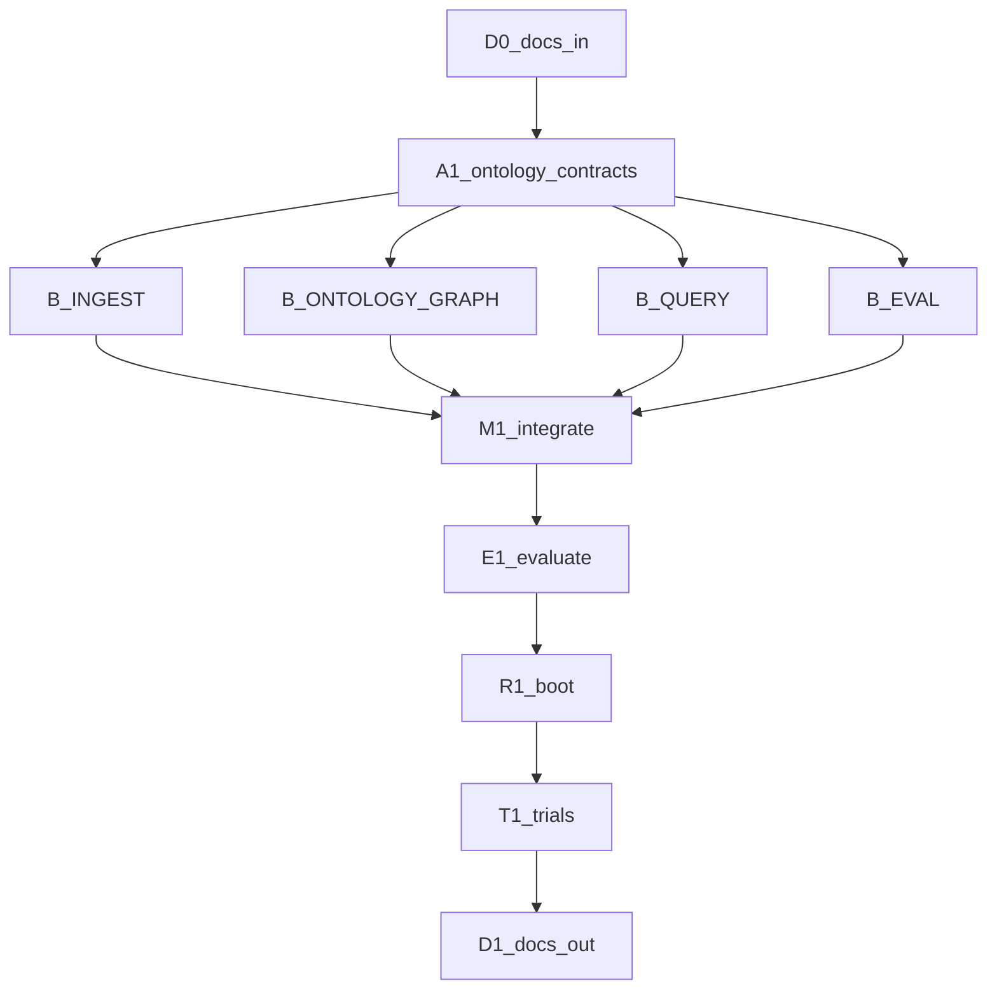

# Execution graph — RAG hybrid + hierarchical ontology

| Field | Value |
|-------|-------|
| **Scope plan** | [IMPLEMENTATION_PLAN.md](IMPLEMENTATION_PLAN.md) |
| **Objective** | Hybrid-graph RAG with figure links and ≤7s retrieve |
| **Topology** | diamond (parallel build → M1 barrier) |
| **Depth** | 2 |
| **Branch** | `cursor/rag-hybrid-pipeline-78c0` |

## Node plans

| ID | Name | Plan |
|----|------|------|
| D0 | Docs-in | [plans/nodes/rag-D0.md](plans/nodes/rag-D0.md) |
| A1 | Ontology contracts | [plans/nodes/rag-A1.md](plans/nodes/rag-A1.md) |
| B_ONTOLOGY_GRAPH | Schema + store | [plans/nodes/rag-B_ONTOLOGY.md](plans/nodes/rag-B_ONTOLOGY.md) |
| B_INGEST | Parse/OCR/figures | [plans/nodes/rag-B_INGEST.md](plans/nodes/rag-B_INGEST.md) |
| B_QUERY | Hybrid + hops | [plans/nodes/rag-B_QUERY.md](plans/nodes/rag-B_QUERY.md) |
| B_EVAL | Eval slice | [plans/nodes/rag-B_EVAL.md](plans/nodes/rag-B_EVAL.md) |
| M1 | Integrate | [plans/nodes/rag-M1.md](plans/nodes/rag-M1.md) |
| E1 | Evaluate | [plans/nodes/rag-E1.md](plans/nodes/rag-E1.md) |
| R1 | Boot | [plans/nodes/rag-R1.md](plans/nodes/rag-R1.md) |
| T1 | Trials | [plans/nodes/rag-T1.md](plans/nodes/rag-T1.md) |
| D1 | Docs-out | [plans/nodes/rag-D1.md](plans/nodes/rag-D1.md) |

## Lifecycle

| Stage | Node(s) |
|-------|---------|
| Research + questions | R0 (Gate 0 closed) |
| Docs-in | D0 |
| Architecture | A1 |
| Design / UI | U1 — N/A |
| Build | B_ONTOLOGY_GRAPH, B_INGEST, B_QUERY, B_EVAL |
| Integrate | M1 |
| Evaluate | E1 |
| Run | R1 |
| Trials | T1 |
| Docs-out | D1 |

## Mermaid

## Wave status

| Wave | Nodes | Status |
|------|-------|--------|
| 0 | D0, A1 + artifacts | done |
| 1 | B_* parallel | done |
| 2 | M1, E1 | done |
| 3 | R1, T1, D1 | done |

Approving this graph starts execution. Node plans are linked.
