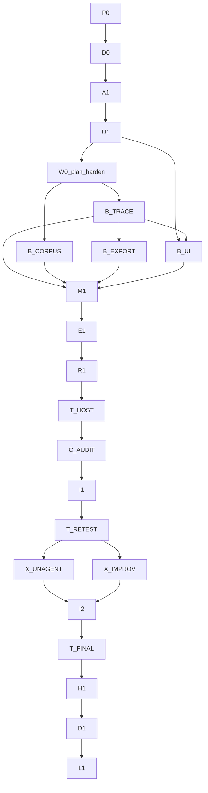

# Loop graph — Kernel harden (JSONL + host-heavy corpus)

> **This is the live graph.** Node plans are separate files; every one is linked below.
>
> XOR: do not treat [`docs/planning/LOOP_GRAPH_SIMULINK_AGENTS.md`](docs/planning/LOOP_GRAPH_SIMULINK_AGENTS.md),
> [`docs/planning/LOOP_GRAPH_D19.md`](docs/planning/LOOP_GRAPH_D19.md),
> [`docs/planning/LOOP_GRAPH_KNOWLEDGE.md`](docs/planning/LOOP_GRAPH_KNOWLEDGE.md),
> or [`docs/planning/LOOP_GRAPH_SKILLS_MATLAB.md`](docs/planning/LOOP_GRAPH_SKILLS_MATLAB.md) as live.
>
> Scope: [`IMPLEMENTATION_PLAN.md`](IMPLEMENTATION_PLAN.md)  
> Gate 0: [`docs/planning/GATE_0_KERNEL_HARDEN.md`](docs/planning/GATE_0_KERNEL_HARDEN.md)  
> Product overlay: [`docs/planning/PRODUCT_KERNEL_HARDEN.md`](docs/planning/PRODUCT_KERNEL_HARDEN.md)  
> ADR: [`docs/planning/ADR_TRACE_JSONL.md`](docs/planning/ADR_TRACE_JSONL.md)  
> Plan-harden: [`docs/planning/W0_PLAN_HARDEN_CHECK.md`](docs/planning/W0_PLAN_HARDEN_CHECK.md)

---

## Metadata

| Field | Value |
|-------|-------|
| **Scope plan** | [IMPLEMENTATION_PLAN.md](IMPLEMENTATION_PLAN.md) |
| **Objective** | Stdlib JSONL tracing, ≥100 host-heavy UG EE trials, Unagent+Improveness critique, kernel patches, UI surface, harden, docs-out case study |
| **Topology** | W0 plan/docs chain → fan-out B_* → M1 diamond → T_HOST cycle → critique/improve → advisors → H1 → D1/L1 |
| **Depth** | 2 |
| **Graph-of-loops** | named — live |
| **Branch** | `cursor/ee-kernel-harden-trace-8db3` |
| **Commit budget** | 40 (cap 42) |
| **Wave status** | W0–W7 done |

---

## Node plans

| ID | Name | Plan | Status |
|----|------|------|--------|
| P0 | product lock | [plans/kernel-harden-loops/P0.md](plans/kernel-harden-loops/P0.md) | pending |
| D0 | docs-in gaps | [plans/kernel-harden-loops/D0.md](plans/kernel-harden-loops/D0.md) | pending |
| A1 | ADRs | [plans/kernel-harden-loops/A1.md](plans/kernel-harden-loops/A1.md) | pending |
| U1 | trace UX IA | [plans/kernel-harden-loops/U1.md](plans/kernel-harden-loops/U1.md) | pending |
| B_TRACE | JSONL writer | [plans/kernel-harden-loops/B_TRACE.md](plans/kernel-harden-loops/B_TRACE.md) | pending |
| B_CORPUS | scenario bank | [plans/kernel-harden-loops/B_CORPUS.md](plans/kernel-harden-loops/B_CORPUS.md) | pending |
| B_EXPORT | Unagent adapter | [plans/kernel-harden-loops/B_EXPORT.md](plans/kernel-harden-loops/B_EXPORT.md) | pending |
| B_UI | trace panel | [plans/kernel-harden-loops/B_UI.md](plans/kernel-harden-loops/B_UI.md) | pending |
| M1 | integrate | [plans/kernel-harden-loops/M1.md](plans/kernel-harden-loops/M1.md) | pending |
| E1 | evaluate | [plans/kernel-harden-loops/E1.md](plans/kernel-harden-loops/E1.md) | pending |
| R1 | boot | [plans/kernel-harden-loops/R1.md](plans/kernel-harden-loops/R1.md) | pending |
| T_HOST | host trials ≥100 | [plans/kernel-harden-loops/T_HOST.md](plans/kernel-harden-loops/T_HOST.md) | pending |
| C_AUDIT | architecture critique | [plans/kernel-harden-loops/C_AUDIT.md](plans/kernel-harden-loops/C_AUDIT.md) | pending |
| I1 | patch round 1 | [plans/kernel-harden-loops/I1.md](plans/kernel-harden-loops/I1.md) | pending |
| T_RETEST | retest | [plans/kernel-harden-loops/T_RETEST.md](plans/kernel-harden-loops/T_RETEST.md) | pending |
| X_UNAGENT | Unagent recommend | [plans/kernel-harden-loops/X_UNAGENT.md](plans/kernel-harden-loops/X_UNAGENT.md) | pending |
| X_IMPROV | Improveness tooling | [plans/kernel-harden-loops/X_IMPROV.md](plans/kernel-harden-loops/X_IMPROV.md) | pending |
| I2 | patch round 2 | [plans/kernel-harden-loops/I2.md](plans/kernel-harden-loops/I2.md) | pending |
| T_FINAL | final trials | [plans/kernel-harden-loops/T_FINAL.md](plans/kernel-harden-loops/T_FINAL.md) | pending |
| H1 | harden | [plans/kernel-harden-loops/H1.md](plans/kernel-harden-loops/H1.md) | pending |
| D1 | docs-out | [plans/kernel-harden-loops/D1.md](plans/kernel-harden-loops/D1.md) | pending |
| L1 | learning sync | [plans/kernel-harden-loops/L1.md](plans/kernel-harden-loops/L1.md) | pending |

---

## Lifecycle

| Stage | Node(s) |
|-------|---------|
| Research + Gate 0 | lead (done → GATE_0_KERNEL_HARDEN.md) |
| Product | P0 |
| Docs-in | D0 |
| Architecture | A1 |
| Design / UI UX | U1 |
| Build | B_TRACE, B_CORPUS, B_EXPORT, B_UI |
| Integrate | M1 |
| Evaluate | E1 |
| Run | R1 |
| Trials | T_HOST, T_RETEST, T_FINAL |
| Critique / improve | C_AUDIT, I1, I2 |
| Advisors | X_UNAGENT, X_IMPROV |
| Harden | H1 |
| Docs-out | D1, L1 |

---

## Mermaid

---

## Waves

| Wave | Nodes | Barrier |
|------|-------|---------|
| 0 | P0 → D0 → A1 → U1 + all plan files + W0_PLAN_HARDEN_CHECK | yes — before any `src/` product code |
| 1 | B_TRACE ∥ B_CORPUS ∥ B_EXPORT ∥ B_UI | yes → M1 |
| 2 | M1 → E1 → R1 | yes |
| 3 | T_HOST | yes ≥100 |
| 4 | C_AUDIT → I1 → T_RETEST | yes |
| 5 | X_UNAGENT ∥ X_IMPROV → I2 → T_FINAL | yes |
| 6 | H1 | yes |
| 7 | D1 → L1 | done |

---

## Approval implication

This graph is live on branch `cursor/ee-kernel-harden-trace-8db3`. Execute Wave 0 plan/docs first; then product waves without per-node human waits unless escalated.
