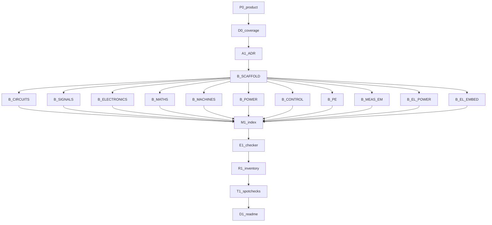

# Loop graph

> **This is the plan you read.** Loop plans are separate files; every one
> appears as a markdown link below.
>
> XOR: do not treat [`EXECUTION_GRAPH.md`](EXECUTION_GRAPH.md) or
> [`docs/planning/LOOP_GRAPH_D19.md`](docs/planning/LOOP_GRAPH_D19.md) as live.
> Scope: [`IMPLEMENTATION_PLAN.md`](IMPLEMENTATION_PLAN.md).

---

## Metadata

| Field | Value |
|-------|-------|
| **Scope plan** | [IMPLEMENTATION_PLAN.md](IMPLEMENTATION_PLAN.md) |
| **Objective** | Licence-clean encyclopedic UG EE markdown corpus in `knowledge/`, proven by checker + inventory boot + trials + README |
| **Topology mix** | chain (P0–B_SCAFFOLD) + fan-out (B_* packs) + diamond (M1) + tail (E1–D1) |
| **Depth** | 2 |
| **Graph-of-loops** | named — this graph is live |
| **Graph-engineering** | not loaded (XOR) |
| **Branch** | `cursor/ug-ee-knowledge-corpus-0daa` |
| **Cheap checker** | `composer-2.5-fast` else `inherit` |

---

## Loop plans

| ID | Name | Plan | Stop | Max rounds | Status |
|----|------|------|------|------------|--------|
| P0 | product lock | [plans/knowledge-loops/P0.md](plans/knowledge-loops/P0.md) | grep PRODUCT headings | 3 | passed |
| D0 | coverage manifest | [plans/knowledge-loops/D0.md](plans/knowledge-loops/D0.md) | COVERAGE.yaml pack/unit floors | 3 | passed |
| A1 | ADR-0014 | [plans/knowledge-loops/A1.md](plans/knowledge-loops/A1.md) | grep ADR-0014 | 3 | passed |
| B_SCAFFOLD | schema and checker | [plans/knowledge-loops/B_SCAFFOLD.md](plans/knowledge-loops/B_SCAFFOLD.md) | check_knowledge_tree.py --allow-empty | 3 | passed |
| B_CIRCUITS | circuits handbook | [plans/knowledge-loops/B_CIRCUITS.md](plans/knowledge-loops/B_CIRCUITS.md) | --pack circuits | 3 | passed |
| B_SIGNALS | signals handbook | [plans/knowledge-loops/B_SIGNALS.md](plans/knowledge-loops/B_SIGNALS.md) | --pack signals | 3 | passed |
| B_ELECTRONICS | electronics handbook | [plans/knowledge-loops/B_ELECTRONICS.md](plans/knowledge-loops/B_ELECTRONICS.md) | --pack electronics | 3 | passed |
| B_MATHS | maths-for-EE | [plans/knowledge-loops/B_MATHS.md](plans/knowledge-loops/B_MATHS.md) | --pack maths | 3 | passed |
| B_MACHINES | machines | [plans/knowledge-loops/B_MACHINES.md](plans/knowledge-loops/B_MACHINES.md) | --pack machines | 3 | pending |
| B_POWER | power systems | [plans/knowledge-loops/B_POWER.md](plans/knowledge-loops/B_POWER.md) | --pack power | 3 | pending |
| B_CONTROL | control | [plans/knowledge-loops/B_CONTROL.md](plans/knowledge-loops/B_CONTROL.md) | --pack control | 3 | pending |
| B_PE | power electronics | [plans/knowledge-loops/B_PE.md](plans/knowledge-loops/B_PE.md) | --pack power-electronics | 3 | pending |
| B_MEAS_EM | measurements + EM | [plans/knowledge-loops/B_MEAS_EM.md](plans/knowledge-loops/B_MEAS_EM.md) | --pack measurements and em | 3 | pending |
| B_EL_POWER | power-side electives | [plans/knowledge-loops/B_EL_POWER.md](plans/knowledge-loops/B_EL_POWER.md) | --pack electives-power | 3 | pending |
| B_EL_EMBED | embedded/comms electives | [plans/knowledge-loops/B_EL_EMBED.md](plans/knowledge-loops/B_EL_EMBED.md) | --pack electives-embed | 3 | pending |
| M1 | cross-index | [plans/knowledge-loops/M1.md](plans/knowledge-loops/M1.md) | checker + GLOSSARY.md | 3 | pending |
| E1 | evaluate | [plans/knowledge-loops/E1.md](plans/knowledge-loops/E1.md) | pytest test_knowledge_tree | 3 | pending |
| R1 | inventory boot | [plans/knowledge-loops/R1.md](plans/knowledge-loops/R1.md) | R1_BOOT_KNOWLEDGE.md | 3 | pending |
| T1 | trials | [plans/knowledge-loops/T1.md](plans/knowledge-loops/T1.md) | T1_TRIALS_KNOWLEDGE.md ≥5 pass | 3 | pending |
| D1 | docs-out | [plans/knowledge-loops/D1.md](plans/knowledge-loops/D1.md) | README names checker | 3 | pending |

State: `plans/knowledge-loops/<id>.state.json`.

N/A: U1 (no user-facing UI), H1 (no new bind/secret surface; licence test is E1), deploy, auth, graph-engineering.

---

## Lifecycle

| Stage | Node id(s) | Plan |
|-------|------------|------|
| Research + questions | R0 | [GATE_0_UG_EE_KNOWLEDGE.md](docs/planning/GATE_0_UG_EE_KNOWLEDGE.md) — done |
| Product lock | P0 | [P0](plans/knowledge-loops/P0.md) |
| Docs-in | D0 | [D0](plans/knowledge-loops/D0.md) |
| Architecture | A1 | [A1](plans/knowledge-loops/A1.md) |
| Design / UI UX | U1 | N/A — no user-facing UI this graph |
| Build | B_SCAFFOLD, B_* | links above |
| Integrate | M1 | [M1](plans/knowledge-loops/M1.md) |
| Evaluate | E1 | [E1](plans/knowledge-loops/E1.md) |
| Run | R1 | [R1](plans/knowledge-loops/R1.md) |
| Trials | T1 | [T1](plans/knowledge-loops/T1.md) |
| Docs-out | D1 | [D1](plans/knowledge-loops/D1.md) |
| Harden | H1 | N/A — none this graph |

---

## Mermaid

**Edges cut:** packs do not wait on each other; D1 after T1; no RAG node; no UI node.

---

## Nodes

See loop-plans table. Maker inherit. Checker composer-2.5-fast else inherit. Max rounds 3. Write paths in each loop plan.

---

## Edges

| From | To | Data name | Kind |
|------|----|-----------|------|
| P0 | D0 | product lock | verify |
| D0 | A1 | COVERAGE.yaml | plumbing |
| A1 | B_SCAFFOLD | ADR-0014 | plumbing |
| B_SCAFFOLD | each B_* pack | schema+checker | verify |
| all B_* | M1 | filled units | verify |
| M1 | E1 | tree | verify |
| E1 | R1 | pytest green | verify |
| R1 | T1 | boot log | plumbing |
| T1 | D1 | trial log | verify |

---

## Waves

| Wave | Nodes | Fan-out? | Barrier? | Status | Lead plumbing |
|------|-------|----------|----------|--------|---------------|
| 0 | P0, D0, A1, B_SCAFFOLD | no | serial | done | archive D19 already done |
| 1 | B_CIRCUITS, B_SIGNALS, B_ELECTRONICS, B_MATHS | yes | no | done | — |
| 2 | B_MACHINES, B_POWER, B_CONTROL, B_PE | yes | no | pending | — |
| 3 | B_MEAS_EM, B_EL_POWER, B_EL_EMBED | yes | no | pending | — |
| 4 | M1 | no | yes — whole set | pending | flatten indexes |
| 5 | E1, R1, T1, D1 | no | serial tail | pending | git + README |

---

## Failure

- Checker fail + rounds left → next maker round with findings only.
- `max_rounds` exhausted → `escalated`, wait for human.
- Required pack nodes are not optional.

---

## Commit mapping

| Node | Plan | §9 rows | Gate |
|------|------|---------|------|
| archive + Gate 0 | this file | #1 | loop-plan links resolve |
| P0 | [P0](plans/knowledge-loops/P0.md) | #2 | grep headings |
| A1 | [A1](plans/knowledge-loops/A1.md) | #3 | grep ADR-0014 |
| D0 + B_SCAFFOLD | [D0](plans/knowledge-loops/D0.md), [B_SCAFFOLD](plans/knowledge-loops/B_SCAFFOLD.md) | #4 | `--allow-empty` |
| B_CIRCUITS … B_EL_EMBED | pack plans | #5–#15 | `--pack` |
| M1 | [M1](plans/knowledge-loops/M1.md) | #16 | GLOSSARY.md |
| E1 R1 T1 D1 | tail plans | #17 | pytest + boot + trials + README |

Lead commits after the loop **passed**. Ponytail on every write. Subagents do not commit.

---

## Approval implication

Approving this loop graph started execution immediately. No second wait per node unless a loop **escalates**.
