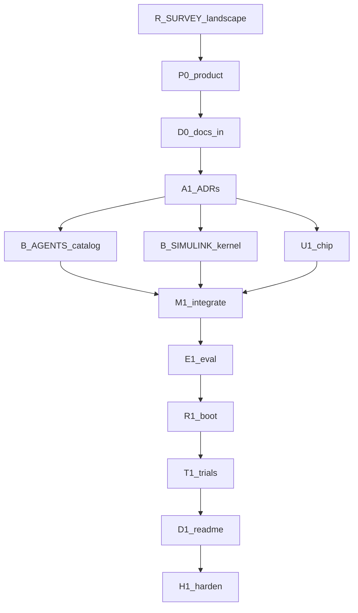

# Loop graph

> **This is the plan you read.** Node plans are separate files; every one
> appears as a markdown link below.
>
> XOR: do not treat [`EXECUTION_GRAPH.md`](EXECUTION_GRAPH.md),
> [`docs/planning/LOOP_GRAPH_D19.md`](docs/planning/LOOP_GRAPH_D19.md),
> [`docs/planning/LOOP_GRAPH_KNOWLEDGE.md`](docs/planning/LOOP_GRAPH_KNOWLEDGE.md),
> or [`docs/planning/LOOP_GRAPH_SKILLS_MATLAB.md`](docs/planning/LOOP_GRAPH_SKILLS_MATLAB.md) as live.
> Scope: [`IMPLEMENTATION_PLAN.md`](IMPLEMENTATION_PLAN.md).
> Gate 0: [`docs/planning/GATE_0_SIMULINK_AGENTS.md`](docs/planning/GATE_0_SIMULINK_AGENTS.md).

---

## Metadata

| Field | Value |
|-------|-------|
| **Scope plan** | [IMPLEMENTATION_PLAN.md](IMPLEMENTATION_PLAN.md) |
| **Objective** | In-repo EE specialist catalog the host can spawn; Arc-mediated Simulink toolkit; fail-closed without MATLAB |
| **Topology mix** | chain (R_SURVEY→A1) + fan-out (B_AGENTS ∥ B_SIMULINK ∥ U1) + diamond (M1) + tail (E1–H1) |
| **Depth** | 2 |
| **Graph-engineering** | named — this graph is live |
| **Branch** | `cursor/ee-simulink-host-agents-37b3` |
| **Cheap checker** | `composer-2.5-fast` else `inherit` |
| **Wave status** | 0 running |

---

## Node plans

| ID | Name | Plan | Status |
|----|------|------|--------|
| R_SURVEY | landscape | [plans/simulink-agents-loops/R_SURVEY.md](plans/simulink-agents-loops/R_SURVEY.md) | pending |
| P0 | product lock | [plans/simulink-agents-loops/P0.md](plans/simulink-agents-loops/P0.md) | pending |
| D0 | docs-in | [plans/simulink-agents-loops/D0.md](plans/simulink-agents-loops/D0.md) | pending |
| A1 | ADRs | [plans/simulink-agents-loops/A1.md](plans/simulink-agents-loops/A1.md) | pending |
| B_AGENTS | catalog | [plans/simulink-agents-loops/B_AGENTS.md](plans/simulink-agents-loops/B_AGENTS.md) | pending |
| B_SIMULINK | kernel | [plans/simulink-agents-loops/B_SIMULINK.md](plans/simulink-agents-loops/B_SIMULINK.md) | pending |
| U1 | chip | [plans/simulink-agents-loops/U1.md](plans/simulink-agents-loops/U1.md) | pending |
| M1 | integrate | [plans/simulink-agents-loops/M1.md](plans/simulink-agents-loops/M1.md) | pending |
| E1 | evaluate | [plans/simulink-agents-loops/E1.md](plans/simulink-agents-loops/E1.md) | pending |
| R1 | boot | [plans/simulink-agents-loops/R1.md](plans/simulink-agents-loops/R1.md) | pending |
| T1 | trials | [plans/simulink-agents-loops/T1.md](plans/simulink-agents-loops/T1.md) | pending |
| D1 | docs-out | [plans/simulink-agents-loops/D1.md](plans/simulink-agents-loops/D1.md) | pending |
| H1 | harden | [plans/simulink-agents-loops/H1.md](plans/simulink-agents-loops/H1.md) | pending |

---

## Lifecycle

| Stage | Node id(s) | Plan |
|-------|------------|------|
| Research + questions | R0 | [GATE_0_SIMULINK_AGENTS.md](docs/planning/GATE_0_SIMULINK_AGENTS.md) — done |
| Solution landscape | R_SURVEY | [R_SURVEY](plans/simulink-agents-loops/R_SURVEY.md) |
| Product lock | P0 | [P0](plans/simulink-agents-loops/P0.md) |
| Docs-in | D0 | [D0](plans/simulink-agents-loops/D0.md) |
| Architecture | A1 | [A1](plans/simulink-agents-loops/A1.md) |
| Design / UI UX | U1 | chip only; no new screens |
| Build | B_AGENTS, B_SIMULINK | links above |
| Integrate | M1 | [M1](plans/simulink-agents-loops/M1.md) |
| Evaluate | E1 | [E1](plans/simulink-agents-loops/E1.md) |
| Run | R1 | [R1](plans/simulink-agents-loops/R1.md) |
| Trials | T1 | [T1](plans/simulink-agents-loops/T1.md) |
| Docs-out | D1 | [D1](plans/simulink-agents-loops/D1.md) |
| Harden | H1 | [H1](plans/simulink-agents-loops/H1.md) |

---

## Mermaid

---

## Waves

| Wave | Nodes | Barrier | Status |
|------|-------|---------|--------|
| 0 | R_SURVEY | yes | pending |
| 1 | P0, D0 | yes | pending |
| 2 | A1 | yes | pending |
| 3 | B_AGENTS, B_SIMULINK, U1 | yes — M1 needs the set | pending |
| 4 | M1 | yes | pending |
| 5 | E1, R1, T1 | yes | pending |
| 6 | D1, H1 | yes | pending |

---

## Commit mapping

| Node | §9 rows |
|------|---------|
| R_SURVEY + graph | 1–2 |
| P0 D0 A1 | 3–4 |
| B_AGENTS | 5, 7 |
| B_SIMULINK | 6, 10 |
| U1 | 8 |
| M1 | 9 |
| E1 R1 T1 | 10 leftover + boot evidence |
| D1 H1 | 11–12 |

---

## Edges cut

- No B_AGENTS → B_SIMULINK (catalog does not call the toolkit)
- No live-MATLAB trial node
- No coding-`.cursor/` writer
- No 77-role SDLC fleet
- UI beyond the chip: N/A

---

## Approval implication

This graph was approved 2026-09-14. Execution is in progress.
