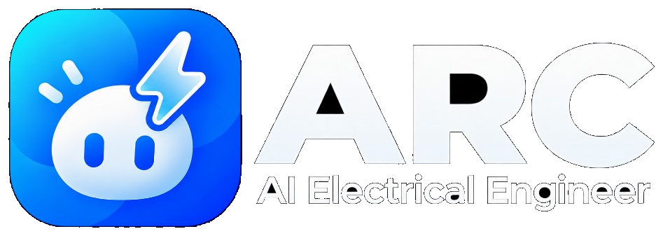
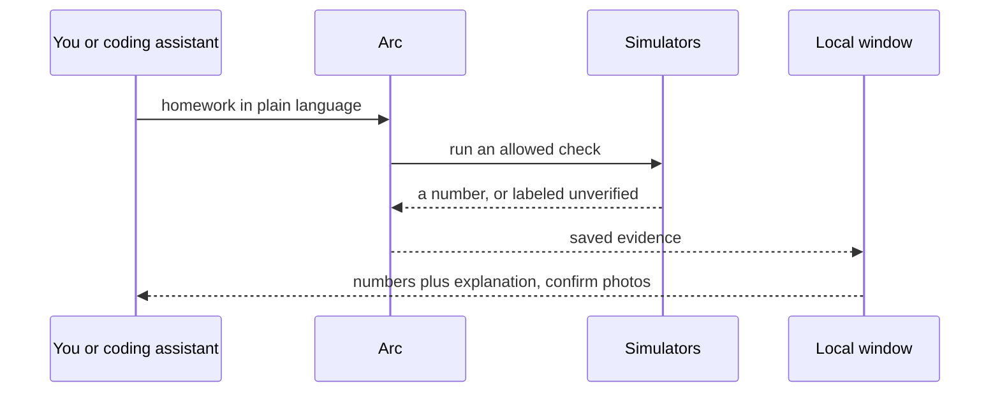

<p align="center">
  
</p>

<p align="center">
  <strong>The first open-source, agentic electrical engineer.</strong>
</p>

<p align="center">
  <a href="LICENSE"></a>
  <a href=".github/workflows/ci.yml"></a>
</p>

<p align="center">
  <a href="#quick-start"><b>Quick start</b></a> ·
  <a href="#domain-kernel"><b>Domain kernel</b></a> ·
  <a href="docs/ON_THE_HARNESS.md"><b>On the harness</b></a> ·
  <a href="#try-these-prompts"><b>Try these prompts</b></a> ·
  <a href="docs/CANNOT_DO.md"><b>Cannot-do</b></a> ·
  <a href="LICENSE"><b>License</b></a>
</p>

Turn your AI coding assistant into an undergraduate electrical engineer. 10 undergraduate packs, 12 host-spawned specialists, 27 named lab recipes.

Describe the circuit, viva, or assignment in plain language. Arc retrieves, checks, and explains. Simulators run when they exist. If Arc did not verify a number, it labels that number unverified. In the saved run that label is the word `unchecked`. It never presents a guess as a lab result.

> **Arc is a local lab you clone and run.** It is not a general coding agent that also does circuits.
> Primary interface: paste a prompt into Cursor, Claude Code, Codex, or ChatGPT desktop, or run `electrical-engineer`.
> Rule: **if a number was not verified, Arc labels it unverified.**

```text
$ uv run electrical-engineer eval --pack circuits
PASS divider-dc-01 recipe=solve-circuit-problem
1/1 passed
```

That eval is the product check. Gold `eval/gold/circuits/divider-dc-01` expects divider `Vout = 5.0` from `Vin=10`, `R1=R2=1k`.

## Domain kernel

A **domain kernel** is the expertise a general coding assistant loads so it can do one subject well.

Arc is that kernel for undergraduate electrical engineering. Cursor, Claude Code, Codex, and ChatGPT desktop stay general assistants. This kernel holds what they load: named lab recipes, simulators when they exist, gates, saved runs, and an unverified label when a number was not checked. The assistant still writes the viva. The ohms come from a deterministic check, or they are labeled unverified.

Arc is a working example of a domain kernel. It is what enables a general assistant to have expertise in electrical engineering, including the determinism a chat loop does not have on its own.

Plain-language walkthrough (what Arc adds, why numbers stay deterministic, how Arc mediates MATLAB): [`docs/ON_THE_HARNESS.md`](docs/ON_THE_HARNESS.md).

## Try these prompts

Open this repo in Cursor, Claude Code, Codex, or ChatGPT desktop and paste:

```text
Solve this: 10 V divider, R1 = R2 = 1 kΩ. What is Vout?
```

```text
Explain Thevenin as if I have a viva in ten minutes. Cite the book chapter you retrieved.
```

```text
This isn't a named lab recipe. Still answer, and label anything you did not check.
```

Works with those hosts, or with the CLI alone (`electrical-engineer run solve-circuit-problem`). Host adapters: [`docs/hosts/README.md`](docs/hosts/README.md). **12 EE specialists** live in [`hosts/agents/`](hosts/agents/INDEX.md); the **host** (Cursor, Codex, Claude) spawns at most two after `electrical-engineer hosts install --into <homework>`. Do not add MATLAB MCP or Simulink Agentic Toolkit on the host; Arc mediates both.

## Quick start

You need **Python 3.11+**, **[uv](https://docs.astral.sh/uv/)**, and (for the UI) **Node** to build `ui/dist`. An AI coding assistant is optional. The CLI is a complete path without one.

```text
uv sync --extra dev
uv run electrical-engineer workflows
```

Then paste a prompt above, or boot the same commands recorded in [`docs/planning/R1_BOOT.md`](docs/planning/R1_BOOT.md):

```text
uv run electrical-engineer --help
uv run electrical-engineer run solve-circuit-problem
uv run electrical-engineer mcp
uv run electrical-engineer hosts install --into /tmp/ee-hw --host all
EE_NO_BROWSER=1 uv run electrical-engineer ui
```

```text
uv run electrical-engineer run solve-circuit-problem
EE_NO_BROWSER=1 uv run electrical-engineer ui
uv run electrical-engineer mcp
uv run electrical-engineer eval --pack circuits
./scripts/validate.sh
```

Put a `problem.json` in the working directory for numeric tasks (see `eval/gold/circuits/divider-dc-01/fixtures/problem.json`).

If you are an agent reading this: load [`skills/SKILL.md`](skills/SKILL.md), then [`docs/hosts/README.md`](docs/hosts/README.md). Do not invent a kind of check. Do not present a fluent number as verified.

Maintainers compiling UG method notes (not the RAG index): [`knowledge/README.md`](knowledge/README.md). Inventory: `python scripts/check_knowledge_tree.py`.

The workspace is `electrical-engineer ui` on **127.0.0.1:8765** only.

## How it works



- **Named lab recipes.** 27 saved workflows. The assistant picks one (or proposes an allowed graph). Arc runs it. A free agent loop can skip the simulator. Limit: Arc never invents a new recipe in chat. [`docs/WORKFLOWS.md`](docs/WORKFLOWS.md)
- **Host-spawned specialists.** 12 cards in [`hosts/agents/`](hosts/agents/INDEX.md). Cursor, Codex, or Claude starts at most two on a large assignment. Limit: Arc never starts those children. Cloud `/in-cloud` spawn is off.
- **Deterministic checks.** The recipe runner and the simulators do not sample. Same netlist, same `Vout`. Limit: the explanation can still vary. The ohms cannot, unless they are labeled unverified. [`docs/ON_THE_HARNESS.md`](docs/ON_THE_HARNESS.md)
- **Unverified numbers are labeled.** If SPICE, python-control, or pandapower is missing, Arc does not guess. Limit: a verified number needs a simulator or a numeric check, not a fluent paragraph.
- **Local window.** On `127.0.0.1:8765` only. Limit: not on the internet, no chat loop in the browser.
- **Tools for the coding assistant.** List recipes, look up a citation, open the window, run a short simulation, propose allowed checks, read the labeled result, replay a recipe. Limit: the chat never waits on you.

## Go deeper

| Doc | What it is |
|-----|------------|
| [`docs/ON_THE_HARNESS.md`](docs/ON_THE_HARNESS.md) | What Arc adds on a coding assistant, in plain language |
| [`docs/EXTENSIVE.md`](docs/EXTENSIVE.md) | Concepts, runtime path, every package |
| [`docs/ARCHITECTURE.md`](docs/ARCHITECTURE.md) | Kernel, capabilities, seams |
| [`docs/WORKFLOWS.md`](docs/WORKFLOWS.md) | Named recipe catalog |
| [`docs/CANNOT_DO.md`](docs/CANNOT_DO.md) | Honest holes |
| [`docs/hosts/README.md`](docs/hosts/README.md) | Cursor, Claude Code, Codex, ChatGPT desktop |

## License

Apache-2.0. See [`LICENSE`](LICENSE).
