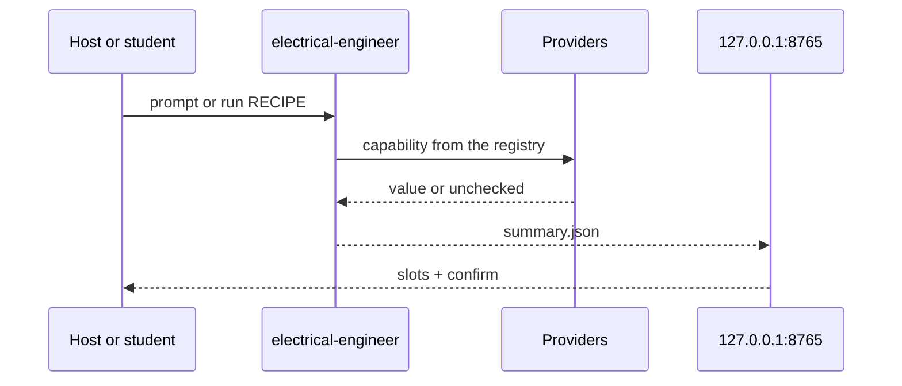

<p align="center">
  
</p>

<p align="center">
  <strong>The first open-source, agentic electrical engineer.</strong>
</p>

<p align="center">
  <a href="LICENSE"></a>
  <a href=".github/workflows/ci.yml"></a>
</p>

<p align="center">
  <a href="#quick-start"><b>Quick start</b></a> ·
  <a href="#domain-kernel"><b>Domain kernel</b></a> ·
  <a href="#try-these-prompts"><b>Try these prompts</b></a> ·
  <a href="docs/CANNOT_DO.md"><b>Cannot-do</b></a> ·
  <a href="LICENSE"><b>License</b></a>
</p>

Turn your AI coding assistant into an undergraduate EE lab. 10 undergraduate packs, 27 named workflows, 14 capabilities.

Describe the circuit, viva, or assignment in plain language. Arc retrieves, checks, and explains. Simulators run when they exist. Everything else is the exact token `unchecked`.

> **Arc is a local lab you clone and run.** It is not a general coding agent that also does circuits.
> Primary interface: paste a prompt into Cursor, Claude Code, Codex, or ChatGPT desktop, or run `electrical-engineer`.
> Invariant: **unverified numbers use the exact token `unchecked`.**

```text
$ uv run electrical-engineer eval --pack circuits
PASS divider-dc-01 recipe=solve-circuit-problem
1/1 passed
```

That eval is the product check. Gold `eval/gold/circuits/divider-dc-01` expects divider `Vout = 5.0` from `Vin=10`, `R1=R2=1k`.

## Domain kernel

A **domain kernel** is what enables a general agentic harness to have expertise in a specific domain.

Arc is the local domain kernel for undergraduate electrical engineering. Cursor, Claude Code, Codex, and ChatGPT desktop stay general harnesses. This kernel holds the expertise they load: named workflows, simulators when they exist, and the exact token `unchecked` when they do not.

## Try these prompts

Open this repo in Cursor, Claude Code, Codex, or ChatGPT desktop and paste:

```text
Solve this: 10 V divider, R1 = R2 = 1 kΩ. What is Vout?
```

```text
Explain Thevenin as if I have a viva in ten minutes. Cite the book chapter you retrieved.
```

```text
This isn't a named lab recipe. Still answer, and label anything you did not check.
```

Works with those hosts, or with the CLI alone (`electrical-engineer run solve-circuit-problem`). Host adapters: [`docs/hosts/README.md`](docs/hosts/README.md).

## Quick start

You need **Python 3.11+**, **[uv](https://docs.astral.sh/uv/)**, and (for the UI) **Node** to build `ui/dist`. An AI coding assistant is optional. The CLI is a complete path without one.

```text
uv sync --extra dev
uv run electrical-engineer workflows
```

Then paste a prompt above, or:

```text
uv run electrical-engineer run solve-circuit-problem
EE_NO_BROWSER=1 uv run electrical-engineer ui
uv run electrical-engineer mcp
uv run electrical-engineer eval --pack circuits
./scripts/validate.sh
```

Put a `problem.json` in the working directory for numeric tasks (see `eval/gold/circuits/divider-dc-01/fixtures/problem.json`).

If you are an agent reading this: load [`skills/SKILL.md`](skills/SKILL.md), then [`docs/hosts/README.md`](docs/hosts/README.md). Do not invent a capability id. Do not present a fluent number as checked.

The workspace is `electrical-engineer ui` on **127.0.0.1:8765** only.

## How it works



- **Named workflows.** 27 YAML recipes under `workflows/`. Limit: the router never invents a graph; unmatched work uses `unmatched-cosolver` and stays unchecked. [`docs/WORKFLOWS.md`](docs/WORKFLOWS.md)
- **Label-unchecked.** If ngspice, python-control, or pandapower is missing, the run fails closed with token `unchecked`. Limit: a checked number requires a tool or a numeric check, not a fluent paragraph. [`docs/ARCHITECTURE.md`](docs/ARCHITECTURE.md)
- **Loopback workspace.** FastAPI on `127.0.0.1:8765`. Limit: no WAN bind, no agent loop in the browser.
- **stdio MCP.** As-built: `list_workflows` / `run_workflow`. Limit: MCP never waits on a human.

## Go deeper

| Doc | What it is |
|-----|------------|
| [`docs/EXTENSIVE.md`](docs/EXTENSIVE.md) | Concepts, runtime path, every package |
| [`docs/ARCHITECTURE.md`](docs/ARCHITECTURE.md) | Kernel, capabilities, seams |
| [`docs/WORKFLOWS.md`](docs/WORKFLOWS.md) | Named recipe catalog |
| [`docs/CANNOT_DO.md`](docs/CANNOT_DO.md) | Honest holes |
| [`docs/hosts/README.md`](docs/hosts/README.md) | Cursor, Claude Code, Codex, ChatGPT desktop |

## License

Apache-2.0. See [`LICENSE`](LICENSE).
