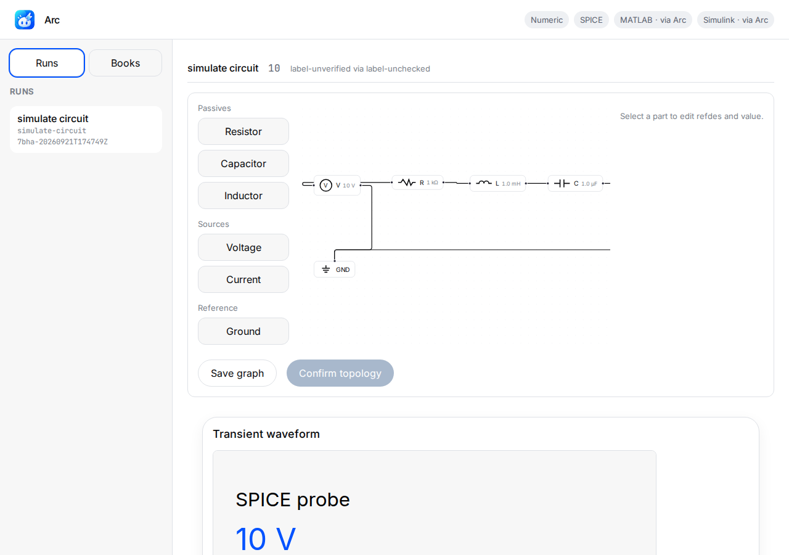
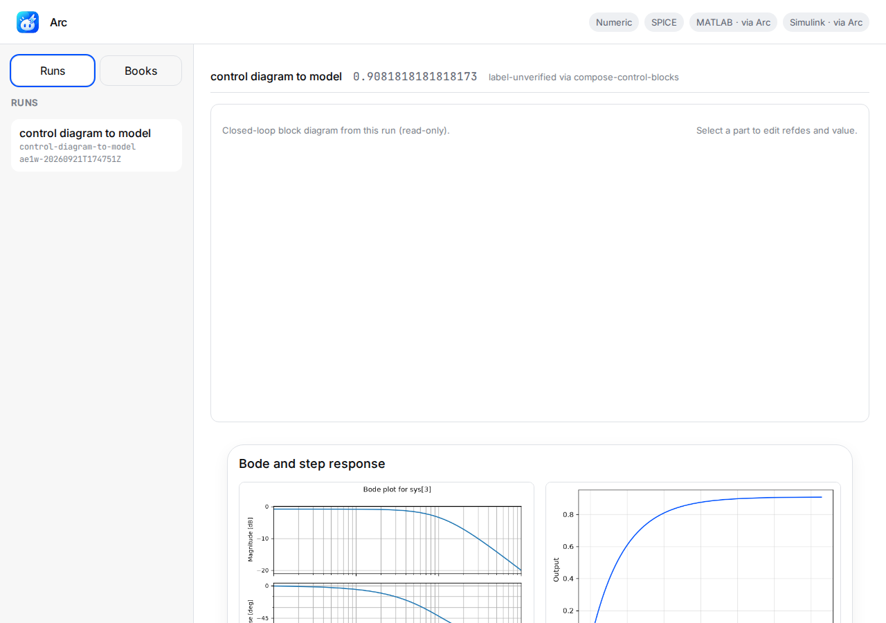
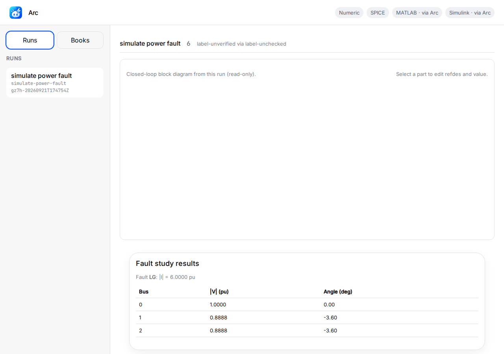
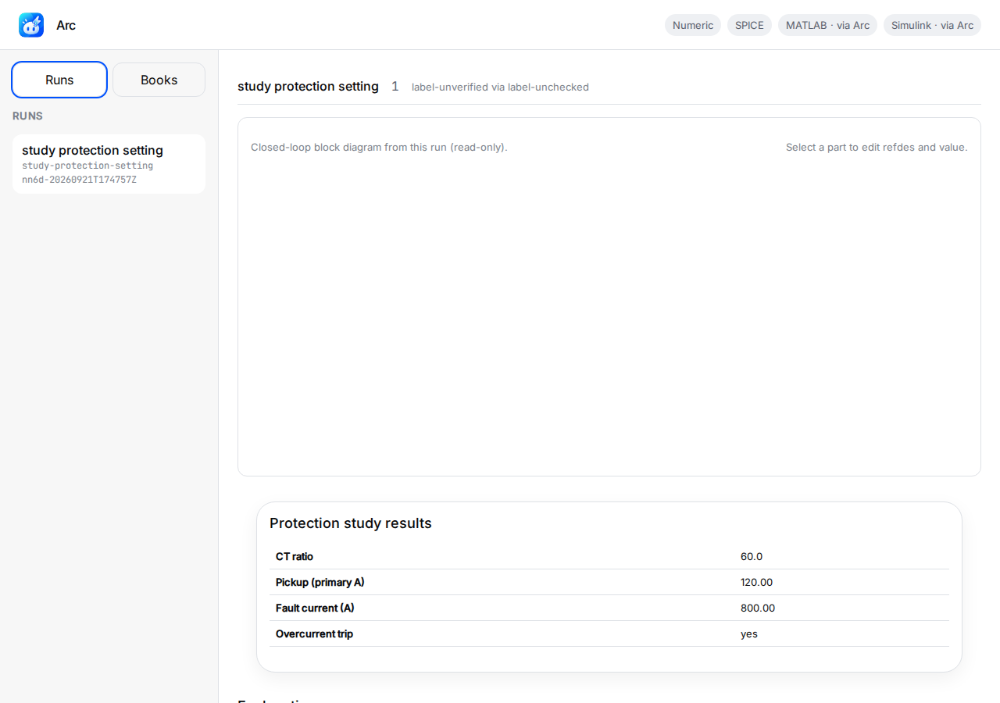
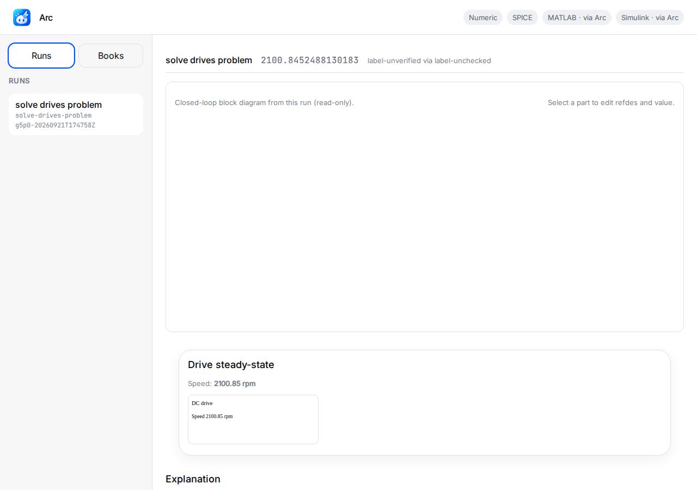
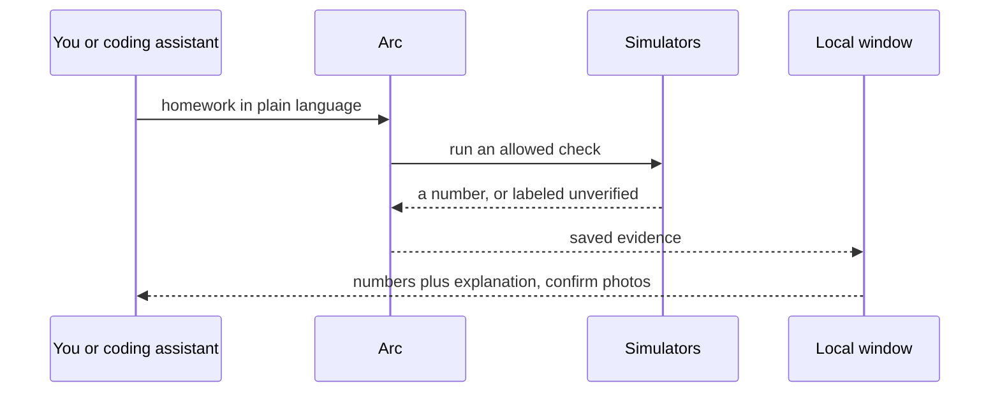

<p align="center">
  
</p>

<p align="center">
  <strong>The first open-source, agentic electrical engineer.</strong>
</p>

<p align="center">
  <a href="LICENSE"></a>
  <a href=".github/workflows/ci.yml"></a>
</p>

<p align="center">
  <a href="#quick-start"><b>Quick start</b></a> ·
  <a href="#domain-kernel"><b>Domain kernel</b></a> ·
  <a href="docs/ON_THE_HARNESS.md"><b>On the harness</b></a> ·
  <a href="#try-these-prompts"><b>Try these prompts</b></a> ·
  <a href="docs/CANNOT_DO.md"><b>Cannot-do</b></a> ·
  <a href="LICENSE"><b>License</b></a>
</p>

Turn your AI coding assistant into an undergraduate electrical engineer. 10 undergraduate packs, 12 host-spawned specialists, 27 named lab recipes.

**Arc is built for agents.** Clone the repo, install, run `electrical-engineer hosts install`, then paste a job brief into Cursor, Claude Code, Codex, or ChatGPT desktop. The assistant picks named recipes, runs simulators when they exist, and labels anything it did not verify as `unchecked` in the saved run.

> **Arc is a local lab you clone and run.** It is not a general coding agent that also does circuits.
> Primary interface: an agent (or you) pasting a prompt after install.
> Rule: **if a number was not verified, Arc labels it unverified.**

```text
python -m venv .venv
source .venv/bin/activate   # Windows: .venv\Scripts\activate
pip install -e ".[dev]"
electrical-engineer eval --pack circuits
PASS divider-dc-01 recipe=solve-circuit-problem
1/1 passed
```

That eval is the product check. Gold `eval/gold/circuits/divider-dc-01` expects divider `Vout = 5.0` from `Vin=10`, `R1=R2=1k`.

## Domain kernel

A **domain kernel** is what enables a general agentic harness to have expertise in a specific domain.

Arc is that kernel for undergraduate electrical engineering. Cursor, Claude Code, Codex, and ChatGPT desktop stay general assistants. This kernel holds what they load: named lab recipes, simulators when they exist, gates, saved runs, and an unverified label when a number was not checked. The assistant still writes the viva. The ohms come from a deterministic check, or they are labeled unverified.

Arc is a working example of a domain kernel. It is what enables a general assistant to have expertise in electrical engineering, including the determinism a chat loop does not have on its own.

Plain-language walkthrough (what Arc adds, why numbers stay deterministic, how Arc mediates MATLAB): [`docs/ON_THE_HARNESS.md`](docs/ON_THE_HARNESS.md).

## Try these prompts

Paste into Cursor or Claude after you clone Arc and install. Each block is a real homework ask (2–3 lines). Open the local UI at `127.0.0.1:8765` to see schematics, diagrams, and plots for each run.

```text
Series RLC: 10 V step, R = 1 kΩ, L = 1 mH, C = 1 µF.
Plot capacitor voltage for the first 10 ms and explain the overdamped/underdamped case.
```

```text
Control tutorial: G(s) = 10/(s+1) in unity negative feedback with H = 1.
I need Bode plots and the step response, plus phase margin in plain words.
```

```text
Compensator design: plant 10/(s+1), unity feedback, sketch the loop you used.
Compare open-loop vs closed-loop bandwidth before I submit the lab report.
```

```text
Power systems assignment: LG fault on a 3-bus equivalent, Z1 = Z2 = 0.1 pu, Z0 = 0.3 pu.
Find fault current in pu and show bus voltages after the fault.
```

```text
DC machine lab: 120 V armature, Ra = 1 Ω, torque constant 0.5 N·m/A, load 5 N·m.
What steady-state speed should I expect? Include the back-emf relation in the write-up.
```

Host adapters: [`docs/hosts/README.md`](docs/hosts/README.md). **12 EE specialists** in [`hosts/agents/`](hosts/agents/INDEX.md) for large worksheets (host spawns at most two).

## Quick start

You need **Python 3.11+** and (for the UI) **Node** to build `ui/dist`. An AI coding assistant is the primary interface; the CLI is complete without one.

```bash
python -m venv .venv
source .venv/bin/activate   # Windows: .venv\Scripts\activate
pip install -e ".[dev]"
electrical-engineer workflows
```

Then paste a prompt above, or boot the same commands recorded in [`docs/planning/R1_BOOT.md`](docs/planning/R1_BOOT.md):

```bash
electrical-engineer --help
electrical-engineer run solve-circuit-problem
electrical-engineer mcp
electrical-engineer hosts install --into /tmp/ee-hw --host all
EE_NO_BROWSER=1 electrical-engineer ui
```

```bash
electrical-engineer run solve-circuit-problem
EE_NO_BROWSER=1 electrical-engineer ui
electrical-engineer mcp
electrical-engineer eval --pack circuits
./scripts/validate.sh
```

Put a `problem.json` in the working directory for numeric tasks (see `eval/gold/circuits/divider-dc-01/fixtures/problem.json`).

If you are an agent reading this: load [`skills/SKILL.md`](skills/SKILL.md), then [`docs/hosts/README.md`](docs/hosts/README.md). Do not invent a kind of check. Do not present a fluent number as verified.

Maintainers compiling UG method notes (not the RAG index): [`knowledge/README.md`](knowledge/README.md). Inventory: `python scripts/check_knowledge_tree.py`.

The workspace is `electrical-engineer ui` on **127.0.0.1:8765** only.

### Optional: uv

If you use [uv](https://docs.astral.sh/uv/), the same extras apply:

```bash
uv sync --extra dev
uv run electrical-engineer workflows
```

CI uses uv internally; user-facing docs stay pip-first.

### Optional simulation engines

```bash
# Linux: ngspice system binary + Python extras
sudo apt-get install -y ngspice libngspice0
pip install -e ".[engines,dev]"
```

| Domain | Recipe | Engine |
|--------|--------|--------|
| RLC / netlist | `simulate-circuit` | ngspice + PySpice |
| Bode / step | `solve-control-problem` | `control` (python-control) |
| Block diagram → plant | `control-diagram-to-model` | compose blocks + `control` |
| Digital z-domain | `solve-digital-control-problem` | discrete TF / ZOH sample |
| Fault / load flow | `simulate-power-fault` | pandapower + sequence networks |
| Protection (study) | `study-protection-setting` | CT, pickup, distance zone math |
| Drives (UG intro) | `solve-drives-problem` | OSS DC / IM slip steady-state |

Boot details: [`docs/planning/R1_BOOT_SHIP.md`](docs/planning/R1_BOOT_SHIP.md).

### Domain screenshots (localhost UI window)

Fixed **1280×900** viewport captures of the Arc shell at `127.0.0.1:8765` (one run in the sidebar, diagram on canvas, plots below). Not full-page scroll shots.

Regenerate:

```bash
pip install playwright
playwright install chromium
npm run build --prefix ui
python scripts/capture_readme_ui_screenshots.py
```

| Domain | Screenshot |
|--------|------------|
| Circuits (series RLC + transient) |  |
| Control (loop diagram + Bode/step) |  |
| Power (one-line + fault table) |  |
| Protection (CT/relay one-line + settings) |  |
| Drives (DC steady-state) |  |

## How it works



- **Named lab recipes.** 27 saved workflows. The assistant picks one (or proposes an allowed graph). Arc runs it. A free agent loop can skip the simulator. Limit: Arc never invents a new recipe in chat. [`docs/WORKFLOWS.md`](docs/WORKFLOWS.md)
- **Host-spawned specialists.** 12 cards in [`hosts/agents/`](hosts/agents/INDEX.md). Cursor, Codex, or Claude starts at most two on a large assignment. Limit: Arc never starts those children. Cloud `/in-cloud` spawn is off.
- **Deterministic checks.** The recipe runner and the simulators do not sample. Same netlist, same `Vout`. Limit: the explanation can still vary. The ohms cannot, unless they are labeled unverified. [`docs/ON_THE_HARNESS.md`](docs/ON_THE_HARNESS.md)
- **Unverified numbers are labeled.** If SPICE, python-control, or pandapower is missing, Arc does not guess. Limit: a verified number needs a simulator or a numeric check, not a fluent paragraph.
- **Local window.** On `127.0.0.1:8765` only. Limit: not on the internet, no chat loop in the browser.
- **Tools for the coding assistant.** List recipes, look up a citation, open the window, run a short simulation, propose allowed checks, read the labeled result, replay a recipe. Limit: the chat never waits on you.

## Go deeper

| Doc | What it is |
|-----|------------|
| [`docs/ON_THE_HARNESS.md`](docs/ON_THE_HARNESS.md) | What Arc adds on a coding assistant, in plain language |
| [`docs/EXTENSIVE.md`](docs/EXTENSIVE.md) | Concepts, runtime path, every package |
| [`docs/ARCHITECTURE.md`](docs/ARCHITECTURE.md) | Kernel, capabilities, seams |
| [`docs/WORKFLOWS.md`](docs/WORKFLOWS.md) | Named recipe catalog |
| [`docs/CANNOT_DO.md`](docs/CANNOT_DO.md) | Honest holes |
| [`docs/hosts/README.md`](docs/hosts/README.md) | Cursor, Claude Code, Codex, ChatGPT desktop |

## License

Apache-2.0. See [`LICENSE`](LICENSE).


## Kernel harden

- [`docs/CASE_STUDY_DOMAIN_KERNEL.md`](docs/CASE_STUDY_DOMAIN_KERNEL.md)
- [`docs/planning/AUDIT_KERNEL_HARDEN.md`](docs/planning/AUDIT_KERNEL_HARDEN.md)
- [`docs/integrations/UNAGENT.md`](docs/integrations/UNAGENT.md)
- [`docs/integrations/IMPROVENESS.md`](docs/integrations/IMPROVENESS.md)
- [`LEARNING.md`](LEARNING.md)
