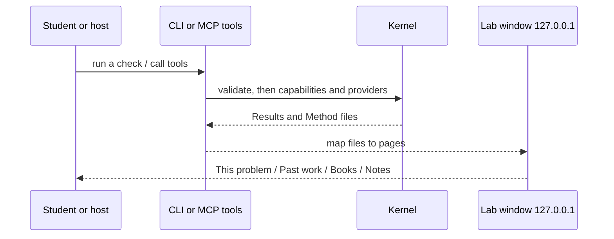

<p align="center">
  
</p>

<p align="center">
  <a href="docs/EXTENSIVE.md"></a>
  <a href="LICENSE"></a>
  <a href=".github/workflows/ci.yml"></a>
</p>

<p align="center">
  <a href="docs/EXTENSIVE.md"><b>Internals</b></a> ·
  <a href="docs/ARCHITECTURE.md"><b>Architecture</b></a> ·
  <a href="docs/UI.md"><b>Lab window</b></a> ·
  <a href="docs/CANNOT_DO.md"><b>Cannot-do</b></a> ·
  <a href="LICENSE"><b>License</b></a>
</p>

> Full internals (every package, file map, how the repo runs): [Extensive README](docs/EXTENSIVE.md)

**Electrical Engineer** is an Apache-2.0 **undergraduate electrical-engineering lab**. A thin local CLI and a localhost workbook wrap a rented coding agent (Cursor, Claude Code, Codex, or ChatGPT desktop) so homework numbers are checked by simulators and sympy — or labelled with the exact token **unchecked**. ngspice, YAML recipes, and FastAPI are this-pass implementations, not the product identity. The domain is **coverage of UG EE coursework**: every in-bound question has a complete path.

> **Electrical Engineer is a local CLI + lab window you can run today.** It is not Electric Pi, not a second Electrical Engineer chat app, not an ngspice wrapper, and not a JSON dump of run files as the intended student UX.
> Primary interface: `electrical-engineer`.
> Invariant: **a number marked checked was written by the kernel.** Unverified numbers use the exact token `unchecked`. Chat answers that never called our tools are not lab-checked.

```text
$ uv run electrical-engineer --help
usage: electrical-engineer [-h] [--version]
                           {run,workflows,mcp,eval,ui,rag,memory} ...
```

```text
$ uv run electrical-engineer eval --pack circuits
PASS divider-dc-01 recipe=solve-circuit-problem
1/1 passed
```

That eval is the product check: gold `eval/gold/circuits/divider-dc-01` expects divider `Vout = 5.0` from `Vin=10`, `R1=R2=1k`. A fluent wrong number presented as checked fails the product.

## The workspace you actually open

The **intended** student window is a lab workbook — pages **This problem**, **Past work**, **Books**, **Notes** — not a file browser. Spec: [`docs/UI.md`](docs/UI.md). `electrical-engineer ui` binds **127.0.0.1:8765** only. White canvas, scarce `#0052ff` pills, Inter + JetBrains Mono — **not** Coinbase fonts or wordmark. Tokens: [`ui/src/tokens.css`](ui/src/tokens.css) from [`docs/design/DESIGN-coinbase.md`](docs/design/DESIGN-coinbase.md).

**As-built today:** the React app still lists run ids and dumps `summary.json`. Filling the workbook pages is a later UI code plan. The screenshots below are that as-built chrome, not the target.


Empty as-built chrome: pick a run from the CLI. The `unchecked` badge is a pill in the copy, not a red/green verdict.


A **checked** divider in the as-built JSON view: `"value": 5.0` and `"unchecked": false`. The title has no badge — the word `unchecked` inside JSON keys must not light the pill.


An **unmatched** run stays `unchecked`. Confirm writes `confirmed.json` and **does not run SPICE**.

Trials: [`docs/planning/T1_TRIALS.md`](docs/planning/T1_TRIALS.md). Boot log: [`docs/planning/R1_BOOT.md`](docs/planning/R1_BOOT.md). Honest holes: [`docs/CANNOT_DO.md`](docs/CANNOT_DO.md).

## Why it exists

Undergraduate electrical engineering is circuits, signals, machines, power, and control — not chatbot fluency. This repo is a **domain kernel** ([`docs/PID.md`](docs/PID.md)): a branded CLI wrapping portable skills and stdio MCP, with a FastAPI + React workspace on loopback. Hosts own the LLM loop and the viva. The kernel owns capabilities, providers, gates, and files. The CLI can also talk to a local OpenAI-compatible daemon when `EE_LOCAL_LLM_URL` is set.

Nearby-wrong products (MATLAB Copilot, a general coding agent that “also does circuits”, Electric Pi) are not the runtime. If we grew our own chat loop, or put an LLM node in the middle of a physics graph, that would be a different product.

## Core techniques

- **Capability coverage.** Fourteen allowlisted capabilities (`algebraic-check`, `lumped-circuit-sim`, …) cover every in-bound UG pack × genre. Limit: not every numeral is simulated; missing a provider is the exact token `unchecked`, not a fake Bode. [`docs/ARCHITECTURE.md`](docs/ARCHITECTURE.md)
- **Label-unchecked.** If ngspice, python-control, or pandapower is missing, the run fails closed with token `unchecked`. `EE_ALLOW_ALL` skips *asks*, not this token. Limit: a checked number requires a kernel provider, not a fluent paragraph — and a host may skip our tools entirely. [`docs/ARCHITECTURE.md`](docs/ARCHITECTURE.md)
- **Short attachments, then validate.** Hosts call short physics replays or `propose_composition` of capability ids; the kernel validates then runs. Mega YAML that includes an essay node is **CLI / eval rollback**, not the chat brain. Limit: the router never invents a spice graph. [`docs/WORKFLOWS.md`](docs/WORKFLOWS.md)
- **Lab workbook.** Four pages map kernel files to tables, figure grids, and rendered method. Limit: as-built `ui/` still dumps JSON; filling [`docs/UI.md`](docs/UI.md) is a later code plan. No WAN bind, no agent loop in the browser.
- **stdio MCP + local RAG.** As-built tools: `list_workflows` / `run_workflow` (photo / compose / control-diagram fail closed with a `ui_url`). Target: 5–7 tools including `simulate_attachment` and `propose_composition`. Book/chapter/folder filters; empty retrieval is visible. Limit: MCP never waits on a human; no commercial PDFs in git; extract/chunk is specified but not fully shipped. [`docs/hosts/README.md`](docs/hosts/README.md)

## Field guide

**Checked vs unchecked.** A number is checked only when a kernel provider wrote it. Everything else is the exact token `unchecked`. Fluency is not evidence.

**Host skip.** Skills cannot force Cursor or Claude to call tools. Lab-checked means Results written by the kernel. Chat-only numbers are not lab-checked. CLI + UI remain the complete numbers path.

**Confirm ≠ simulate.** Photo and topology gates stop after the student confirms. Confirming a picture never starts SPICE by itself.

**YAML is replay, not the domain.** Named recipes bind capabilities. A signals or EM question is in-bound even when no YAML row exists yet.

**Loopback only.** The workspace is a shared viewer on `127.0.0.1`. Binding `0.0.0.0` is a product bug (`./scripts/validate.sh` greps for it).

## How it works



Entry: `electrical-engineer` → `electrical_engineer.cli:main`. Internals: [`docs/EXTENSIVE.md`](docs/EXTENSIVE.md). As-built runner still loads YAML recipes; that encoding is a freeze, not the identity.

## What it achieves (honest)

Reproduced on this tree ([T1](docs/planning/T1_TRIALS.md)): divider `Vout=5.0` checked; unmatched and injection stay `unchecked`; MCP photo does not hang; UI binds loopback; control artifacts exist but say `python-control missing` when the library is absent. MATLAB is optional and not in CI. The as-built UI is a JSON viewer. Split MCP tools, RAG extract/chunk, observation writer, workbook pages, and the viva checklist scorer are specified, not shipped. PyPI, HTTP MCP, and BYOK cloud are later-graph — named so they are not silently claimed.

## Get started

You need **Python 3.11+**, **[uv](https://docs.astral.sh/uv/)**, and (for the UI) **Node** to build `ui/dist`.

```text
uv sync --extra dev
uv run electrical-engineer workflows
uv run electrical-engineer run solve-circuit-problem
EE_NO_BROWSER=1 uv run electrical-engineer ui
uv run electrical-engineer mcp
uv run electrical-engineer eval --pack circuits
./scripts/validate.sh
```

Put a `problem.json` in the working directory for numeric tasks (see `eval/gold/circuits/divider-dc-01/fixtures/problem.json`). Host adapters: [`docs/hosts/README.md`](docs/hosts/README.md). Words: [`docs/GLOSSARY.md`](docs/GLOSSARY.md).

## Go deeper

| Doc | What it is |
|-----|------------|
| [`docs/EXTENSIVE.md`](docs/EXTENSIVE.md) | Concepts, runtime path, every package |
| [`docs/PID.md`](docs/PID.md) | Locked identity |
| [`docs/PRD.md`](docs/PRD.md) | Product requirements |
| [`docs/ARCHITECTURE.md`](docs/ARCHITECTURE.md) | How the lab works |
| [`docs/UI.md`](docs/UI.md) | Student lab window |
| [`docs/GLOSSARY.md`](docs/GLOSSARY.md) | Contributor words |
| [`docs/WORKFLOWS.md`](docs/WORKFLOWS.md) | Named recipe catalog (replay) |
| [`docs/CANNOT_DO.md`](docs/CANNOT_DO.md) | Honest holes |
| [`docs/design/DESIGN-coinbase.md`](docs/design/DESIGN-coinbase.md) | Visual lock |
| [`docs/planning/T1_TRIALS.md`](docs/planning/T1_TRIALS.md) | Live trial ledger |

## License

Apache-2.0. See [`LICENSE`](LICENSE).
