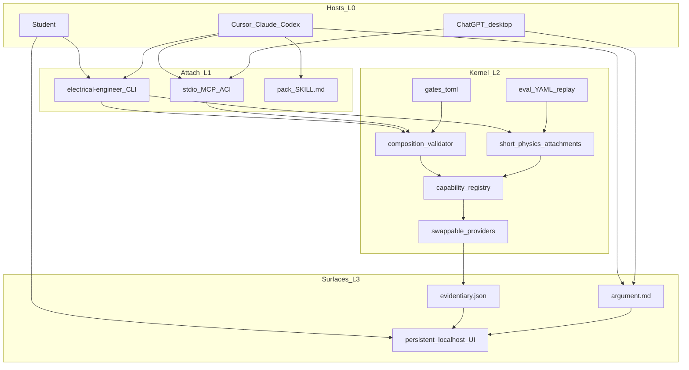
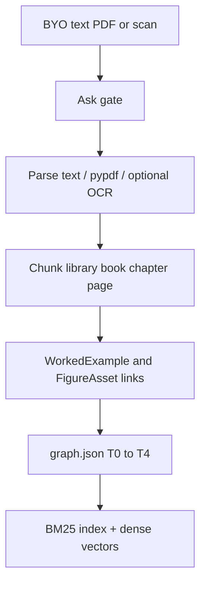
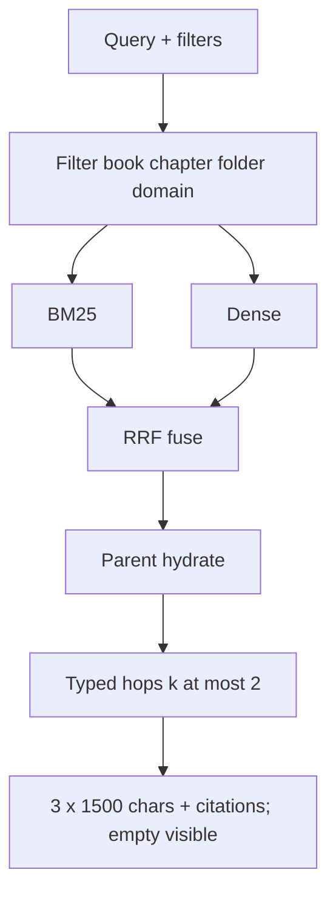

# Technical architecture — Arc

Human walkthrough (plain language: what Arc adds, determinism, MATLAB coming next): [`ON_THE_HARNESS.md`](ON_THE_HARNESS.md). Topic pages (RAG ingest/query graphs): [`architecture/`](architecture/).

**Status:** Accepted for this graph (D19/D20 graph-of-loops, 2026-09-13) overlay on Accepted A1 (2026-09-10). Hybrid composition (D18), **capability-first domain contract (D19)**, plus **harness persist / observe / spawn (D20)**: the rented host owns the loop, compaction, and specialist spawn; the kernel owns runs, memory, RAG ingest, observation, and deterministic hooks. Aligns with [`PRD.md`](PRD.md) / [`PID.md`](PID.md).  
**Date:** 2026-09-12  
**Authority:** [`PID.md`](PID.md) (accepted this graph), [`PRD.md`](PRD.md) (accepted this graph)

Do not invent LangGraph, Temporal, Cordis, or a second agent loop (H5). YAML runner, unmatched, `unchecked`, and MCP-never-waits stay.

**Hybrid quality.** The host (plus 2–3 pack skills) composes the *job*. On a **large** job (entire assignment, several problems, more than one attachment) the host **writes `plan.md` first**, then executes. **Capabilities** own what kind of check is allowed; **providers** (typed engines) produce numbers. **Short** named physics attachments stay as replayable bindings (this-pass example: `simulate-circuit` = lumped-circuit-sim + repair + label). The host may propose an **allowlisted** capability/provider graph; the kernel **validates then runs**. Mega YAML that includes `solve-explain` is **not** the host-path brain — it is CLI-without-host / gold rollback. Evidence: [`../research/notes/hybrid-engine-composition.md`](../research/notes/hybrid-engine-composition.md).

---

## 0. Domain contract (D19) — any UG EE question

This kernel is an **undergraduate electrical-engineering co-solver**, not an ngspice product, not a MATLAB product, not a YAML catalog, and not a FastAPI app. Those are **providers** and **this-pass freezes**. The domain contract is: every question that is in-bound on [`curriculum-map.md`](curriculum-map.md) has a complete path.

**Coverage law.** For every in-bound UG question (any pack × any genre below):

1. Bind one or two packs from the curriculum map (never invent a third discipline).
2. Name Given / Find / assumptions (host + pack skill).
3. Request **capability ids** from the registry in this section — never a session-invented verb.
4. The kernel binds an **installed provider** for each capability, or fails closed to the exact token `unchecked` plus a [`CANNOT_DO.md`](CANNOT_DO.md) id.
5. Write two bands: evidentiary (providers/gates) and argument (host or local fallback).

“Solve any UG EE question” means **that path always exists**. It does **not** mean every numeral is tool-checked, and it does **not** reopen PG, plant-floor, tape-out, or civil/mechanical. A 2nd-year signals problem on a circuits-thin install is `unchecked` (or a later provider), not a silent fake Bode.

**Genres** (from [`../research/notes/ee-task-taxonomy-draft.md`](../research/notes/ee-task-taxonomy-draft.md); every pack owns all seven):

| Genre | Student ask | Kernel owes |
|-------|-------------|-------------|
| Solve | Find a number or closed form | `algebraic-check` and/or a model capability; else `unchecked` |
| Derive | Show the law → result | Method in the argument band; optional `algebraic-check` on the last line |
| Design | Choose a UG parameter/topology to spec | Same as solve, plus assumptions; no professional EDA |
| Simulate | Run a model / plot | The matching model capability **only** with a typed artifact port |
| Review | Critique a solution | Recompute via capabilities; label disagreements `unchecked` if unverified |
| Explain | Viva / concept | Host `argument.md` + optional `retrieve-citation`; no minted ohms |
| Report | Lab numerical + plots | Same as simulate/solve; procedure lives in the argument band |

**Identity vs this-pass freeze.** Swap a freeze without an owner lock only if the identity column still holds.

| Identity (do not silently drop) | This-pass freeze (a provider or encoding, not the thesis) |
|---------------------------------|----------------------------------------------------------|
| H3; four layers 0–3; no H5 loop | Python 3.11+ CLI wrapping the kernel |
| UG bound = curriculum-map union; GATE = eval overlay | Named YAML files under `workflows/` as **replay** of short attachments |
| Exact token `unchecked`; EE kernel is the only checked-number authority | Default providers: ngspice, python-control, pandapower, sympy, MATLAB-if-present |
| Validate-then-apply; never invent capability or provider ids | Activity function names (`run-spice`, …) as the Python registry keys |
| Two-band artifacts + localhost workspace on `127.0.0.1` | FastAPI + Vite/React + Zustand + DESIGN-coinbase tokens |
| Pack skills teach method; gates stay in code | LightRAG 1.5 spike behind a RAG **facade** |
| MCP never waits; photo/compose confirm in the UI | Specific ACI **names** (`simulate_attachment`, …) — kinds stay: catalog, retrieve, attach-physics, propose-graph, label, clarify |
| OSS path complete without MATLAB | MATLAB as optional provider of several capabilities |

### 0.1 Capability registry (stable)

Allowlist. Host and CLI may name these ids. Session-defined ids (`lookup_vout_guess`) are reject. A later code plan may add a capability **only** with a curriculum-map gap and a CANNOT_DO close-out — not because a host wanted a new MCP tool.

| Capability | What it checks or produces | Typical packs | This-pass default provider | Other legal providers (examples, not a promise) |
|------------|----------------------------|---------------|----------------------------|--------------------------------------------------|
| `algebraic-check` | Laws, identities, last-line numeric/symbolic | all | `check-numeric` (sympy/hand) | MATLAB symbolic if present |
| `lumped-circuit-sim` | DC / AC / transient of a **netlist artifact** | circuits, electronics, power_electronics | `run-spice` (ngspice) | LTspice, MATLAB Simscape if present |
| `lti-analysis` | TF/SS, step, Bode, Nyquist, root locus | control, signals | `run-python-control` | MATLAB Control Toolbox if present |
| `power-network-study` | Study-level load flow / fault / per-unit | power | `run-load-flow` (pandapower) | MATPOWER / MATLAB if present |
| `machine-model` | Transformer and rotating-machine eq. circuits, phasors, tests | machines | `check-numeric` (+ optional numeric) | MATLAB if present |
| `converter-model` | Averaged converter / duty / UG switching algebra | power_electronics | `check-numeric` (+ optional lumped sim) | MATLAB if present |
| `signal-analysis` | Convolution, Fourier/Laplace, sampling, LTI signals | signals, maths | `check-numeric` / scipy when present | MATLAB if present |
| `fields-analytic` | UG electrostatics, magnetostatics, plane waves, lossless lines | em | `check-numeric` | none as a public full-wave promise |
| `measurement-model` | Error budgets, bridges, instrument specs | measurements | `check-numeric` | none as live-bench control |
| `retrieve-citation` | Book + chapter + page the student has rights to | all | `retrieve-passage` (RAG facade) | BM25 fallback |
| `render-figure` | Library schematic or plot (PNG+SVG) | all | schemdraw / matplotlib / python-control | other **libraries**, never a vision-invented circuit PNG |
| `ingest-figure` | Photo/diagram → draft structure → **UI confirm** | circuits, control, electronics | photo-stub stages | `control-diagram-to-model` also seeds `control_diagram.json` on canvas |
| `label-unverified` | Exact token `unchecked` | all | `label-unchecked` | — |
| `ask-student` | Missing data, topology confirm | all | `ask-human` / UI | MCP fail-closed with `ui_url` |

Capability-first provider selection stays: **MATLAB if present and registered for that capability, else the OSS default.** Do not invent a third rule. Product and CI work with **zero** MATLAB. Peer MATLAB MCP / Copilot scalars are **not** a provider until an EE engine recomputes them (FR20).

**No-provider path.** If no installed provider can honour a requested capability, the kernel does not guess. It applies `label-unverified` and names the hole (`CD-NO-PROVIDER` or a pack row in [`CANNOT_DO.md`](CANNOT_DO.md)). That is a successful co-solver outcome.

### 0.2 Pack × capability (coverage, not v1 gold depth)

Every public pack must be able to request the capabilities in this table. v1 **gold depth** may still be circuits-first ([`PRD.md`](PRD.md) §8). Missing depth is `unchecked` + cannot-do, not “out of architecture.”

| Pack | Default model capability | Always available |
|------|--------------------------|------------------|
| circuits | `lumped-circuit-sim` when a netlist exists; else `algebraic-check` | retrieve, render, ingest-figure, label, ask |
| signals | `signal-analysis`; `lti-analysis` when the unknown is a TF/plot | retrieve, render, label, ask |
| electronics | `algebraic-check`; `lumped-circuit-sim` for analog netlists | retrieve, render, ingest-figure, label, ask |
| machines | `machine-model` | retrieve, render, label, ask |
| power | `power-network-study` when a network artifact exists; else `algebraic-check` | retrieve, render, label, ask |
| control | `lti-analysis` | retrieve, render, ingest-figure, label, ask |
| power_electronics | `converter-model`; optional `lumped-circuit-sim` | retrieve, render, label, ask |
| measurements | `measurement-model` | retrieve, render, label, ask |
| em | `fields-analytic` | retrieve, render, label, ask |
| maths | `algebraic-check` and/or `signal-analysis` | retrieve, render, label, ask |

Unmatched text (no pack, no typed model artifact) uses **only** retrieve-optional → `label-unverified` → summary. It must not auto-bind `lumped-circuit-sim` because the prompt “looks like a netlist.”

### 0.3 Harness ownership (D20)

A coding harness is prompts, tools, filesystem, orchestration, hooks, and observability. Arc **does not reimplement** that stack. Split:

| Harness part | Owner | We author | Must not |
|--------------|-------|-----------|----------|
| Inner loop, compaction, continuation, model routing, token/cost meters | **L0 host** | nothing | A Python chat loop, compaction middleware, or cost dashboard |
| System / lab prompt, pack skills, specialist spawn prompts | Host **loads**; we **write** files | [`skills/SKILL.md`](../skills/SKILL.md), `skills/<pack>/`, [`hosts/adapters/`](../hosts/adapters/) | This repo’s coding [`AGENTS.md`](../AGENTS.md) as the student lab prompt; EE packs inside vendored `.cursor/skills/` |
| Tools / MCP / CLI | **L1** | verb *kinds* + CLI `rag` / `memory` / `eval` | 1:1 provider MCP; waiting on stdio |
| Sandbox / general browser agent | **L0 host** | localhost UI on `127.0.0.1` for confirm + artifacts | Shipping a second browser agent |
| Spawn / handoff | **L0 host** | spawn map + adapter markdown | A custom multi-agent runtime (H5) |
| Deterministic hooks | **L2 kernel** | ingest → validate-then-apply → repair → observe → lesson-propose → eval | Re-asking a model inside the runner |
| Persist | **L2** | run dir, memory files, RAG index | Silent chat dumps; crash-resume; fleet learning |
| Observe / verify | **L2 + L3** | `observation.json` (or evidentiary seed), gold, `unchecked` | LLM-as-judge; memory `errors.md` as a checked number |

**Spawn map (host-native only).** The main rented host (Cursor / Claude Code / Codex) may start **at most two** pack specialists (maths may occupy the second slot) using **that host’s** Task/subagent UI. Each child loads one pack skill, calls the **same** EE MCP, and must not mint checked numbers or skip UI confirm. Handoff is `run_id` + file URIs under `./runs/<id>/` (or `children/` — §6), not a message bus. Parent writes `argument.md`. Chat/Work does **not** claim pack spawn until Skills-over-MCP. Adapter files: [`hosts/adapters/`](../hosts/adapters/). Catalog: [`hosts/agents/INDEX.md`](../hosts/agents/INDEX.md) (12 cards). The CLI, MCP server, and UI **never** start specialists. A Python process that interviews, plans, and fans out specialists is the H3/H5 falsifier.

---

## 1. System map



**Patterns (agent-patterns MCP unreachable — ids MCP-PENDING):** Pipeline; DAG fan-out; Human-in-the-loop; hard step cap.

---

## 2. Layers (four-layer domain kernel)

Canonical numbering stays **0–3**. A fifth layer is not earned (eval stays 2e; pack method stays 2a). See [`../research/notes/hybrid-engine-composition.md`](../research/notes/hybrid-engine-composition.md).

| Layer | Owns | Must not own |
|-------|------|----------------|
| 0 Host (rented) | Inner loop; compaction/continuation; **spawn** pack specialists; load **2–3** pack skills; **plan then execute**; call ACI; write `argument.md`; ask when data is missing | Kirchhoff as numeric truth; inventing capability ids; minting checked ohms; unique EE chat loop; a Python specialist orchestrator |
| 1 Attach | CLI inner; MCP outer; **5–7 ACI verbs**; host skill files; adapter prompts under `hosts/adapters/` | 1:1 provider MCP; waiting on humans; PTC on physics writes; mega `run_workflow` as the host-path viva |
| 2 Domain kernel | Capabilities, providers, validator, attachments, **kernel hooks**, gates, eval, RAG ingest/index, memory files, `observation.json`, `unchecked` | A unique host-incompatible chat loop (H5); long YAML as the chat brain; compaction; token billing |
| 3 Surfaces | Localhost UI; two-band files; observation excerpt | ChatGPT-clone UI; WAN bind; KiCad clone; treating the UI stack as the domain |

As-built sub-pieces (still true): CLI glue, pack `SKILL.md` **method** files, stdio MCP (`list_workflows` + `run_workflow` only), UI, RAG sidecar, registered **provider** nodes. Target: this section + [`PRD.md`](PRD.md) §5–§6. Capability→provider bind in the runner is a later code plan; today graphs still name provider keys.

**H3 falsifier:** if the CLI grows a custom harness hosts cannot share, stop and return to the owner. Layer 0 stays rented. A **Python multi-turn composition dialog** (interview/plan loop inside the CLI) **or a Python specialist fan-out** is that falsifier. `propose_composition` is one write verb, not a chat product.

**Runner law:** no model calls inside the DAG runner except through **registered providers**, plus one **pre-runner** classifier when the workflow id is omitted **and no host is driving**. The DAG runner itself is deterministic. Host-path attachments **must not** invoke `solve-explain` (FR21). `solve-explain` must not mint checked numbers (FR9). Composition graphs name **capability ids** and/or **registered provider ids** — never a new activity invented in the session.

### 2.1 Layer 0 — Host contract (not a new harness)

The rented host must:

1. Always-on: **root** skill (triggers, 5–7 verbs, `unchecked` law, **plan-then-execute**) plus MCP tool schemas. Not every pack.
2. On domain match, load **at most two** matching pack skills (GraSP 2–3 with root). Packs are **on-demand**, not always-on.
3. On a **large job**, write `./runs/<id>/plan.md` and show it **before** write verbs. Then execute only that plan. Small jobs (one unknown, one short attachment) may skip a written plan.
4. Call kernel ACI instead of one mega-apply of `solve-circuit-problem`.
5. Write the engineering-argument band to `./runs/<id>/argument.md` when a file is needed (Chat/Work may start in the transcript and copy).
6. Treat `unchecked` as law. Stop when gates refuse.
7. **May spawn** at most two pack specialists via the **host’s** Task/subagent feature (adapter markdown in [`hosts/adapters/`](../hosts/adapters/)). The CLI, MCP, and UI never start those children. Do not spawn a second EE product. Handoff is the run dir.

Student-without-host is Layer 0 *absence*: CLI + engines + UI remain a complete path for **numbers**. Viva needs a host or a configured local/BYO model. ChatGPT **web** is not a host.

### 2.2 Layer 1 — Attach (required for hybrid)

Always-on ACI, **5–7 verbs** (names illustrative; implementation is a later code plan). As-built today is `list_workflows` + `run_workflow`.

| Verb | Kind | Notes |
|------|------|--------|
| `list_workflows` | read | Catalog. Host-path rows are **short attachments**; mega `solve-*`/`explain-*` marked rollback |
| `retrieve` | read | Tagged RAG; citations evidentiary |
| `open_ui` / `clarify` | read (+ questions) | MCP **never waits**. Returns `ui_url` |
| `simulate_attachment` | write | Named **short** physics id only (`simulate-circuit`, `photo-to-netlist`, …). Those ids are **bindings** of capabilities to this-pass providers. Never `solve-explain` inside |
| `propose_composition` | write | Graph of **capability ids and/or registered provider ids** + typed ports. `apply: false` **validates and records** the plan (no physics run). `apply: true` (default after a plan exists) **validates then runs**. Not a 45-tool dump |
| `label` / `summary` | write | Gate over child EE artifacts only (FR20) |
| `eval_run` | write | Gold replay. **CLI** on Chat/Work |

`run_workflow` / `electrical-engineer run <id>` remain **headless/eval rollback** and student one-command for **short** attachments. On the **host path** they must not own `solve-explain`.

**Never a host tool:** invent a new capability or provider id; confirm photo without UI; present fluent `Vout` as checked; session-defined `lookup_vout_guess`; PTC on physics-write providers.

Do **not** wrap individual providers (`run-spice`, `run-matlab-if-present`, `run-simulink-if-present`, `run-load-flow`, `retrieve-passage`, `solve-explain`) as extra MCP tools. Capabilities are reached through the verbs above. The host names `lumped-circuit-sim`, not a new `run_ngspice` MCP tool.

CLI inner, MCP outer, PTC/Code Mode later and **reads only**. Dual MATLAB MCP: peer scalars untrusted until an EE engine recomputes (FR20).

### 2.3 Layer 2 — Domain kernel (main)

```text
Host (+ pack skill)
  large job? write plan.md (Given/Find, packs, asks, capabilities)
        |
        v
Kernel ACI (Layer 1)
  retrieve | simulate_attachment | propose_composition | label | open_ui | eval
        |
        v
Validator (allowlist of capability/provider ids + port types + unmatched/photo/unchecked)
        |
        v
Capability registry → installed provider
  algebraic-check | lumped-circuit-sim | lti-analysis | power-network-study
  machine-model | converter-model | signal-analysis | fields-analytic
  measurement-model | retrieve-citation | render-figure | ingest-figure
  label-unverified | ask-student
        |
        v
This-pass providers (Python registry keys; swappable)
  check-numeric | run-spice | run-python-control | run-load-flow
  run-matlab-if-present | retrieve-passage | label-unchecked
        |
        v
apply -> ./runs/<id>/ evidentiary band
```

**Method (2a).** Thick pack skills teach: name the unknown, write the laws of that pack, when to **plan then execute**, which **capability** to request vs `unchecked`, when to ask, how to write the argument band without minting scalars. Skills do **not** mint checked numbers (FR19). They name capabilities, not “always SPICE.” The root skill at `skills/SKILL.md` is always-on and names plan-then-execute plus the coverage law. As-built four-line pack stubs were a **method** hole — pack bodies now carry the UG method for every curriculum pack. Do not move gates into markdown.

**Capabilities then providers (2b).** Registered activities remain typed Python tools (this-pass keys in §15). The **domain** name is the capability. `propose_composition` may use either column of §0.1; the kernel maps capability → installed provider before run. Capability-first provider selection stays (MATLAB if present for that capability, else OSS). `algebraic-check` / `check-numeric` is first-class on `propose_composition` (hand KCL / divider without a circuit simulator). It may set `unchecked: false` **only** from its own solver over ports that are student/netlist/prior-provider artifacts — **not** from host-typed or peer MATLAB/Copilot scalars (FR20). `solve-explain` is a **fallback** when no host is configured; it must not mint `unchecked: false`; it is **not** on the host-path allowlist.

**Short attachments (2c).** Named YAML pipelines that **bind** one or two capabilities to this-pass providers. Example: `simulate-circuit` = load netlist → `lumped-circuit-sim` (`repair_max: 2`) → `label-unverified` → `write-run-summary`. **No** retrieve/explain inside the attachment. YAML is the **eval/CLI replay** catalog of those bindings, not the chat brain and not the only way a signals or EM question is solved.

**Validator (2g).** Host may propose a graph whose nodes are **already in the capability registry or the provider map**. Kernel checks: allowlist of ids; capability→provider bind (or `CD-NO-PROVIDER`); typed ports; acyclicity; 16 nodes / 24 edges; unmatched cannot auto-attach `lumped-circuit-sim`; photo still UI-gated. Then **apply** via the existing in-process runner. Invalid graphs fail closed before physics. This reopens D13 “router never invents a DAG” **only** this far — not ToolWeave free authoring.

**Gates / eval / stores (2d–2f).** Unchanged invariants: unmatched, photo confirm, compose allowlist, exact token `unchecked`, gold scores evidentiary artifacts, `./runs/<id>/` is audit not crash-resume.

### 2.4 Layer 3 — Surfaces (main)

**UI.** Persistent `127.0.0.1` workspace: run list, plots, photo confirm, compose allowlist, RAG inventory, **two-band viewer** (evidentiary vs argument). Not a ChatGPT clone. Not a video timeline. Detail: §9.

**Artifacts.** Canonical files per run:

| File | Band | Who writes | May contain | Must not |
|------|------|------------|-------------|----------|
| `plan.md` | job plan (not a numeric band) | Host; optional kernel outline from `propose_composition apply: false` | Given/Find, packs, asks, retrieve filters, attachment/engine **ids**, what stays `unchecked` | Checked scalars; a spice log presented as done work |
| `evidentiary.json` | evidentiary | Engines + gates (`write-run-summary` seed) | Verifier id, values, `unchecked`, paths to `.cir` / plots / citations | Host judgment presented as SPICE |
| `argument.md` | engineering argument | Host, or local `solve-explain` fallback | Method, viva, labeled inference | Minting a checked scalar; flipping `unchecked` |
| netlist / plots / spice log **path** | evidentiary | Engines | Library-rendered figures | Vision-model circuit PNG with no netlist |

`summary.json` remains the as-built seed of `evidentiary.json` until a code plan splits the filename. Gold continues to score the evidentiary band.

**Agent file interface.** MCP returns `run_id` + file URIs. The host reads the run dir. Chat/Work copies the viva into `argument.md` when a file is needed. Codex / Cursor / Claude Code can write the file directly.

No Layer 4: these files and the UI *are* Layer 3.

### Context contract (always-on vs on-demand)

Always-on: root skill (triggers, 5–7 verbs, `unchecked` law, coverage law, plan-then-execute) + MCP tool schemas + optional `./runs/<id>/` pointer. Never the textbook corpus, never every pack skill, never gold fixtures, never a `propose_composition` **graph body**.

On-demand: matching `skills/<pack>/SKILL.md` (at most two packs), one-level `reference/`, RAG `retrieve` (book/chapter/page), run-dir evidentiary + **observation** + memory **excerpts**.

ChatGPT **web** is not a host. Chat/Work: pin root skill until Skills-over-MCP is verified. Peer MATLAB MCP: untrusted until an EE engine recomputes (FR20).

### 2.5 Kernel hooks (middleware we own)

Not host compaction, continuation, or essay lint. Those stay Layer 0. The kernel pipeline is **deterministic** (code later; this is the contract):

1. **Ingest** (`rag add` / BYO): kernel-owned. Gate ask → parse (text/markdown; optional PDF/OCR; figures linked) → chunk (`book_id` / `chapter_id` / `page`) → T0–T4 graph write → BM25+dense index (`hybrid-graph`). Fail closed if unreadable (`CD-RAG-PARSE` for commercial-scan layout). Circuit-homework photos do **not** take this path (`ingest-figure`). Diagrams: [`architecture/rag.md`](architecture/rag.md).
2. **Validate-then-apply** (D18): allowlist of capability/provider ids, typed ports, unmatched predicate, 16/24 cap.
3. **Simulate repair:** `repair_max: 2` then `label-unverified`. Never a fake pass.
4. **Post-run observe:** write `observation.json` (or fields on the evidentiary seed until rename).
5. **Lesson propose:** if `unchecked`, draft an 800-char `lessons.md` excerpt in the run dir. Do **not** auto-append to project memory.
6. **Eval:** `electrical-engineer eval` reads the evidentiary band only.

A Python middleware loop that re-asks a model is the H5 falsifier. Optional **host** hook snippets (Claude/Codex copy-paste) live in [`hosts/`](hosts/) and may remind the host to write `argument.md`; they are not kernel code.

---

## 3. Language, OS, install (this-pass freeze)

| Topic | Freeze |
|-------|--------|
| Runtime this pass | **Python 3.11+** CLI, runner, and in-process node functions |
| Install | `pip` (and equivalent) on **Linux, macOS, and Windows** |
| Offline | Required: with a configured local model, CLI-only is a complete path. Model-free providers (circuit sim, LTI, load-flow, algebraic-check) work with **no** model |
| MATLAB | **Optional provider.** Product and CI must work with OSS only |
| Later CLI skin | Owner also allowed a Go or Rust CLI wrapping this Python runner. Not the Proposed freeze. Revisit after PRD accept if a static binary is needed |

This table is **how this graph ships**, not what the lab *is*. A later pass may wrap the same capability registry in another language. Main LLM work lives in **Cursor / Claude Code / Codex / ChatGPT desktop** (or a local/BYO model). The CLI is deterministic glue: YAML replay, Python providers, files, UI, eval. ChatGPT web is not a host.

---

## 4. Composition (host path vs CLI)

**Host path (first-class hosts).** The host does **not** pick a mega recipe that includes `solve-explain`. It:

1. Loads 2–3 skills and reads the assignment.
2. If the job is **large** (FR23): write `plan.md`, show it, optionally `propose_composition` with `apply: false` to validate the physics graph. Do not spice yet.
3. Calls `retrieve` when a citation is needed.
4. Executes **only the plan**: `simulate_attachment` and/or `propose_composition` with `apply: true` (capabilities or registered providers).
5. Writes `argument.md`. Calls `label` / `open_ui` / `eval_run` as needed.

A job is **large** when any of: the student asks to solve an entire assignment / worksheet / several numbered problems; more than one short attachment would run; more than one pack would match; photo + simulate in one request; the host would propose a composition graph rather than a single attachment. A job is **small** when there is one unknown and one `simulate_attachment` — a written `plan.md` is optional.

Planning lives in the **rented host** (and `plan.md` on disk). It is not a Python multi-turn planner. `plan.md` cannot mint checked numbers.

The kernel **validates then applies**. Unmatched text still uses **`unmatched-cosolver` only** (no auto-simulate). On the **host path**, that attachment is retrieve-optional → `label-unchecked` → summary — **no** `solve-explain`; the host writes `argument.md`. CLI-without-host / gold may keep the essay node in rollback YAML. Numerics without a verifier artifact use the exact token `unchecked`.

**CLI-without-host.**

1. Explicit id (`electrical-engineer run simulate-circuit`) **skips** classify.
2. If the id is omitted **and no host is driving**, one **small classifier LLM** call ranks named **attachments**. If top-1 and top-2 scores differ by **less than 0.15**, **ask the student** (interrupt).
3. Mega `solve-*` YAML that still contains `solve-explain` is **rollback** for gold and for students who want one command until those recipes are split. Prefer short attachments **or** a capability graph. A signals/EM/machines question must not be forced through `simulate-circuit` just because that YAML exists.

**Validate-then-apply (D13 reopen, QUALITY).** The router still **never invents capability or provider ids**. New graphs are either:

- `propose_composition` — host-authored, **allowlisted capabilities/providers only**, kernel-validated. `apply: false` records the validated graph into `plan.md` and does not run physics. `apply: true` then runs. Or
- `compose-from-parts --advanced` — student CLI, human-gated, typed ports, 16/24 cap.

Inside a named attachment the runner **may** branch on conditional DAG edges, pick a child via `run-recipe` when the parent declares that choice, and multi-hop RAG inside `retrieve-passage` (book → chapter → passages) with a hop cap.

**Forbidden:** unmatched path attaching `lumped-circuit-sim` because text “looks like a netlist”; memory or a BYO PDF instructing a new **capability or provider** into existence; session-defined `lookup_vout_guess`; host-path YAML invoking `solve-explain`.

---

## 5. DAG runner and FSM

Custom **in-process** runner. No LangGraph, Temporal, Treadle, Ordius, or Tasked.

- Recipes: YAML at `workflows/<pack>/<id>.yaml`. **Host path** uses **short physics attachments** (no `solve-explain`). Mega `solve-*` / `explain-*` YAML is eval/CLI rollback.
- Nodes: registered Python functions (the **this-pass provider registry**). `propose_composition` may name capability ids (resolved here) or these ids.
- A node is **ready** when every incoming typed port is satisfied.
- All ready nodes **may run concurrently** (threads or asyncio in **one** process for **one** run).
- **Start order** among simultaneously ready nodes: sorted `node id` (evals replay the same start sequence even if wall clocks overlap).
- Isolation: `runs/<id>/nodes/<node-id>/`. Shared mutable files at the run root are forbidden except the evidentiary band (`summary.json` / `evidentiary.json`) written at the end and host-authored `argument.md`.
- FSM states: `running`, `waiting-human` (live TTY or UI, not crash-resume), `failed`, `done`.
- Timeouts: **2 min** default, recipe override allowed, **10 min** hard ceiling.
- Sim-repair: `repair_max: 2` on named simulate nodes. Automatic. **Does not** count toward human interrupts. After exhaustion: `label-unchecked` or `ask-human`, never a fake pass.

**No crash-resume.** The run directory is **audit**. If the process dies, start a new run. Do not skip nodes by reading old `out.json`.

### Run ids

Format: `{short-suffix}-{utc-timestamp}`, suffix **first**.

- Suffix: 4 chars, lowercase Crockford base32 (or similar), from a few random bytes. Speakable: “run k7m2”.
- Timestamp: `YYYYMMDDTHHMMSSZ`.
- Example: `k7m2-20260910T162148Z`.
- Directory name is always the full id. Display may use the suffix alone only if unique under `./runs/`.

Location: `./runs/<id>/` under the **project root** (cwd, or nearest ancestor with `.electrical-engineer/` or `workflows/`). Gitignore `runs/`.

### Concurrency across runs

No project lock. No cap. Each `electrical-engineer run` is one process, one `runs/<id>/`, one context bundle. Two Cursor chats, or CLI + MCP, may run together. Do not share `summary.json` or spice working directories across runs.

If one process ever hosts several in-flight recipes, use a single deterministic FIFO of ready nodes keyed by `(run_id, node_id)`. No work-stealing, priorities, or remote workers in this pass.

MATLAB: if a single-seat licence errors on a second engine, fail that node clearly. Do not globally serialize all recipes.

---

## 6. Composition, `run-recipe`, and `propose_composition`

**Space (plugins):** swap **providers** behind a capability (`lumped-circuit-sim` → `run-spice` vs `run-matlab-if-present`) without a second CLI.

**Time (attachments):** a short YAML DAG of providers, including nested recipes. Not retrieve+essay+spice in one host-path file. Attachments are optional convenience; a host may `propose_composition` of capabilities with no named YAML row.

Activity **`run-recipe`**: input `recipe_id` plus a small map matching the child’s declared ports. Allowed in checked-in YAML **and** in DAGs emitted by `compose-from-parts` **or** accepted by `propose_composition`.

Child run dir: `runs/<parent-id>/children/<child-suffix>-<timestamp>/` (same id rules). Child evidentiary summary is the parent node’s output (short JSON + **paths**, not bodies).

Hard rules:

- Cycle detection on the recipe-id graph. `A → A` or `A → B → A` rejected **before** run.
- Max nesting depth **3** (root = 0).
- A `run-recipe` node counts as **one** node on the parent’s 16-node cap. The child has its **own** 16/24 budget.
- Child interrupts count toward the parent’s **2-interrupt** budget.
- Child gates use the same policy. MCP still does not wait.

### `propose_composition` (host path)

MCP/CLI verb. Body: a DAG whose **every node is a capability id or a registered provider id**, plus typed port bindings. Kernel validator (always, including `apply: false`):

1. Unknown id → reject (no `lookup_vout_guess`). Capability ids resolve through the provider map; missing provider → `CD-NO-PROVIDER` / `label-unverified`, not a fluent number.
2. Activity is `solve-explain` → reject on the **host path** (FR21). CLI-without-host / gold rollback may still run that node inside named YAML.
3. `run-recipe` child must be a **short attachment** (no `solve-explain` in the child YAML). Nesting mega `solve-*` is reject.
4. Port type mismatch or cycle → reject.
5. Over 16 nodes / 24 edges → reject.
6. Would attach `lumped-circuit-sim` without a **netlist artifact** on an incoming typed port (raw problem text, unmatched prompt, or host-typed `.cir` that did not come from `photo-to-netlist` / student file / prior provider) → reject. Unmatched is a kernel signal (no matching short attachment **and** no netlist port), not skill prose. Other model capabilities have the same class of artifact predicate (network case for `power-network-study`, TF/SS for `lti-analysis`).
7. Graph contains photo stages or MATLAB or `ask-human` → on **MCP**, do not apply; fail closed with `ui_url` (never wait). CLI may enter `waiting-human`.
8. Would skip photo UI confirm for photo-stage graphs → fail closed with `ui_url`.
9. If `apply: false`: persist the validated outline into `plan.md` (capability/provider ids + ports, not physics logs) and return `run_id` + path. **Do not run providers.**
10. If `apply: true`: **apply** through the in-process runner.

This is GraSP-shaped, not a skill-to-DAG compiler: the host proposes edges among **already registered** capabilities/providers; the kernel verifies types and allowlist; locality-bounded repair stays `repair_max: 2` inside simulate providers. Do not call this a GraSP compile. Large jobs should call `apply: false` first (FR23).

### `compose-from-parts`

Listed, **`--advanced`**. Student/CLI cousin of `propose_composition`. Typed ports. Cap **16 nodes / 24 edges**. Invalid graphs fail closed before spice. May include `run-recipe` nodes. Asking to compose counts as an interrupt (see gates). Still the only **CLI** path that emits a new DAG without a host.

---

## 7. Gates (Cursor-like)

Files:

- Global: `~/.config/electrical-engineer/gates.toml`
- Project: `.electrical-engineer/gates.toml`
- Format: TOML
- Merge: **most-restrictive wins**
- Allow-all: file flag **and** env `EE_ALLOW_ALL` **and** CLI `--allow-all`
- Default: **on**
- Budget: **at most 2** `ask-human` / visual confirms per **root** run (children included). A would-be **3rd** interrupt **aborts**. Do not auto-allow the rest.

| Action | Policy |
|--------|--------|
| Local sim writing only inside that run’s dir (`run-spice`, `run-python-control`, `run-load-flow`) | auto-run |
| MATLAB | ask |
| RAG retrieve (read-only) | auto-run |
| Writes outside the run dir | deny-by-default |
| Photo / vision | ask (UI confirm) |
| Extra network / API from a node (not the student’s configured LLM) | ask |
| Installing packages | deny-by-default |
| `compose-from-parts` | ask |
| `propose_composition` | MCP: **never wait** — preflight MATLAB / photo / `ask-human`; if any would ask, fail closed with `ui_url`. CLI: same ask policy as those child engines |
| `run-recipe` | inherits child gates; no extra ask just for nesting |
| Memory file write | auto-run inside the two memory dirs; deny anywhere else |
| RAG ingest (BYO add) | ask (persistent index) |

Configured host / BYO / local **LLM** is allowed without a gate. “Network” ≠ that model.

**MCP:** write verbs (`run_workflow`, `simulate_attachment`, `propose_composition`, `label`) **never wait**. If a gate would fire: fail closed with a structured error, a `ui_url` when the UI is up, or the exact command `electrical-engineer ui --run <id>`, plus a CLI hint. Host UI is **not** allow-all.

Eval may set `EE_ALLOW_ALL=1` so gates do not block CI. That does **not** disable the `unchecked` contract.

---

## 8. CLI and MCP

Specified, not shipped.

| Command | Now / later |
|---------|-------------|
| `electrical-engineer run <id>` | now |
| `electrical-engineer workflows` | now (discovery) |
| `electrical-engineer mcp` | now (stdio) |
| `electrical-engineer eval` / `eval --pack circuits` | now |
| `electrical-engineer ui` / `ui --run <id>` | now |
| `electrical-engineer rag add \| list \| tag` | now |
| `electrical-engineer memory` | now |
| `electrical-engineer resume` | **later** |
| Faculty / LMS | **never** |

MCP **as-built** (stateless stdio): `list_workflows`, `run_workflow` (mega-apply; photo/compose/control-diagram fail closed with `ui_url`).

MCP **target** (same 5–7 always-on verbs as §2.2): `list_workflows`, `retrieve`, `open_ui`/`clarify`, `simulate_attachment`, `propose_composition`, `label`/`summary`; `eval_run` is CLI-equivalent on Chat/Work. HTTP/SSE **later**. `resume_workflow` / `list_runs` / `get_run` **later**.

Each write verb returns short JSON + `run_id` + artifact **paths** (not bodies). **`propose_composition` returns `composition_id` / `run_id` + paths — never the accepted graph JSON** (that would blow the 800-char after-each-node budget). The **host** reads `./runs/<id>/` and writes `argument.md`. The CLI assembles context for the **local-model** path. Do not build a second hidden prompt loop inside MCP. `run_workflow` remains an alias for headless apply of a **short** attachment id. Engine allowlist is enforced **server-side**; always-on `inputSchema` must not enumerate every registered activity.

---

## 9. Persistent localhost UI (critical)

The UI is a **first-class product surface**, not a fine-diagram gadget.

**Why.** Cursor/Claude users (and CLI users) need a place that **stays up** so both the **student and the agent** can see and understand: current and past runs, library-rendered schematics, plots, photo-stub topology, citations, RAG inventory, and memory excerpts. Understanding is the point of the co-solver.

**Stack (this-pass freeze, not the domain).** FastAPI serves a Vite/React CSR SPA. Zustand holds layout + current run id. A **thin in-repo slot registry** (inspire DSH named holes; **no Cordis / DSH runtime**). Visual tokens: [`design/DESIGN-coinbase.md`](design/DESIGN-coinbase.md) (Inter + JetBrains/Geist Mono; never Coinbase fonts or wordmark). Slot map: `root`, `sidebar`, `workspace`, `run.detail`, `run.artifacts`, `run.plan` (job plan), `run.bands` (two-band viewer), `run.observation` (excerpt of `observation.json`), `photo.confirm`, `rag.inventory`, `memory.excerpt`, `gates.prompt`. Layout: `src/electrical_engineer` + `ui/`. The **domain** requirement is a persistent `127.0.0.1` two-band workspace with photo confirm. Swapping the web stack later does not change Layer 3’s job.

**Shape**

- Command: `electrical-engineer ui` (optionally `--run <id>`). CLI **auto-opens** it when a recipe hits a **visual** gate.
- Long-lived local HTTP server. Bind **`127.0.0.1` only**. No product cloud. No LAN bind by default.
- Persistent for the working session (and may stay up across runs). Text-only recipes never **require** it; it still helps browse artifacts.
- **Two-band viewer:** evidentiary pane (numbers, `unchecked`, verifier id, plots, citations) beside argument pane (`argument.md`). The argument pane is read-only for checked scalars — editing markdown cannot flip `unchecked`.
- **Job plan:** `run.plan` shows `plan.md` when present. Looking at the plan is not executing spice. `plan.md` is not a third numeric band.
- Thin viewer + confirm: render **library** SVG/PNG plus the JSON graph. If the student edits topology, the UI updates the JSON graph / netlist, then a **library re-renders**. Not a KiCad clone. Not an image-model PNG.
- Photo stub confirm happens **here**, not as ASCII-only.
- After photo confirm: **still no sim** in the stub (C4 sim remains later).
- MCP does not wait; fail payload points at this UI (`ui_url` includes `run_id`).

**As-built vs target.** As-built UI is a single-band viewer of `summary.json` (slots: `root`, `sidebar`, `workspace`, `run.detail`, `run.artifacts`, `photo.confirm`). That **cannot** stop `argument.md` looking like SPICE — FR18 has no UI enforcement point until `run.bands` ships. This docs pass specifies the target; filling slots is a later UI plan. Do not swap FastAPI+React for a static viewer (photo confirm and gates need HTTP). Do not grow an in-UI agent loop (H5).

This remains **H3 glue** (a viewer/workspace). If the UI grows its own agent loop, that is the H5 falsifier.

---

## 10. RAG (quality is mandatory)

**As-built default (ADR-0004):** Arc-owned **`hybrid-graph`** facade — tagged, citable, local RAG. QUALITY then SPEED. Optional MinerU/RAG-Anything/LightRAG adapters may plug in later; they are **not** the product identity and are **not** CI-required ([`CANNOT_DO.md`](CANNOT_DO.md) `CD-RAG-ANYTHING` / `CD-RAG-ENGINE`). Commercial-scan layout fidelity remains `CD-RAG-PARSE`. Full graphs and ontology: [`architecture/rag.md`](architecture/rag.md). Research: [`../research/notes/rag-ingest-query-architecture.md`](../research/notes/rag-ingest-query-architecture.md). Eval: [`../research/notes/rag-eval-pack-stack.md`](../research/notes/rag-eval-pack-stack.md).

**Approach judgment (architecture):** Filter-first **BM25 ∥ dense → RRF → ≤2 typed hops** over a small academic graph (worked examples, figures, light propositions) is a **sound production pattern** for UG textbooks: strong lexical hit on symbols (`KVL`, `V=IR`), semantic headroom when MiniLM is installed, multi-hop without GraphRAG community map-reduce or agent rewrite loops in the runner. It is the right default under a **p95 ≤ 7 s** interactive budget. Heavier multimodal parse stays an optional ingest adapter, not the query path.

**Ingest pipeline** (student BYO; student machine only; **kernel owns the write**). Student walkthrough: [`rag-byo.md`](rag-byo.md).



```text
drop .electrical-engineer/corpus/<book_id>/
  → electrical-engineer rag add PATH --book-id --chapter-id --domain-tag --licence-tag
  → gate (ask; persistent index)
  → extract (text/markdown; optional PDF text / OCR; figures linked when present)
  → chunk + graph write (T0–T4; page on the chunk)
  → index (BM25 + dense; engine label hybrid-graph)
```

**Query pipeline** (**kernel owns hops and packing**; host only sends query + tags). Host may call `retrieve` more than once; each kernel call is one shot + hop cap.



Keep an explicit source tree: **library → book → chapter → chunk**.

EE metadata on the chunk note: `doc_id`, title, chapter, section, pages, `licence_tag`, `folder_tag`, student tags, `domain_tag`, `chunk_type`. Optional concept-graph prerequisites remain the P1 overlay in [`../research/notes/rag-chunking-and-retrieval.md`](../research/notes/rag-chunking-and-retrieval.md).

| Rule | Freeze |
|------|--------|
| BYO ingest | PDFs **and** images (scans). Circuit-homework photos for **simulation** still go through `photo-to-netlist` / `ingest-figure`, not quiet RAG-as-netlist |
| Inventory | `electrical-engineer rag list` — every ingested source and its tags. CLI is enough this pass (MCP `retrieve` is the FR17 read verb, not a third dump of nodes) |
| Filters (v1 retrieval) | `book_id`, `chapter_id`, `folder_tag`, `domain_tag`. “Search only this book, chapter 3” is required, not optional |
| Hybrid | dense + BM25 then bounded graph hops (`hybrid-graph`). Empty retrieval is **visible**, never silent |
| Citations | book + chapter + page (+ tag if filtered) |
| Legal | no commercial PDFs in git; BYO stays on the student’s machine |
| Untrusted | ingest cannot override gates, `--allow-all`, or `unchecked`; cannot mint a capability id |

**Very good RAG** means **precision under a small context budget**, not dumping chapters.

---

## 11. Memory

Not the RAG index. Not a chat dump. Not a product that learns from other students’ machines. “Improves with usage” means **this student’s** project and user files.

| Scope | Path |
|-------|------|
| Project | `.electrical-engineer/memory/` (student may commit as a course notebook) |
| User | `~/.local/share/electrical-engineer/memory/` (never in the project repo) |

**Normative files** (one concern each; same names in both scopes):

| File | Write when | Must not |
|------|------------|----------|
| `preferences.md` | Units, notation, “always show steps” | Checked ohms |
| `course.md` | Course code, `book_id` filters, active pack | Invent a capability |
| `facts.md` | Student-confirmed identities they want reused | Copy a textbook chapter |
| `errors.md` | Recurring mistakes (forgot pu, wrong ground) | Dump SPICE logs |
| `lessons.md` | **Explicit** post-run: what stayed `unchecked` and why | Silent append every turn |

**Write law.** Host or CLI `memory write <file>` only. Kernel hook §2.5 may **propose** a lesson (run-dir path + 800-char draft) when `unchecked: true`. Applying it is an explicit write. It does **not** count toward the 2-interrupt budget. Cap **32 KiB per file**; over cap ⇒ summarise. Context: **paths + excerpt** (800-char class), never the whole folder. Untrusted: cannot override gates, `--allow-all`, or `unchecked`. A line in `errors.md` is not a verifier.

**Past user input.** The assignment PDF is a host file or RAG ingest, not memory. `problem.json` in the run dir snapshots that job. Preferences / errors / lessons are how the **next** job improves.

Run audit (not memory): `./runs/<id>/` — `problem.json`, node `out.json`, evidentiary seed, `plan.md`, `argument.md`, `observation.json`, artifact **paths**. Not crash-resume.

---

## 12. Context policy

| Always | Skill **index** (id + one line) |
|--------|--------------------------------|
| On EE tasks | matching `skills/<pack>/SKILL.md` |
| After each node | ≤ **800** chars JSON + **paths**, not bodies |
| RAG in context | cited passages, max **1500 chars × 3**, plus book + chapter + page (and tag if filtered). Paths-only is **not** enough for C2 |
| Filtered RAG | honour book/chapter/folder tags **before** filling the 3-passage budget |
| Never | full SPICE traces, RAG index dump, conversation logs, full memory folder, full chapter text |

Skills live at `skills/<pack>/SKILL.md`. CLI and hosts read the **same** files.

---

## 13. Trust, math, figures, two-band files

**Unchecked.** The exact token `unchecked` appears in the student-facing answer **and** the evidentiary file has a field plus a sentence. Synonyms (`unverified`, `not simulated`) are **not** the contract token.

**LaTeX.** Answers with mathematics use `$...$` / `$$...$$` (or `\[ \]`). Evidentiary JSON may include `math: latex | plain`. CLI prints plaintext/unicode fallback. Hosts get LaTeX. Unmatched delimiters are a **defect**.

**Figures.** Forbidden default: vision model invents a pretty circuit PNG with no netlist. Required: node/agent writes **Python against a library** (`render-figure`) → artifacts in the run dir → UI displays them.

First-class **this-pass** libraries (swap behind `render-figure` if a later pass measures better):

- Circuits drawing: **schemdraw** (and/or lcapy diagrams)
- Numeric plots: **matplotlib**
- Control plots: **python-control** (Bode, step, root locus)
- Model providers: `lumped-circuit-sim` / `lti-analysis` / `power-network-study` / optional MATLAB

Export **png** (share/report) and **svg** (crisp in UI).

### Two-band file contract (Layer 3)

OpenMontage steal: **schemas**, not video checkpoints. Prose (on-disk JSON Schema is a later P1; not this docs pass).

`evidentiary.json` (providers/gates write; host must not):

```text
run_id, recipe_id or composition_id
verifier: <capability> via <provider> | none
  examples: algebraic-check/check-numeric | lumped-circuit-sim/run-spice | lti-analysis/run-python-control | none
values: { name: number | "unchecked", unit? }
unchecked: bool
citations: [{ book, chapter, page }]
artifact_paths: [ netlist, plots, spice_log_path ]
```

`argument.md` (host writes; local `solve-explain` fallback):

```text
# Engineering argument
Method, viva, assumptions.
Any numeral not bound to an evidentiary key is written with the exact token unchecked or omitted.
```

`plan.md` (host writes before large-job execute; optional kernel outline from `apply: false`):

```text
# Job plan
Given / Find
Packs (at most two)
Ask the student first?
Retrieve filters
Attachments or capability/provider ids (not invented verbs)
What stays unchecked
```

Same clamp as the argument band: `plan.md` must not mint a checked scalar or flip `unchecked`.

`observation.json` (kernel writes at end of run; host must not mint numbers here):

```text
run_id
capabilities: [ ids ]
providers: [ ids ]
nodes: { id: { ok, unchecked } }
unchecked_reason: no-provider | sim-exhausted | unmatched | empty-retrieve | gate-closed | labeled | null
# labeled is residual: answered, unverified, nothing for the host to act on.
# Prefer a more specific reason when one applies: no-provider (install a tool),
# gate-closed (confirm a draft), unmatched (router miss), empty-retrieve, sim-exhausted.
retrieve: { empty, filters, citations }
# P1: wall_ms per node. Never token/cost (host).
```

Until a code plan splits the file, these fields may live on `summary.json`. **One observation writer.** A lesson in `errors.md` is not this record and is not verification.

`write-run-summary` / as-built `summary.json` is the **seed** of `evidentiary.json`. **One evidentiary writer.** Until a code plan renames the file, gold/UI/MCP read `summary.json`. After the split, `evidentiary.json` is canonical and `summary.json` is either removed or a compat alias of the same bytes — **never two live writers**. A host-authored markdown file next to it **must not** flip `unchecked` to false. Displaying an unlabeled numeral in the argument band is a fail.

**Run dir contents:** node JSON, two-band files, artifact paths, spice **log path** (not body). No API keys. Redact `*_KEY`, `*_TOKEN`, `*_SECRET`, `sk-`, `Bearer`, MATLAB licence strings.

**Injection:** BYO PDFs, photos, folder tags, and memory files **cannot** override gates, `--allow-all`, or `unchecked`. `argument.md` cannot override them either. `observation.json` cannot flip `unchecked` by itself — the evidentiary `unchecked` field is the contract.

Gold still scores the **evidentiary** band, not `observation.json` and not `argument.md`.

---

## 14. Eval (specified this pass)

Gold home: [`../eval/gold/`](../eval/gold/README.md).

```text
eval/gold/
  circuits/
  control/
  unmatched/
  injection/          # BYO-PDF must not flip gates
```

Suggested item shape (prose, not a JSON Schema): `task.md` (student-facing prompt), `expect.json` (numeric tolerances, required token `unchecked` or checked, `recipe_id`), optional `fixtures/`.

`electrical-engineer eval` and `eval --pack circuits`. A gold item **names a recipe** (short attachment id on the host-path catalog; mega solve YAML only as rollback) **or**, later, a capability graph id. Scoring reads the **evidentiary** band (`summary.json` today; `evidentiary.json` when split). MATLAB optional. `EE_ALLOW_ALL=1` may skip gates in CI; **unchecked** still scores. Do **not** score `argument.md` as if it were a simulator. Gold may tag GATE sections; missing a curriculum pack is still a product gap.

Do not design a hosted leaderboard, LLM-as-judge platform, or a 200-task bank here.

---

## 15. Activity nodes (this-pass provider keys)

Student-facing names live in [`WORKFLOWS.md`](WORKFLOWS.md). Domain names live in §0.1. Activities below are **provider keys** (not a classifier):

`retrieve-passage` (`retrieve-citation`), `check-numeric` (`algebraic-check` and several model capabilities when no dedicated sim is installed), `run-spice` (`lumped-circuit-sim`), `run-python-control` (`lti-analysis`), `run-matlab-if-present` (optional provider of several capabilities), `run-simulink-if-present` (optional Simulink toolkit; fail closed to `CD-SIMULINK-PLANT`), `run-load-flow` (`power-network-study`), `ask-human` (`ask-student`), `label-unchecked` (`label-unverified`), `write-run-summary`, `solve-explain`, photo stages `detect-components`, `connect-wires`, `ocr-labels`, `draft-netlist`, `confirm-topology` (`ingest-figure`), `run-recipe`.

Simulate seam: **separate** providers per capability. MATLAB if present else OSS (PRD P1). Do not invent a third rule. Do not add a new MCP tool per provider.

---

## 16. Local OpenAI-compatible LLM

CLI path for `solve-explain` uses a local OpenAI-compatible HTTP client (LM Studio / Ollama / vLLM). Skip-if-missing in CI. Hosts keep their own loops. BYOK is **later** (not this graph).

---

## 17. Non-goals (this architecture)

- LangGraph, Temporal cluster, DSH/Cordis runtime, Treadle/Ordius/Tasked
- Crash-resume, HTTP MCP, `resume` CLI, BYOK
- Hosted eval, full schematic editor, locking a RAG engine before the spike
- Per-field JSON Schema
- Faculty/LMS, H4/H5, second git repo, civil/mechanical packs
- Treating ngspice, MATLAB, YAML, FastAPI, or LightRAG as the product identity
- Claiming every UG numeral is simulated; the honest path is `unchecked`
- PG-only optimal control, live PLC, analog tape-out, commercial full-wave as a public promise
- Product-cloud telemetry; silent chat-dump memory; fleet learning from other students
- Compaction / continuation / model routing inside the CLI
- A custom multi-agent runtime (host-native spawn only)

---

## Owner review checkpoint

Closed A1 2026-09-10 (owner: start / execute this graph):

- [x] Hybrid router, named recipes, compose `--advanced` only
- [x] Python 3.11+ pip CLI; deterministic runner; hosts own the main LLM
- [x] Persistent localhost UI as a **critical** shared workspace (FastAPI + React slots, DESIGN-coinbase)
- [x] Typed DAG + `run-recipe` depth 3; no crash-resume
- [x] Gates, MCP fail-closed, `unchecked` exact token
- [x] RAG facade after LightRAG 1.5 spike; markdown memory
- [x] `eval/gold/` + `electrical-engineer eval`
- [x] **Architecture accepted** for this graph

Proposed hybrid overlay (2026-09-12) — owner Accept lives on the vision lock sheet, not here:

- Host + pack skills compose; typed engines; short attachments; `propose_composition` validate-then-apply
- Two-band files + UI viewer; mega YAML with `solve-explain` is host-path rollback
- Layer 4 withheld; L0 contract and L1 ACI updated because the hybrid requires them

Proposed capability-first overlay (D19, 2026-09-12) — same Accept sheet:

- Coverage law: every in-bound UG question has a complete path (check or `unchecked`)
- Capability registry is the domain contract; providers and YAML/UI/RAG engines are this-pass freezes
- `propose_composition` may name capability ids; kernel binds an installed provider or `CD-NO-PROVIDER`

Proposed harness overlay (D20, 2026-09-12) — same Accept sheet:

- Host owns loop, compaction, spawn; kernel owns persist, observation, ingest hooks, memory write law
- BYO RAG pipeline as-built as `hybrid-graph` (extract/chunk/graph + BM25∥dense + ≤2 hops); commercial-scan layout fidelity remains `CD-RAG-PARSE`; graphs in [`architecture/rag.md`](architecture/rag.md)
- Pack specialists are host-native adapters, not a Python orchestrator
