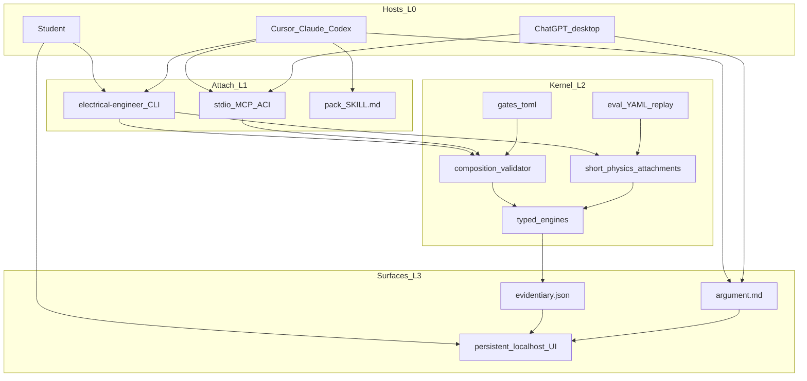

# Technical architecture — Electrical Engineer

**Status:** Proposed (2026-09-12) overlay on Accepted A1 (2026-09-10). Hybrid composition (2026-09-12): host + pack skills compose; typed engines; short attachments; validate-then-apply. Aligns with Proposed [`PRD.md`](PRD.md) / [`PID.md`](PID.md).  
**Date:** 2026-09-12  
**Authority:** [`PID.md`](PID.md) (Proposed), [`PRD.md`](PRD.md) (Proposed)

Do not invent LangGraph, Temporal, Cordis, or a second agent loop (H5). YAML runner, unmatched, `unchecked`, and MCP-never-waits stay.

**Hybrid quality.** The host (plus 2–3 pack skills) composes the *job*. Typed **engines** own numbers. **Short** named physics attachments (`simulate-circuit` = spice + repair + label) stay as code. The host may propose an **allowlisted** engine graph; the kernel **validates then runs**. Mega YAML that includes `solve-explain` is **not** the host-path brain — it is CLI-without-host / gold rollback. Evidence: [`../research/notes/hybrid-engine-composition.md`](../research/notes/hybrid-engine-composition.md).

---

## 1. System map



**Patterns (agent-patterns MCP unreachable — ids MCP-PENDING):** Pipeline; DAG fan-out; Human-in-the-loop; hard step cap.

---

## 2. Layers (four-layer domain kernel)

Canonical numbering stays **0–3**. A fifth layer is not earned (eval stays 2e; pack method stays 2a). See [`../research/notes/hybrid-engine-composition.md`](../research/notes/hybrid-engine-composition.md).

| Layer | Owns | Must not own |
|-------|------|----------------|
| 0 Host (rented) | Inner loop; load **2–3** pack skills; call ACI; write `argument.md`; ask the student when data is missing | Kirchhoff as numeric truth; spice DAG invention; minting checked ohms; unique EE chat loop |
| 1 Attach | CLI inner; MCP outer; **5–7 ACI verbs** including `propose_composition`; host skill files | 1:1 node MCP; waiting on humans; PTC on spice writes; mega `run_workflow` as the host-path viva |
| 2 Domain kernel | Engine registry, validator, short physics attachments, gates, eval replay, RAG store, `unchecked` | A unique host-incompatible chat loop (H5); long YAML as the professional-workflow brain |
| 3 Surfaces | Localhost UI; two-band files (`evidentiary.json`, `argument.md`) | ChatGPT-clone UI; WAN bind; KiCad clone |

As-built sub-pieces (still true): CLI glue, pack `SKILL.md` stubs, stdio MCP (`list_workflows` + `run_workflow` only), UI, RAG sidecar, registered nodes. Target: this section + [`PRD.md`](PRD.md) §5–§6.

**H3 falsifier:** if the CLI grows a custom harness hosts cannot share, stop and return to the owner. Layer 0 stays rented. A **Python multi-turn composition dialog** (interview/plan loop inside the CLI) is that falsifier. `propose_composition` is one write verb, not a chat product.

**Runner law:** no model calls inside the DAG runner except through **registered nodes**, plus one **pre-runner** classifier when the workflow id is omitted **and no host is driving**. The DAG runner itself is deterministic. Host-path attachments **must not** invoke `solve-explain` (FR21). `solve-explain` must not mint checked numbers (FR9).

### 2.1 Layer 0 — Host contract (not a new harness)

The rented host must:

1. Load the **root** skill plus **at most two** matching pack skills (GraSP 2–3), not every pack.
2. Call kernel ACI instead of one mega-apply of `solve-circuit-problem`.
3. Write the engineering-argument band to `./runs/<id>/argument.md` when a file is needed (Chat/Work may start in the transcript and copy).
4. Treat `unchecked` as law. Stop when gates refuse.

Student-without-host is Layer 0 *absence*: CLI + engines + UI remain a complete path for **numbers**. Viva needs a host or a configured local/BYO model. ChatGPT **web** is not a host.

### 2.2 Layer 1 — Attach (required for hybrid)

Always-on ACI, **5–7 verbs** (names illustrative; implementation is a later code plan). As-built today is `list_workflows` + `run_workflow`.

| Verb | Kind | Notes |
|------|------|--------|
| `list_workflows` | read | Catalog. Host-path rows are **short attachments**; mega `solve-*`/`explain-*` marked rollback |
| `retrieve` | read | Tagged RAG; citations evidentiary |
| `open_ui` / `clarify` | read (+ questions) | MCP **never waits**. Returns `ui_url` |
| `simulate_attachment` | write | Named **short** physics id only (`simulate-circuit`, `photo-to-netlist`, …). Never `solve-explain` inside |
| `propose_composition` | write | Graph of **registered engine ids** + typed ports. Kernel **validates then runs**. Not a 45-tool dump |
| `label` / `summary` | write | Gate over child EE artifacts only (FR20) |
| `eval_run` | write | Gold replay. **CLI** on Chat/Work |

`run_workflow` / `electrical-engineer run <id>` remain **headless/eval rollback** and student one-command for **short** attachments. On the **host path** they must not own `solve-explain`.

**Never a host tool:** invent a new engine id; confirm photo without UI; present fluent `Vout` as checked; session-defined `lookup_vout_guess`; PTC on spice/MATLAB/load-flow writes.

Do **not** wrap `run-spice`, `run-matlab-if-present`, `run-load-flow`, `retrieve-passage`, `solve-explain` as extra MCP tools. Engines are reached through the verbs above.

CLI inner, MCP outer, PTC/Code Mode later and **reads only**. Dual MATLAB MCP: peer scalars untrusted until an EE engine recomputes (FR20).

### 2.3 Layer 2 — Domain kernel (main)

```text
Host (+ pack skill)
  propose: retrieve? attach physics? ask student?
        |
        v
Kernel ACI (Layer 1)
  retrieve | simulate_attachment | propose_composition | label | open_ui | eval
        |
        v
Validator (allowlist + port types + unmatched/photo/unchecked)
        |
        v
Engine registry (typed ports, one activity each)
  check-numeric | run-spice | run-python-control | run-load-flow
  run-matlab-if-present | retrieve-passage | label-unchecked
        |
        v
apply -> ./runs/<id>/ evidentiary band
```

**Method (2a).** Thick pack skills teach: name the unknown, write KCL/KVL, when to simulate vs `unchecked`, when to ask, how to write the argument band without minting scalars. Skills do **not** mint checked numbers (FR19). As-built four-line stubs (`skills/circuits/SKILL.md`) are a **method hole**, not a number hole — a later skill-body plan fills circuits first. The contract is already this; do not move gates into markdown.

**Engines (2b).** Registered activities are typed tools. Capability-first provider selection stays (MATLAB if present, else ngspice / python-control). `check-numeric` is first-class on `propose_composition` (hand KCL / divider without spice). It may set `unchecked: false` **only** from its own solver over ports that are student/netlist/prior-engine artifacts — **not** from host-typed or peer MATLAB/Copilot scalars (FR20). `solve-explain` is a **fallback** when no host is configured; it must not mint `unchecked: false`; it is **not** on the host-path allowlist.

**Short attachments (2c).** Named YAML pipelines that attach physics only. Example: `simulate-circuit` = load netlist → `run-spice` (`repair_max: 2`) → `label-unchecked` → `write-run-summary`. **No** retrieve/explain inside the attachment. YAML is the **eval/CLI replay** catalog of those attachments, not the chat brain.

**Validator (2g).** Host may propose a graph whose nodes are **already in the engine registry**. Kernel checks: allowlist of activity ids; typed ports; acyclicity; 16 nodes / 24 edges; unmatched cannot auto-spice; photo still UI-gated. Then **apply** via the existing in-process runner. Invalid graphs fail closed before spice. This reopens D13 “router never invents a DAG” **only** this far — not ToolWeave free authoring.

**Gates / eval / stores (2d–2f).** Unchanged invariants: unmatched, photo confirm, compose allowlist, exact token `unchecked`, gold scores evidentiary artifacts, `./runs/<id>/` is audit not crash-resume.

### 2.4 Layer 3 — Surfaces (main)

**UI.** Persistent `127.0.0.1` workspace: run list, plots, photo confirm, compose allowlist, RAG inventory, **two-band viewer** (evidentiary vs argument). Not a ChatGPT clone. Not a video timeline. Detail: §9.

**Artifacts.** Canonical files per run:

| File | Band | Who writes | May contain | Must not |
|------|------|------------|-------------|----------|
| `evidentiary.json` | evidentiary | Engines + gates (`write-run-summary` seed) | Verifier id, values, `unchecked`, paths to `.cir` / plots / citations | Host judgment presented as SPICE |
| `argument.md` | engineering argument | Host, or local `solve-explain` fallback | Method, viva, labeled inference | Minting a checked scalar; flipping `unchecked` |
| netlist / plots / spice log **path** | evidentiary | Engines | Library-rendered figures | Vision-model circuit PNG with no netlist |

`summary.json` remains the as-built seed of `evidentiary.json` until a code plan splits the filename. Gold continues to score the evidentiary band.

**Agent file interface.** MCP returns `run_id` + file URIs. The host reads the run dir. Chat/Work copies the viva into `argument.md` when a file is needed. Codex / Cursor / Claude Code can write the file directly.

No Layer 4: these files and the UI *are* Layer 3.

### Context contract (always-on vs on-demand)

Always-on: root skill (triggers, 5–7 verbs, `unchecked` law) + MCP tool schemas + optional `./runs/<id>/` pointer. Never the textbook corpus, never every pack skill, never gold fixtures.

On-demand: matching `skills/<pack>/SKILL.md`, one-level `reference/`, RAG `retrieve` (book/chapter/page), run-dir evidentiary files.

ChatGPT **web** is not a host. Chat/Work: pin root skill until Skills-over-MCP is verified. Peer MATLAB MCP: untrusted until an EE engine recomputes (FR20).

---

## 3. Language, OS, install

| Topic | Freeze |
|-------|--------|
| Runtime this pass | **Python 3.11+** CLI, runner, and in-process node functions |
| Install | `pip` (and equivalent) on **Linux, macOS, and Windows** |
| Offline | Required: with a configured local model, CLI-only is a complete path. Spice/control/load-flow work with **no** model |
| MATLAB | **Optional.** Product and CI must work with OSS only (ngspice, python-control, pandapower, sympy) |
| Later CLI skin | Owner also allowed a Go or Rust CLI wrapping this Python runner. Not the Proposed freeze. Revisit after PRD accept if a static binary is needed |

Main LLM work lives in **Cursor / Claude Code / Codex / ChatGPT desktop** (or a local/BYO model). The CLI is deterministic glue: YAML recipes, Python nodes, files, UI, eval. ChatGPT web is not a host.

---

## 4. Composition (host path vs CLI)

**Host path (first-class hosts).** The host does **not** pick a mega recipe that includes `solve-explain`. It:

1. Loads 2–3 skills and reads the assignment.
2. Calls `retrieve` when a citation is needed.
3. Calls `simulate_attachment` with a **short** physics id, **or** `propose_composition` with a graph of **registered** engines.
4. Writes `argument.md`. Calls `label` / `open_ui` / `eval_run` as needed.

The kernel **validates then applies**. Unmatched text still uses **`unmatched-cosolver` only** (no auto-simulate). On the **host path**, that attachment is retrieve-optional → `label-unchecked` → summary — **no** `solve-explain`; the host writes `argument.md`. CLI-without-host / gold may keep the essay node in rollback YAML. Numerics without a verifier artifact use the exact token `unchecked`.

**CLI-without-host.**

1. Explicit id (`electrical-engineer run simulate-circuit`) **skips** classify.
2. If the id is omitted **and no host is driving**, one **small classifier LLM** call ranks named **attachments**. If top-1 and top-2 scores differ by **less than 0.15**, **ask the student** (interrupt).
3. Mega `solve-*` YAML that still contains `solve-explain` is **rollback** for gold and for students who want one command until those recipes are split. Prefer short attachments.

**Validate-then-apply (D13 reopen, QUALITY).** The router still **never invents engine ids**. New graphs are either:

- `propose_composition` — host-authored, **allowlisted engines only**, kernel-validated, then run; or
- `compose-from-parts --advanced` — student CLI, human-gated, typed ports, 16/24 cap.

Inside a named attachment the runner **may** branch on conditional DAG edges, pick a child via `run-recipe` when the parent declares that choice, and multi-hop RAG inside `retrieve-passage` (book → chapter → passages) with a hop cap.

**Forbidden:** unmatched path attaching `run-spice` because text “looks like a netlist”; memory or a BYO PDF instructing a new **engine** into existence; session-defined `lookup_vout_guess`; host-path YAML invoking `solve-explain`.

---

## 5. DAG runner and FSM

Custom **in-process** runner. No LangGraph, Temporal, Treadle, Ordius, or Tasked.

- Recipes: YAML at `workflows/<pack>/<id>.yaml`. **Host path** uses **short physics attachments** (no `solve-explain`). Mega `solve-*` / `explain-*` YAML is eval/CLI rollback.
- Nodes: registered Python functions (the **engine registry**). `propose_composition` may name only these ids.
- A node is **ready** when every incoming typed port is satisfied.
- All ready nodes **may run concurrently** (threads or asyncio in **one** process for **one** run).
- **Start order** among simultaneously ready nodes: sorted `node id` (evals replay the same start sequence even if wall clocks overlap).
- Isolation: `runs/<id>/nodes/<node-id>/`. Shared mutable files at the run root are forbidden except the evidentiary band (`summary.json` / `evidentiary.json`) written at the end and host-authored `argument.md`.
- FSM states: `running`, `waiting-human` (live TTY or UI, not crash-resume), `failed`, `done`.
- Timeouts: **2 min** default, recipe override allowed, **10 min** hard ceiling.
- Sim-repair: `repair_max: 2` on named simulate nodes. Automatic. **Does not** count toward human interrupts. After exhaustion: `label-unchecked` or `ask-human`, never a fake pass.

**No crash-resume.** The run directory is **audit**. If the process dies, start a new run. Do not skip nodes by reading old `out.json`.

### Run ids

Format: `{short-suffix}-{utc-timestamp}`, suffix **first**.

- Suffix: 4 chars, lowercase Crockford base32 (or similar), from a few random bytes. Speakable: “run k7m2”.
- Timestamp: `YYYYMMDDTHHMMSSZ`.
- Example: `k7m2-20260910T162148Z`.
- Directory name is always the full id. Display may use the suffix alone only if unique under `./runs/`.

Location: `./runs/<id>/` under the **project root** (cwd, or nearest ancestor with `.electrical-engineer/` or `workflows/`). Gitignore `runs/`.

### Concurrency across runs

No project lock. No cap. Each `electrical-engineer run` is one process, one `runs/<id>/`, one context bundle. Two Cursor chats, or CLI + MCP, may run together. Do not share `summary.json` or spice working directories across runs.

If one process ever hosts several in-flight recipes, use a single deterministic FIFO of ready nodes keyed by `(run_id, node_id)`. No work-stealing, priorities, or remote workers in this pass.

MATLAB: if a single-seat licence errors on a second engine, fail that node clearly. Do not globally serialize all recipes.

---

## 6. Composition, `run-recipe`, and `propose_composition`

**Space (plugins):** swap backends behind seams (`run-spice` vs `run-matlab-if-present`) without a second CLI.

**Time (attachments):** a short YAML DAG of engines, including nested recipes. Not retrieve+essay+spice in one host-path file.

Activity **`run-recipe`**: input `recipe_id` plus a small map matching the child’s declared ports. Allowed in checked-in YAML **and** in DAGs emitted by `compose-from-parts` **or** accepted by `propose_composition`.

Child run dir: `runs/<parent-id>/children/<child-suffix>-<timestamp>/` (same id rules). Child evidentiary summary is the parent node’s output (short JSON + **paths**, not bodies).

Hard rules:

- Cycle detection on the recipe-id graph. `A → A` or `A → B → A` rejected **before** run.
- Max nesting depth **3** (root = 0).
- A `run-recipe` node counts as **one** node on the parent’s 16-node cap. The child has its **own** 16/24 budget.
- Child interrupts count toward the parent’s **2-interrupt** budget.
- Child gates use the same policy. MCP still does not wait.

### `propose_composition` (host path)

MCP/CLI verb. Body: a DAG whose **every node activity is in the engine registry**, plus typed port bindings. Kernel validator:

1. Unknown activity id → reject (no `lookup_vout_guess`).
2. Activity is `solve-explain` → reject on the **host path** (FR21). CLI-without-host / gold rollback may still run that node inside named YAML.
3. `run-recipe` child must be a **short attachment** (no `solve-explain` in the child YAML). Nesting mega `solve-*` is reject.
4. Port type mismatch or cycle → reject.
5. Over 16 nodes / 24 edges → reject.
6. Would attach spice without a **netlist artifact** on an incoming typed port (raw problem text, unmatched prompt, or host-typed `.cir` that did not come from `photo-to-netlist` / student file / prior engine) → reject. Unmatched is a kernel signal (no matching short attachment **and** no netlist port), not skill prose.
7. Graph contains photo stages or MATLAB or `ask-human` → on **MCP**, do not apply; fail closed with `ui_url` (never wait). CLI may enter `waiting-human`.
8. Would skip photo UI confirm for photo-stage graphs → fail closed with `ui_url`.
9. Else **apply** through the in-process runner.

This is GraSP-shaped, not a skill-to-DAG compiler: the host proposes edges among **already registered** engines; the kernel verifies types and allowlist; locality-bounded repair stays `repair_max: 2` inside simulate engines. Do not call this a GraSP compile.

### `compose-from-parts`

Listed, **`--advanced`**. Student/CLI cousin of `propose_composition`. Typed ports. Cap **16 nodes / 24 edges**. Invalid graphs fail closed before spice. May include `run-recipe` nodes. Asking to compose counts as an interrupt (see gates). Still the only **CLI** path that emits a new DAG without a host.

---

## 7. Gates (Cursor-like)

Files:

- Global: `~/.config/electrical-engineer/gates.toml`
- Project: `.electrical-engineer/gates.toml`
- Format: TOML
- Merge: **most-restrictive wins**
- Allow-all: file flag **and** env `EE_ALLOW_ALL` **and** CLI `--allow-all`
- Default: **on**
- Budget: **at most 2** `ask-human` / visual confirms per **root** run (children included). A would-be **3rd** interrupt **aborts**. Do not auto-allow the rest.

| Action | Policy |
|--------|--------|
| Local sim writing only inside that run’s dir (`run-spice`, `run-python-control`, `run-load-flow`) | auto-run |
| MATLAB | ask |
| RAG retrieve (read-only) | auto-run |
| Writes outside the run dir | deny-by-default |
| Photo / vision | ask (UI confirm) |
| Extra network / API from a node (not the student’s configured LLM) | ask |
| Installing packages | deny-by-default |
| `compose-from-parts` | ask |
| `propose_composition` | MCP: **never wait** — preflight MATLAB / photo / `ask-human`; if any would ask, fail closed with `ui_url`. CLI: same ask policy as those child engines |
| `run-recipe` | inherits child gates; no extra ask just for nesting |
| Memory file write | auto-run inside the two memory dirs; deny anywhere else |
| RAG ingest (BYO add) | ask (persistent index) |

Configured host / BYO / local **LLM** is allowed without a gate. “Network” ≠ that model.

**MCP:** write verbs (`run_workflow`, `simulate_attachment`, `propose_composition`, `label`) **never wait**. If a gate would fire: fail closed with a structured error, a `ui_url` when the UI is up, or the exact command `electrical-engineer ui --run <id>`, plus a CLI hint. Host UI is **not** allow-all.

Eval may set `EE_ALLOW_ALL=1` so gates do not block CI. That does **not** disable the `unchecked` contract.

---

## 8. CLI and MCP

Specified, not shipped.

| Command | Now / later |
|---------|-------------|
| `electrical-engineer run <id>` | now |
| `electrical-engineer workflows` | now (discovery) |
| `electrical-engineer mcp` | now (stdio) |
| `electrical-engineer eval` / `eval --pack circuits` | now |
| `electrical-engineer ui` / `ui --run <id>` | now |
| `electrical-engineer rag add \| list \| tag` | now |
| `electrical-engineer memory` | now |
| `electrical-engineer resume` | **later** |
| Faculty / LMS | **never** |

MCP **as-built** (stateless stdio): `list_workflows`, `run_workflow` (mega-apply; photo/compose/control-diagram fail closed with `ui_url`).

MCP **target** (same 5–7 always-on verbs as §2.2): `list_workflows`, `retrieve`, `open_ui`/`clarify`, `simulate_attachment`, `propose_composition`, `label`/`summary`; `eval_run` is CLI-equivalent on Chat/Work. HTTP/SSE **later**. `resume_workflow` / `list_runs` / `get_run` **later**.

Each write verb returns short JSON + `run_id` + artifact **paths** (not bodies). The **host** reads `./runs/<id>/` and writes `argument.md`. The CLI assembles context for the **local-model** path. Do not build a second hidden prompt loop inside MCP. `run_workflow` remains an alias for headless apply of a **short** attachment id.

---

## 9. Persistent localhost UI (critical)

The UI is a **first-class product surface**, not a fine-diagram gadget.

**Why.** Cursor/Claude users (and CLI users) need a place that **stays up** so both the **student and the agent** can see and understand: current and past runs, library-rendered schematics, plots, photo-stub topology, citations, RAG inventory, and memory excerpts. Understanding is the point of the co-solver.

**Stack (freeze).** FastAPI serves a Vite/React CSR SPA. Zustand holds layout + current run id. A **thin in-repo slot registry** (inspire DSH named holes; **no Cordis / DSH runtime**). Visual tokens: [`design/DESIGN-coinbase.md`](design/DESIGN-coinbase.md) (Inter + JetBrains/Geist Mono; never Coinbase fonts or wordmark). Slot map: `root`, `sidebar`, `workspace`, `run.detail`, `run.artifacts`, `run.bands` (two-band viewer), `photo.confirm`, `rag.inventory`, `memory.excerpt`, `gates.prompt`. Layout: `src/electrical_engineer` + `ui/`.

**Shape**

- Command: `electrical-engineer ui` (optionally `--run <id>`). CLI **auto-opens** it when a recipe hits a **visual** gate.
- Long-lived local HTTP server. Bind **`127.0.0.1` only**. No product cloud. No LAN bind by default.
- Persistent for the working session (and may stay up across runs). Text-only recipes never **require** it; it still helps browse artifacts.
- **Two-band viewer:** evidentiary pane (numbers, `unchecked`, verifier id, plots, citations) beside argument pane (`argument.md`). The argument pane is read-only for checked scalars — editing markdown cannot flip `unchecked`.
- Thin viewer + confirm: render **library** SVG/PNG plus the JSON graph. If the student edits topology, the UI updates the JSON graph / netlist, then a **library re-renders**. Not a KiCad clone. Not an image-model PNG.
- Photo stub confirm happens **here**, not as ASCII-only.
- After photo confirm: **still no sim** in the stub (C4 sim remains later).
- MCP does not wait; fail payload points at this UI (`ui_url` includes `run_id`).

This remains **H3 glue** (a viewer/workspace). If the UI grows its own agent loop, that is the H5 falsifier.

This remains **H3 glue** (a viewer/workspace). If the UI grows its own agent loop, that is the H5 falsifier.

---

## 10. RAG (quality is mandatory)

Do **not** lock an engine before numbers. This graph **spikes LightRAG 1.5** against Docling and BM25+dense (ADR-0004). QUALITY then SPEED. A facade exposes `retrieve` + inventory regardless of winner. Thin BM25 fallback is allowed if the spike fails; record that in [`CANNOT_DO.md`](CANNOT_DO.md).

Keep an explicit source tree: **library → book → chapter → chunk**.

EE metadata on top of the chunk note: `doc_id`, title, chapter, section, pages, `licence_tag`, `folder_tag`, student tags, `domain_tag`, `chunk_type`. Optional concept-graph prerequisites remain the P1 overlay in [`../research/notes/rag-chunking-and-retrieval.md`](../research/notes/rag-chunking-and-retrieval.md).

| Rule | Freeze |
|------|--------|
| BYO ingest | PDFs **and** images (scans). Circuit-homework photos for **simulation** still go through `photo-to-netlist`, not quiet RAG-as-netlist |
| Inventory | `electrical-engineer rag list` — every ingested source and its tags. CLI is enough this pass (no third MCP tool) |
| Filters (v1 retrieval) | `book_id`, `chapter_id`, `folder_tag`, `domain_tag`. “Search only this book, chapter 3” is required, not optional |
| Hybrid | dense + BM25. Empty retrieval is **visible**, never silent |
| Citations | book + chapter + page (+ tag if filtered) |
| Legal | no commercial PDFs in git; BYO stays on the student’s machine |
| Untrusted | ingest cannot override gates, `--allow-all`, or `unchecked` |

**Very good RAG** means **precision under a small context budget**, not dumping chapters.

---

## 11. Memory

Not the RAG index. Not a chat dump.

| Scope | Path |
|-------|------|
| Project | `.electrical-engineer/memory/` (student may commit as a course notebook) |
| User | `~/.local/share/electrical-engineer/memory/` (never in the project repo) |

One concern per file (examples: `preferences.md`, `course.md`, `errors.md`, `facts.md`). Agent reads/writes through **explicit** nodes or CLI helpers — no silent append every turn. Untrusted (Q57). Context: **paths + short excerpt** (800-char class), never the whole folder. Cap **32 KiB per file**; over cap ⇒ summarise, do not grow forever.

---

## 12. Context policy

| Always | Skill **index** (id + one line) |
|--------|--------------------------------|
| On EE tasks | matching `skills/<pack>/SKILL.md` |
| After each node | ≤ **800** chars JSON + **paths**, not bodies |
| RAG in context | cited passages, max **1500 chars × 3**, plus book + chapter + page (and tag if filtered). Paths-only is **not** enough for C2 |
| Filtered RAG | honour book/chapter/folder tags **before** filling the 3-passage budget |
| Never | full SPICE traces, RAG index dump, conversation logs, full memory folder, full chapter text |

Skills live at `skills/<pack>/SKILL.md`. CLI and hosts read the **same** files.

---

## 13. Trust, math, figures, two-band files

**Unchecked.** The exact token `unchecked` appears in the student-facing answer **and** the evidentiary file has a field plus a sentence. Synonyms (`unverified`, `not simulated`) are **not** the contract token.

**LaTeX.** Answers with mathematics use `$...$` / `$$...$$` (or `\[ \]`). Evidentiary JSON may include `math: latex | plain`. CLI prints plaintext/unicode fallback. Hosts get LaTeX. Unmatched delimiters are a **defect**.

**Figures.** Forbidden default: vision model invents a pretty circuit PNG with no netlist. Required: node/agent writes **Python against a library** → artifacts in the run dir → UI displays them.

First-class libraries:

- Circuits drawing: **schemdraw** (and/or lcapy diagrams)
- Numeric plots: **matplotlib**
- Control plots: **python-control** (Bode, step, root locus)
- Netlist/sim: `run-spice` / `run-python-control` / `run-load-flow` / `run-matlab-if-present`

Export **png** (share/report) and **svg** (crisp in UI).

### Two-band file contract (Layer 3)

OpenMontage steal: **schemas**, not video checkpoints. Prose (on-disk JSON Schema is a later P1; not this docs pass).

`evidentiary.json` (engines/gates write; host must not):

```text
run_id, recipe_id or composition_id
verifier: run-spice | check-numeric | run-python-control | run-load-flow | run-matlab-if-present | none
values: { name: number | "unchecked", unit? }
unchecked: bool
citations: [{ book, chapter, page }]
artifact_paths: [ netlist, plots, spice_log_path ]
```

`argument.md` (host writes; local `solve-explain` fallback):

```text
# Engineering argument
Method, viva, assumptions.
Any numeral not bound to an evidentiary key is written with the exact token unchecked or omitted.
```

`write-run-summary` / as-built `summary.json` is the **seed** of `evidentiary.json`. A host-authored markdown file next to it **must not** flip `unchecked` to false. Displaying an unlabeled numeral in the argument band is a fail.

**Run dir contents:** node JSON, two-band files, artifact paths, spice **log path** (not body). No API keys. Redact `*_KEY`, `*_TOKEN`, `*_SECRET`, `sk-`, `Bearer`, MATLAB licence strings.

**Injection:** BYO PDFs, photos, folder tags, and memory files **cannot** override gates, `--allow-all`, or `unchecked`. `argument.md` cannot override them either.

---

## 14. Eval (specified this pass)

Gold home: [`../eval/gold/`](../eval/gold/README.md).

```text
eval/gold/
  circuits/
  control/
  unmatched/
  injection/          # BYO-PDF must not flip gates
```

Suggested item shape (prose, not a JSON Schema): `task.md` (student-facing prompt), `expect.json` (numeric tolerances, required token `unchecked` or checked, `recipe_id`), optional `fixtures/`.

`electrical-engineer eval` and `eval --pack circuits`. A gold item **names a recipe** (short attachment id on the host-path catalog; mega solve YAML only as rollback). Scoring reads the **evidentiary** band (`summary.json` today; `evidentiary.json` when split). MATLAB optional. `EE_ALLOW_ALL=1` may skip gates in CI; **unchecked** still scores. Do **not** score `argument.md` as if it were SPICE.

Do not design a hosted leaderboard, LLM-as-judge platform, or a 200-task bank here.

---

## 15. Activity nodes

Student-facing names live in [`WORKFLOWS.md`](WORKFLOWS.md). Activities (not a classifier):

`retrieve-passage`, `check-numeric`, `run-spice`, `run-python-control`, `run-matlab-if-present`, `run-load-flow`, `ask-human`, `label-unchecked`, `write-run-summary`, `solve-explain`, photo stages `detect-components`, `connect-wires`, `ocr-labels`, `draft-netlist`, `confirm-topology`, `run-recipe`.

Simulate seam: **separate** spice / matlab / load-flow nodes. MATLAB if present else OSS (PRD P1). Do not invent a third rule.

---

## 16. Local OpenAI-compatible LLM

CLI path for `solve-explain` uses a local OpenAI-compatible HTTP client (LM Studio / Ollama / vLLM). Skip-if-missing in CI. Hosts keep their own loops. BYOK is **later** (not this graph).

---

## 17. Non-goals (this architecture)

- LangGraph, Temporal cluster, DSH/Cordis runtime, Treadle/Ordius/Tasked
- Crash-resume, HTTP MCP, `resume` CLI, BYOK
- Hosted eval, full schematic editor, locking a RAG engine before the spike
- Per-field JSON Schema
- Faculty/LMS, H4/H5, second git repo, civil/mechanical packs

---

## Owner review checkpoint

Closed A1 2026-09-10 (owner: start / execute this graph):

- [x] Hybrid router, named recipes, compose `--advanced` only
- [x] Python 3.11+ pip CLI; deterministic runner; hosts own the main LLM
- [x] Persistent localhost UI as a **critical** shared workspace (FastAPI + React slots, DESIGN-coinbase)
- [x] Typed DAG + `run-recipe` depth 3; no crash-resume
- [x] Gates, MCP fail-closed, `unchecked` exact token
- [x] RAG facade after LightRAG 1.5 spike; markdown memory
- [x] `eval/gold/` + `electrical-engineer eval`
- [x] **Architecture accepted** for this graph

Proposed hybrid overlay (2026-09-12) — owner Accept lives on the vision lock sheet, not here:

- Host + pack skills compose; typed engines; short attachments; `propose_composition` validate-then-apply
- Two-band files + UI viewer; mega YAML with `solve-explain` is host-path rollback
- Layer 4 withheld; L0 contract and L1 ACI updated because the hybrid requires them
