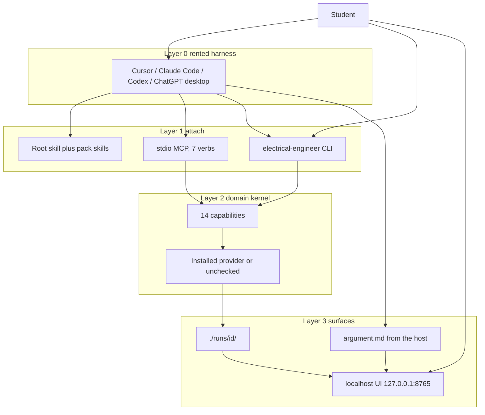
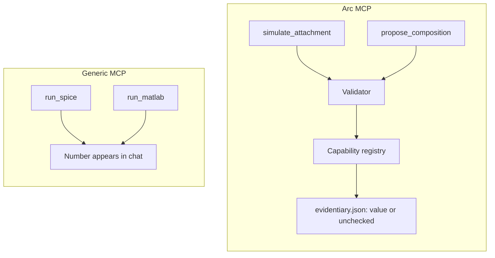
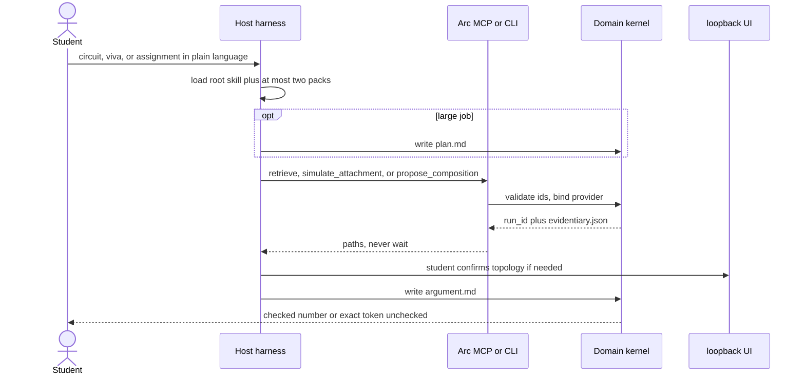
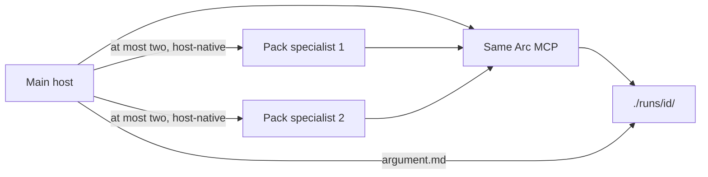

# What Arc puts on the harness

Cursor, Claude Code, Codex, and ChatGPT desktop already run an agent loop. They compact context, call tools, spawn subagents, and bill tokens. Arc does not rebuild that stack.

Arc is the undergraduate electrical-engineering expertise those hosts load: named checks, simulators when they exist, pack method, a visible local run, and the exact token `unchecked` when a number was not verified. The CLI, stdio MCP, and localhost UI are how that expertise attaches.

> Arc is a domain kernel for undergraduate electrical engineering. It is not a 1:1 simulator MCP or a public REST API.
> Primary attach: paste a prompt into a first-class host, or run `electrical-engineer`.
> Invariant: **unverified numbers use the exact token `unchecked`.**

This page is the human walkthrough. File maps live in [`EXTENSIVE.md`](EXTENSIVE.md). The normative contract lives in [`ARCHITECTURE.md`](ARCHITECTURE.md).

## Contents

- [The split in one picture](#the-split-in-one-picture)
- [Why a generic CLI, API, or MCP is not the product](#why-a-generic-cli-api-or-mcp-is-not-the-product)
- [What Arc adds](#what-arc-adds)
- [How work runs over the harness](#how-work-runs-over-the-harness)
- [What we rent and what we write](#what-we-rent-and-what-we-write)
- [What ships in this tree](#what-ships-in-this-tree)
- [What we do not ship](#what-we-do-not-ship)
- [Where to go next](#where-to-go-next)

## The split in one picture

A **domain kernel** is what enables a general agentic harness to have expertise in a specific domain. Arc is that kernel for UG EE. The harness stays rented.

The host talks. The kernel checks. The student can see both bands in the local UI.

## Why a generic CLI, API, or MCP is not the product

People map Arc onto the nearest object: "it is a CLI", "it is an MCP server", "it is an API for circuits". Those objects exist in this tree. None of them is the product.

| Shape | What it gives you | What it still is not |
|-------|-------------------|----------------------|
| Generic CLI | Flags in, stdout out | An EE capability law, pack method, or a two-band run the student can open |
| Generic HTTP API | POST JSON, get JSON | A product Arc ships. FastAPI here is loopback UI (`127.0.0.1`) only |
| Generic MCP | Extra tools on a coding assistant | A checked-number authority. Tools often map 1:1 onto simulators; the number lives in chat |
| Arc attach | CLI + stdio MCP + localhost UI on one kernel | A second Cursor, or a public WAN API. Missing providers still return `unchecked` |

Layer 1 does not wrap each simulator as its own MCP tool. The host names `lumped-circuit-sim`, not a new `run_ngspice` verb. The kernel binds an installed provider or fails closed. Peer MATLAB MCP scalars stay untrusted until an EE provider recomputes them.

There is no public HTTP product surface. `electrical-engineer ui` binds `127.0.0.1:8765` only. WAN bind is a cannot-do.

## What Arc adds

Five pieces. Each has a limit.

### Domain kernel, not a second harness

**How it works.** The rented host owns the inner loop. Arc owns what kind of EE check is allowed, which provider may produce a number, where the run is stored, and the `unchecked` token. Hosts load [`skills/SKILL.md`](../skills/SKILL.md) and at most two pack skills on a domain match. They may spawn at most two pack specialists through **that host's** Task/subagent UI. The CLI, MCP server, and UI never start those children.

**Limit.** A Python chat loop, specialist orchestrator, or token-cost dashboard inside this repo is the H5 falsifier. If the CLI grows a unique harness hosts cannot share, stop.

### Capability registry, not a YAML catalog

**How it works.** Fourteen allowlisted ids name the *kind* of check: `algebraic-check`, `lumped-circuit-sim`, `lti-analysis`, `power-network-study`, `machine-model`, `converter-model`, `signal-analysis`, `fields-analytic`, `measurement-model`, `retrieve-citation`, `render-figure`, `ingest-figure`, `label-unverified`, `ask-student`. Providers (`run-spice`, `check-numeric`, `run-python-control`, `run-load-flow`, …) are this-pass engines. Named YAML under `workflows/` **replays** a short binding. The router never invents a graph or a new id.

**Limit.** A signals question is in-bound even when no YAML row exists. Missing depth is `unchecked` plus a [`CANNOT_DO.md`](CANNOT_DO.md) id, not "out of product." Session-invented verbs (`lookup_vout_guess`) are reject.

### Exact token `unchecked`

**How it works.** Checked numbers come from a registered provider. If ngspice, python-control, pandapower, or another bound engine is missing, the run does not guess. It writes the exact token `unchecked` from `electrical_engineer.unchecked.UNCHECKED`. Gold `eval/gold/circuits/divider-dc-01` expects divider `Vout = 5.0` from `Vin=10`, `R1=R2=1k`. That eval is the product check.

**Limit.** `EE_ALLOW_ALL` skips *asks*. It does not skip this token. Fluent prose is not a check.

### Host plans; kernel validates then runs

**How it works.** On a large job (whole assignment, several problems, more than one attachment) the host writes `./runs/<id>/plan.md` first, then executes only that plan. Short jobs may call `simulate_attachment` on a known id (`simulate-circuit`, `derive-circuit`, `unmatched-cosolver`). New graphs go through `propose_composition` with capability ids. `apply: false` validates and records. `apply: true` validates then runs. Mega `solve-*` YAML that includes `solve-explain` is CLI-without-host / gold rollback, not the host-path brain.

**Limit.** MCP never waits on a human. Photo, compose, and control-diagram asks fail closed with a `ui_url`. Confirm is in the UI. Confirm is not simulate.

### Two-band run you can see

**How it works.** Each run writes `evidentiary.json` (providers and gates) and, when a host is driving, `argument.md` (method / viva). The workspace is `electrical-engineer ui` on loopback. The student confirms photos there. Observation is `observation.json`. Memory lives under `.electrical-engineer/memory/` and does not flip `unchecked`.

**Limit.** The browser is not an agent loop. The UI does not mint ohms. Crash-resume of a dead run is out.

## How work runs over the harness

Same kernel, two entries.

**With a host.** The assistant is Layer 0. It plans, calls the 7 MCP verbs, writes the viva, and may spawn pack specialists. Handoff is the run directory, not a private message bus.

**Without a host.** `electrical-engineer run <id>` (or a classifier when the id is omitted) plus the localhost UI is a complete path for **numbers**. Viva still needs a host or a configured local/BYO model. ChatGPT **web** and mobile are not hosts.

## What we rent and what we write

| Piece | Who owns it | What this repo writes | Must not |
|-------|-------------|------------------------|----------|
| Inner loop, compaction, model routing | L0 host | nothing | A Python chat loop |
| System / pack prompts | Host loads; we author files | [`skills/`](../skills/SKILL.md), [`hosts/adapters/`](../hosts/adapters/README.md) | Using this repo's coding `AGENTS.md` as the student lab prompt |
| Tools | L1 attach | 7 MCP verbs + CLI `run` / `workflows` / `mcp` / `eval` / `ui` / `rag` / `memory` | 1:1 provider MCP; waiting on stdio |
| Spawn | L0 host | Adapter markdown | A custom multi-agent runtime |
| Persist, gates, RAG ingest, observation | L2 kernel | run dir, memory files, RAG index, `observation.json` | Silent chat dumps; crash-resume |
| Checked numbers | L2 + L3 | providers, gold, exact token `unchecked` | LLM-as-judge; peer Copilot scalars |

Normative table: [`ARCHITECTURE.md`](ARCHITECTURE.md) §0.3.

## What ships in this tree

Counts you can reproduce from the checkout.

| Inventory | Count | Where |
|-----------|-------|--------|
| Undergraduate packs | 10 | `workflows/` plus matching `skills/<pack>/` |
| Named YAML workflows | 27 | `workflows/**/*.yaml` |
| Capability ids | 14 | `src/electrical_engineer/capabilities.py` |
| MCP verbs | 7 | `list_workflows`, `retrieve`, `open_ui`, `simulate_attachment`, `propose_composition`, `label`, `run_workflow` |
| CLI commands | 7 | `run`, `workflows`, `mcp`, `eval`, `ui`, `rag`, `memory` |
| First-class hosts | 4 | Cursor, Claude Code, Codex, ChatGPT desktop |

Packs: circuits, signals, electronics, machines, power, control, power electronics, measurements, electromagnetic fields, maths-for-EE. Every pack owns seven genres: solve, derive, design, simulate, review, explain, report. v1 **gold depth** is still circuits-first. Other packs may legally finish as `unchecked`.

This-pass default providers (OSS first; MATLAB if present and registered): ngspice via PySpice, python-control, pandapower, sympy `check-numeric`. Product and CI work with zero MATLAB.

BYO ingest is `electrical-engineer rag add` on files the student has rights to. Commercial textbooks are not in git.

## What we do not ship

- A unique agent harness (H5) or an Electric Pi / Cordis runtime (H4)
- A public HTTP MCP or WAN-bound UI
- Invented capability or provider ids
- Faculty LMS, PG as a public promise, civil/mechanical packs
- Live PLC writes, tape-out, KiCad-as-the-product
- ChatGPT web/mobile, Claude Desktop, GitHub Copilot, Gemini CLI as v1 hosts

Honest holes stay in [`CANNOT_DO.md`](CANNOT_DO.md). Prefer a row there over a fluent fake number.

## Where to go next

| If you want | Open |
|-------------|------|
| Paste a prompt and run | [README](../README.md) |
| Host install (copy skills, point MCP) | [`hosts/README.md`](hosts/README.md) |
| Named recipe catalog | [`WORKFLOWS.md`](WORKFLOWS.md) |
| Capability tables and runner law | [`ARCHITECTURE.md`](ARCHITECTURE.md) |
| Every package and file | [`EXTENSIVE.md`](EXTENSIVE.md) |
| Identity and non-goals | [`PID.md`](PID.md), [`PRODUCT.md`](PRODUCT.md) |
