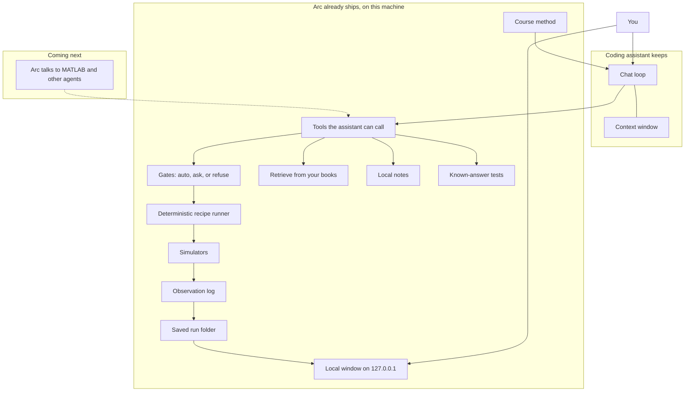
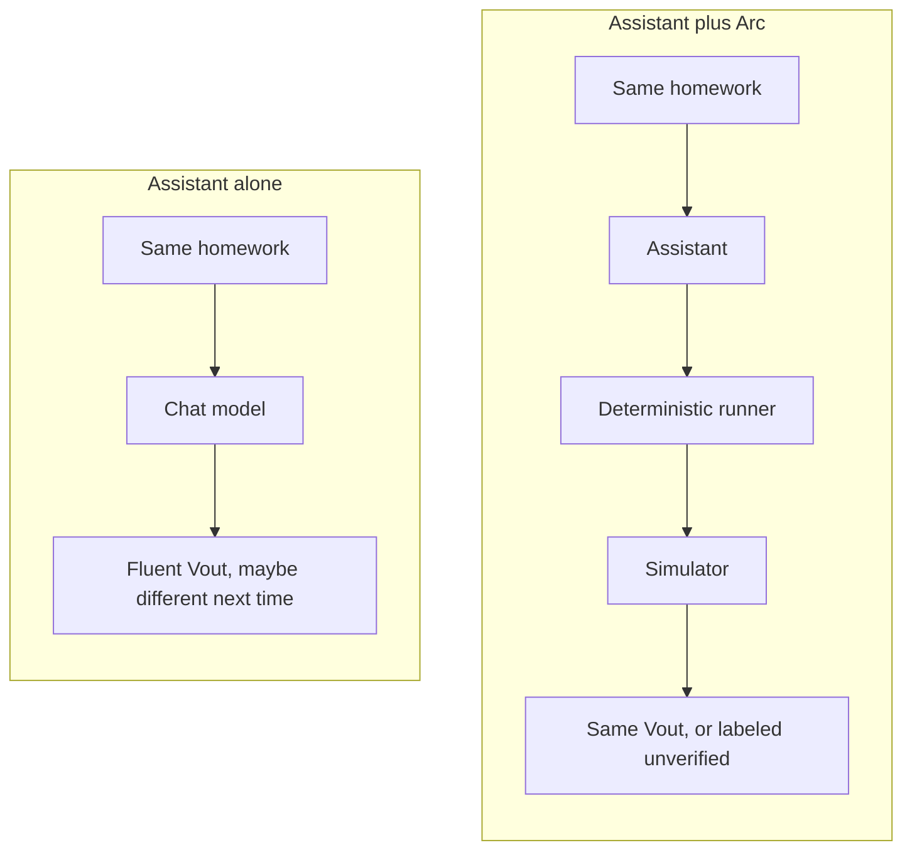
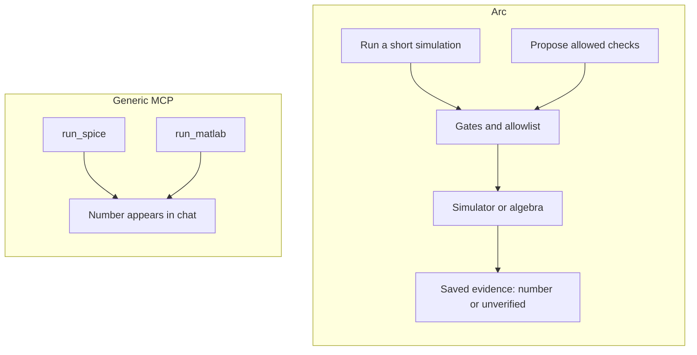
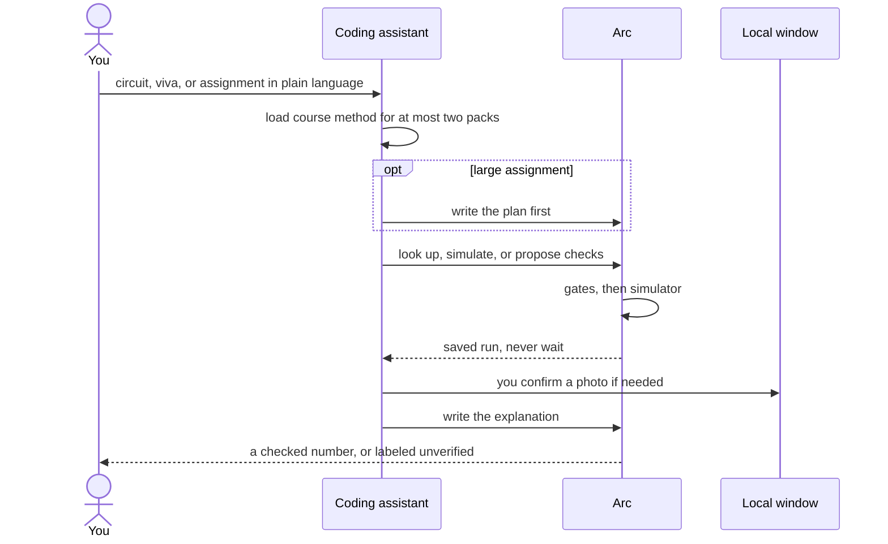
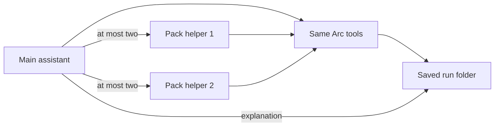
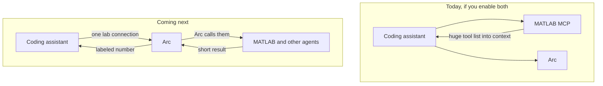

# What Arc puts on the coding assistant

Cursor, Claude Code, Codex, and ChatGPT desktop already chat, call tools, and manage context. Arc does not rebuild that. Arc is the undergraduate electrical-engineering lab those assistants load: course method, simulators, safety gates, saved runs, and a local window you can look at.

If Arc did not actually check a number, it labels that number **unverified**. It never presents a guess as a lab result. In the saved run files that label is the word `unchecked`, so a fluent paragraph cannot hide it.

> Arc is the electrical-engineering expertise a general coding assistant loads. It is not a second Cursor, and it is not a public website API.
> You talk to Cursor (or the other assistants), or you type `electrical-engineer` yourself.
> Rule: an unverified number is labeled. It is never called a simulation.

A **domain kernel** is a short name for that idea: the expertise a general coding assistant loads so it can do one subject well. Arc is that kernel for undergraduate electrical engineering.

File maps: [`EXTENSIVE.md`](EXTENSIVE.md). Engineer contract: [`ARCHITECTURE.md`](ARCHITECTURE.md).

## Contents

- [Words this page uses](#words-this-page-uses)
- [The split in one picture](#the-split-in-one-picture)
- [Determinism, accuracy, reliability](#determinism-accuracy-reliability)
- [Why a generic command line, API, or MCP is not the product](#why-a-generic-command-line-api-or-mcp-is-not-the-product)
- [What Arc already does](#what-arc-already-does)
- [When a number was not verified](#when-a-number-was-not-verified)
- [How homework actually runs](#how-homework-actually-runs)
- [Coming next: Arc talks to MATLAB and other agents](#coming-next-arc-talks-to-matlab-and-other-agents)
- [What ships in this checkout](#what-ships-in-this-checkout)
- [What we do not ship](#what-we-do-not-ship)
- [Where to go next](#where-to-go-next)

## Words this page uses

| Phrase | Meaning |
|--------|---------|
| Coding assistant | Cursor, Claude Code, Codex, or ChatGPT desktop. The chat loop you already use. |
| Tool | Something that assistant can call. People also say MCP tool. This page does not say "verb". |
| Simulator | A program that computes a number: SPICE for circuits, python-control for Bode plots, pandapower for load flow, algebra when that is enough. |
| Gate | A local rule that says auto, ask you, or refuse. The chat never hangs waiting. If you must confirm a photo, you get a link to the local window. |
| Unverified | Arc did not check this number. Saved as the word `unchecked`. |
| Deterministic | Same inputs, same number. The recipe runner and the simulators do not sample. |
| Saved run | A folder under `./runs/` with the evidence, the observation log, and (when the assistant is driving) the explanation. |

## The split in one picture

The coding assistant keeps the chat loop, the context window, and its own permission prompts. Arc owns almost everything else a lab needs: method, tools, simulators, gates, books you add, local notes, an observation log, known-answer tests, and a window on this machine.

The assistant talks. Arc checks. You can open both the numbers and the explanation in the local window.

## Determinism, accuracy, reliability

A chat model samples text. Ask it for `Vout` twice and you can get two fluent answers. That is fine for a draft email. It is a bad fit for core engineering.

In a lot of domains, especially engineering, the same inputs must produce the same number, the number must be accurate, and you must be able to trust the run after it happened. A wrong value is not a typo. On a homework sheet it fails a viva. Later it is a wrong design. That gap (a loop that talks vs a calculator that repeats) is a common reason people will not hand real engineering work to an unconstrained assistant.

Arc does not make the assistant's prose deterministic. The viva can still vary. It puts a **deterministic, accurate, replayable check** under the chat, which the chat does not have on its own:

| Need | What the chat loop does | What Arc does |
|------|-------------------------|---------------|
| Determinism | Samples a next token | The recipe runner has no model inside it. Same YAML plus same netlist, same path |
| Accuracy | Sounds confident | ngspice, python-control, pandapower, or algebra compute the number. Gold `divider-dc-01` expects `Vout = 5.0` |
| Reliability | A wrong ohm can vanish into the transcript | Gates, an observation log, a saved run you can reopen, and an unverified label when the check did not run |

Limit: Arc is an undergraduate lab, not a plant controller. It does not make every numeral tool-checked. It does make this promise: a number presented as verified came from a simulator or a numeric check, and you can open the run that produced it.

## Why a generic command line, API, or MCP is not the product

People map Arc onto the nearest object: "it is a command line", "it is an MCP server", "it is an API for circuits". Those objects exist here. None of them is the product.

| Shape | What you get | What you still miss |
|-------|----------------|---------------------|
| Generic command line | You type a flag, you get text back | Course method, gates, a window that shows the run |
| Generic website API | You POST JSON | Arc does not ship this. The HTTP server here is a local window on `127.0.0.1` only |
| Generic MCP | Extra tools on the assistant | The assistant often calls SPICE or MATLAB directly. The number appears in chat. MATLAB's own MCP also dumps a huge tool list into context |
| Arc | Command line + local MCP + local window, sharing one lab | A second Cursor. Missing simulators still produce an unverified label, not a fake lab result |

The assistant does not get a new `run_ngspice` tool for every engine. It asks Arc for a *kind of check* (simulate this circuit, check this algebra). Arc picks an installed simulator or labels the number unverified.

There is no public website API. `electrical-engineer ui` binds `127.0.0.1:8765` only.

## What Arc already does

A coding harness is usually: chat loop, tools, files, hooks, memory, evals, a UI, and safety. Arc does not rebuild the chat loop or the assistant's own permission UI. It does ship the rest for this lab.

### Course method

Pack files under [`skills/`](../skills/SKILL.md) teach how to solve circuits, machines, power, and the other undergraduate packs. The assistant loads the root file plus at most two packs for the assignment. It does not load every pack at once.

Limit: those files teach method. They do not mint ohms.

### Tools the assistant can call

Your coding assistant talks to Arc through a local MCP connection (`electrical-engineer mcp`). The tools, in plain language:

| The assistant can | What that means |
|-------------------|-----------------|
| List lab recipes | See the named workflows in this checkout |
| Look up a citation | Retrieve from books you have rights to. Empty is visible |
| Open the local window | Get a link. The chat never waits on you |
| Run a short simulation | Known small jobs such as simulate this circuit |
| Propose a combination of allowed checks | Record a plan, then run it if you said so |
| Read the labeled result | What was verified vs unverified |
| Replay a named recipe | The command-line / test path |

You can do the same jobs without an assistant: `electrical-engineer run`, `workflows`, `eval`, `ui`, `rag`, `memory`.

Limit: Arc does not wrap each simulator as its own MCP tool. Confirming a photo happens in the local window, not inside the chat.

### Simulators

When they are installed, Arc can run ngspice (circuits), python-control (Bode, step, root locus), pandapower (study-level load flow), and algebra / last-line checks. MATLAB is optional. The product works with none of it: then the number is labeled unverified.

Limit: a missing simulator is not a fake SPICE pass.

### Gates

Local rules say auto, ask you, or refuse. The strictest rule wins. The chat never hangs. If you must confirm a circuit photo, Arc returns a link to the local window. Three asks in one run abort.

Limit: turning off asks does not turn off the unverified label.

### Saved runs, observations, notes, books, tests

Each run writes:

- evidence: numbers, plots, citations, unverified labels
- `observation.json`: what ran, what failed, why something was unverified
- explanation (`argument.md`) when the assistant is driving the viva
- a plan (`plan.md`) on a large assignment, written before tools that change physics

You can add licence-clean notes and books on the machine (`electrical-engineer memory`, `electrical-engineer rag add`). Known-answer tests live under `eval/gold/` (`electrical-engineer eval --pack circuits`).

Limit: a dead run does not resume. Notes cannot flip unverified to verified. The browser is not a second chat loop.

## When a number was not verified

A checked number comes from a simulator or a numeric check Arc ran. If that did not happen, Arc still answers the assignment as far as method goes, and it **labels the number unverified**.

In the run folder that label is the word `unchecked`. Gold test `eval/gold/circuits/divider-dc-01` expects divider `Vout = 5.0` from `Vin=10`, `R1=R2=1k` when the check actually ran. That eval is the product check.

A paragraph that sounds confident is not a check. A MATLAB Copilot scalar is not a check until Arc recomputes it.

## How homework actually runs

Same lab, two doors.

**With a coding assistant.** It plans, calls the tools above, writes the explanation, and may start at most two pack helpers using that assistant's own Task UI. Helpers share the same Arc tools and the same run folder. Arc never starts those helpers itself.

**Without a coding assistant.** `electrical-engineer run` plus the local window is enough for numbers. A viva still needs an assistant or a local model you configure. ChatGPT in the browser is not a supported assistant.

## Coming next: Arc talks to MATLAB and other agents

Today, if you also turn on MathWorks' MATLAB MCP next to Arc, the coding assistant sees both. MATLAB numbers stay unverified until Arc recomputes them. That side-by-side setup is clumsy: MATLAB's own MCP tends to dump on the order of 10,000 tokens of tool description into the assistant's context window. The chat gets slower and noisier, and it is still allowed to treat a MATLAB scalar as if it were a lab result unless Arc stops it.

**Coming next:** Arc will call MATLAB (and, later, other MCPs or agents) itself. The coding assistant talks only to Arc. Arc decides when MATLAB is needed, runs that call, and returns a short labeled result: verified, or unverified, with the observation log. The 10k-token tool dump never lands in your homework chat.

This is not shipped in this checkout. The product and CI already work with zero MATLAB. OSS simulators stay first-class.

## What ships in this checkout

Counts you can reproduce from the files.

| What | Count | In plain language |
|------|-------|-------------------|
| Undergraduate packs | 10 | Circuits, signals, electronics, machines, power, control, power electronics, measurements, electromagnetic fields, maths-for-EE |
| Named lab recipes | 27 | Saved workflows under `workflows/` |
| Kinds of check | 14 | Algebra, lumped-circuit sim, LTI, power network, machines, converters, signals, fields, measurements, citations, figures, photo ingest, unverified label, ask you |
| Tools the assistant can call | 7 | List, look up, open window, simulate, propose checks, read result, replay recipe |
| Commands you can type | 7 | `run`, `workflows`, `mcp`, `eval`, `ui`, `rag`, `memory` |
| Supported assistants | 4 | Cursor, Claude Code, Codex, ChatGPT desktop |

Every pack covers seven homework shapes: solve, derive, design, simulate, review, explain, report. Known-answer tests are still deepest on circuits. Other packs may finish with an unverified label. That is a legal outcome.

Commercial textbooks are not in git. You add files you have rights to.

## What we do not ship

- A second Cursor (our own chat loop, specialist orchestrator, or token bill)
- A public website MCP or a UI bound to the internet
- New kinds of check invented in a chat session
- Faculty LMS, postgraduate as a public promise, civil or mechanical packs
- Live plant control, chip tape-out, a full schematic editor
- ChatGPT in the browser, Claude Desktop, GitHub Copilot, Gemini CLI as v1 assistants

Honest holes stay in [`CANNOT_DO.md`](CANNOT_DO.md). Prefer a row there over a fluent fake number.

## Where to go next

| If you want | Open |
|-------------|------|
| Paste a prompt and run | [README](../README.md) |
| Hook up Cursor or another assistant | [`hosts/README.md`](hosts/README.md) |
| Named lab recipes | [`WORKFLOWS.md`](WORKFLOWS.md) |
| Engineer tables | [`ARCHITECTURE.md`](ARCHITECTURE.md) |
| Every package and file | [`EXTENSIVE.md`](EXTENSIVE.md) |
| Identity and non-goals | [`PID.md`](PID.md), [`PRODUCT.md`](PRODUCT.md) |
