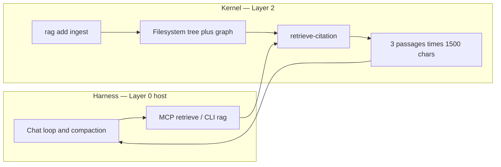
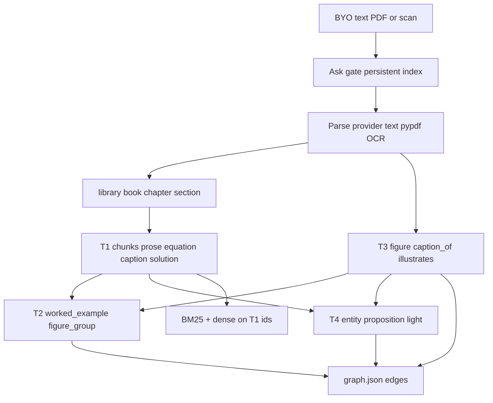
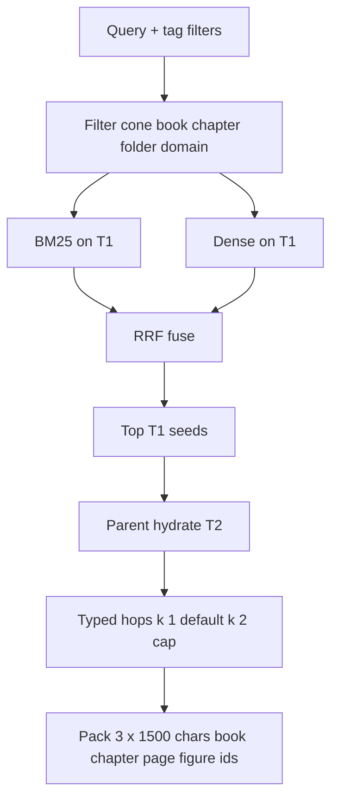
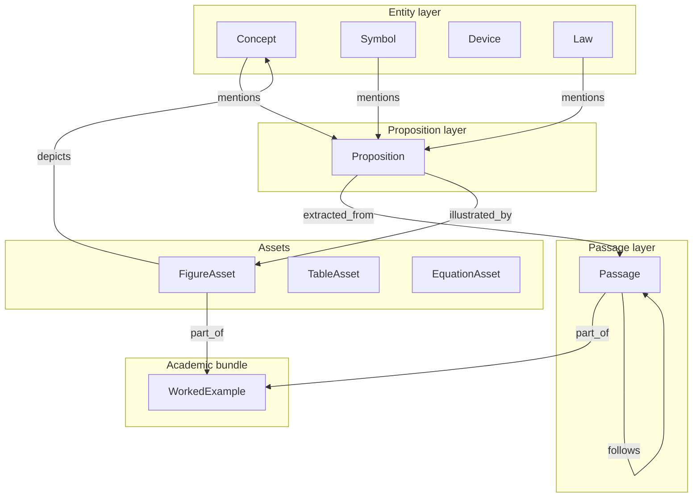

# Local textbook RAG — ingest and query

**Normative freeze** (citations, filters, 3 × 1500 chars, BYO, untrusted ingest): [`ARCHITECTURE.md`](../ARCHITECTURE.md) §10.  
**Harness vs kernel (plain language):** [`ON_THE_HARNESS.md`](../ON_THE_HARNESS.md).  
**This page:** the **graphs** the kernel runs on ingest vs query, and links to the approach (RAG-Anything ingest, GRASP-style proposition graph, hybrid then hops).

**As-built (`engine=hybrid-graph`):** `rag add` parses text/markdown (PDF text via optional `pypdf`; OCR via optional `ocrmypdf`), writes chunk inventory + `graph.json` (T0–T4: docs, chunks, worked examples, figures, light entities/propositions). Retrieve is **filter → BM25∥dense (hash embed in CI; MiniLM when installed) → RRF → parent hydrate → ≤2 typed hops**, packed to 3 × 1500 chars, empty visible, p95 budget **7 s**. MinerU/RAG-Anything remain optional multimodal adapters (`CD-RAG-ANYTHING` / `CD-RAG-ENGINE`); commercial scan layout fidelity remains `CD-RAG-PARSE`.

ADR-0004 (QUALITY then SPEED). Identity is **tagged, citable, local RAG**, not a vendor library.

**Is this a good RAG approach?** Yes for Arc’s constraints. Hybrid lexical+dense with RRF is table-stakes production retrieval; a shallow typed graph (example↔solution↔figure, entity↔proposition↔chunk) buys multi-hop academic shape without GraphRAG’s offline community cost or agentic rewrite loops on the interactive path. Separating **ingest** (minutes OK) from **query** (seconds hard) matches how textbook BYO systems are operated. Gaps that remain intentional: heavy layout OCR and VLM-on-query stay out of the default ≤7 s path.

---

## Kernel vs harness

The **rented harness** (Cursor, Claude Code, Codex, ChatGPT desktop) owns the chat loop. It may call `retrieve` and write `argument.md`. It does **not** own the textbook index, OCR, or graph hops.

The **domain kernel** owns persist and the RAG sidecar: `rag add` ingest, the index, hybrid retrieve, bounded hops, inventory, and citation packing. It does **not** compact context, run GRASP agent rewrite loops, or mint ohms from a PDF.

| Job | Kernel | Host / harness |
|-----|--------|----------------|
| `rag add` (parse/OCR, figures, graph, index write) | Yes — ask gate | May invoke CLI; must not skip the gate |
| Filters, hybrid search, 1–2 hops, pack citations | Yes | Passes query + tags only |
| Multi-hop **viva** (decompose the homework) | Hop cap inside `retrieve-passage` | Host may plan extra `retrieve` calls |
| Agentic GRASP planner / sub-agents | No | Optional in the host, not in the runner |
| Citation in evidentiary band | Yes | Host must not invent page numbers |
| Homework photo → netlist | `ingest-figure`, not this RAG path | UI confirm stays Layer 3 |

---

## Ingest pipeline (offline, separate)

`electrical-engineer rag add`. Minutes per chapter are allowed. Fail closed on unreadable PDF when no text/OCR path works (`CD-RAG-PARSE`).

**As-built path:** Arc parse providers (text → pypdf → optional ocrmypdf) → structure map → T1 chunks + T2 parents + T3 figures → light T4 → BM25+dense indexes. **Optional adapter:** [RAG-Anything](https://github.com/HKUDS/RAG-Anything) / MinerU may feed the same ontology when installed; not required in CI. Circuit **simulation** photos do not use this path.

Student-facing drop folder: [`rag-byo.md`](../rag-byo.md).

---

## Query pipeline (online, separate, p95 ≤ 7 s)

`retrieve-citation` / MCP `retrieve` / CLI `rag query`. Filters first. Empty retrieval is visible. Target wall clock **≤ 6 s**, hard cap **7 s**. Skip optional rerank if the clock already passed 4 s. If hops would overrun, return hybrid passages and mark the retrieve truncated.

**As-built path:** hybrid BM25 ∥ dense → RRF → parent hydrate → deterministic typed hops (GRASP-RAG *index* shape, not GRASP *agent* loops). Passages are what you cite.

Host-path multi-hop in [`ARCHITECTURE.md`](../ARCHITECTURE.md) §4 stays a **hop cap** on `retrieve-passage`, not a second agent loop in Python.

---

## Graph of node types

Three GRASP layers, plus assets and a worked-example bundle so problem, solution, and figures stay linked.

Intra-image labels use RAG-Anything `belongs_to` into the `FigureAsset` anchor. Optional `prerequisite` edges between concepts stay a P1 overlay.

---

## Approach links

| What | Link |
|------|------|
| Product freeze (filters, citations, untrusted ingest) | [`ARCHITECTURE.md`](../ARCHITECTURE.md) §10 |
| Research: ingest vs query, latency budget, ontology | [`research/notes/rag-ingest-query-architecture.md`](../../research/notes/rag-ingest-query-architecture.md) |
| Research: 120-item pack eval bank | [`research/notes/rag-eval-pack-stack.md`](../../research/notes/rag-eval-pack-stack.md) |
| Research: RAG-Anything as ingest engine | [`research/notes/rag-anything-evaluation.md`](../../research/notes/rag-anything-evaluation.md) |
| Stack memo (D11 / D21) | [`research/synthesis/rag-stack-recommendation.md`](../../research/synthesis/rag-stack-recommendation.md) |
| Spike ADR | [`DECISIONS.md`](../../DECISIONS.md) ADR-0004 |
| RAG-Anything (ingest, images, dual graph) | https://github.com/HKUDS/RAG-Anything — paper https://arxiv.org/abs/2510.12323 |
| GRASP-RAG (entities, propositions, passages) | https://arxiv.org/abs/2605.16598 |
| Dense X Retrieval (proposition unit) | https://aclanthology.org/2024.emnlp-main.845/ |
| Hybrid + rerank (production pattern) | https://docs.databricks.com/aws/en/ai-search/retrieval-quality |
| Contextual prefixes at index time | https://www.anthropic.com/engineering/contextual-retrieval |

Do not confuse **GRASP-RAG** (this retrieval graph) with kernel **GraSP** (pack-skill loading in [`ARCHITECTURE.md`](../ARCHITECTURE.md) §6).
