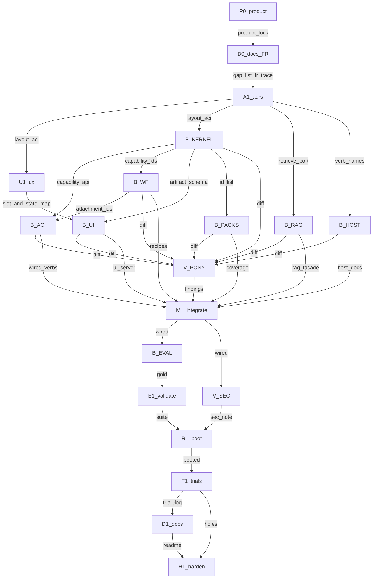

# Loop graph (D19/D20 archive)

> **Historical D19/D20 graph (complete).** Live execution is the UG EE knowledge corpus:
> [`../../LOOP_GRAPH.md`](../../LOOP_GRAPH.md). Do not run this graph.
> Scope archive: [`IMPLEMENTATION_PLAN_D19.md`](IMPLEMENTATION_PLAN_D19.md).
>
> XOR: do not treat [`../../EXECUTION_GRAPH.md`](../../EXECUTION_GRAPH.md) as live.

---

## Metadata

| Field | Value |
|-------|-------|
| **Scope plan** | [IMPLEMENTATION_PLAN_D19.md](IMPLEMENTATION_PLAN_D19.md) |
| **Objective** | Arc D19/D20 public promise: capability path for every pack, 5–7 ACI verbs, two-band UI, RAG ingest, proven by boot + trials + docs |
| **Topology mix** | chain (P0–A1) + fan-out (B*) + diamond (V_PONY→M1) + tail (E1–H1) |
| **Depth** | 2 |
| **Graph-of-loops** | named — this graph is live |
| **Graph-engineering** | not loaded (XOR) |
| **Branch** | `cursor/d19-loop-graph-572f` |
| **Cheap checker** | `composer-2.5-fast` else `inherit` |

---

## Loop plans

| ID | Name | Plan | Stop | Max rounds | Status |
|----|------|------|------|------------|--------|
| P0 | product lock | [plans/loops/P0.md](../../plans/loops/P0.md) | grep PRODUCT headings | 3 | passed |
| D0 | docs-in | [plans/loops/D0.md](../../plans/loops/D0.md) | D0_GAPS + FR_TRACE | 3 | passed |
| A1 | ADRs | [plans/loops/A1.md](../../plans/loops/A1.md) | ADR-0012 + trust | 3 | passed |
| U1 | UX IA a11y | [plans/loops/U1.md](../../plans/loops/U1.md) | evidentiary/argument/WCAG/keyboard | 3 | passed |
| B_KERNEL | capability kernel | [plans/loops/B_KERNEL.md](../../plans/loops/B_KERNEL.md) | pytest capabilities/composition/observation/fr9 | 3 | passed |
| B_RAG | RAG ingest | [plans/loops/B_RAG.md](../../plans/loops/B_RAG.md) | pytest test_rag_ingest | 3 | passed |
| B_HOST | host contract | [plans/loops/B_HOST.md](../../plans/loops/B_HOST.md) | pytest test_host_docs | 3 | passed |
| B_ACI | MCP ACI | [plans/loops/B_ACI.md](../../plans/loops/B_ACI.md) | pytest mcp_aci + classifier + fail_closed | 3 | passed |
| B_WF | attachments | [plans/loops/B_WF.md](../../plans/loops/B_WF.md) | unmatched + host_path tests | 3 | passed |
| B_UI | two-band UI | [plans/loops/B_UI.md](../../plans/loops/B_UI.md) | slots + artifacts + bind + a11y | 3 | passed |
| B_PACKS | pack coverage | [plans/loops/B_PACKS.md](../../plans/loops/B_PACKS.md) | pytest test_pack_coverage | 3 | passed |
| V_PONY | ponytail-review | [plans/loops/V_PONY.md](../../plans/loops/V_PONY.md) | PONYTAIL_REVIEW.md Findings | 3 | passed |
| M1 | integrate | [plans/loops/M1.md](../../plans/loops/M1.md) | pytest test_wiring | 3 | passed |
| B_EVAL | gold FR9 | [plans/loops/B_EVAL.md](../../plans/loops/B_EVAL.md) | eval --pack circuits + scoring | 3 | passed |
| E1 | evaluate | [plans/loops/E1.md](../../plans/loops/E1.md) | ./scripts/validate.sh | 3 | passed |
| V_SEC | security | [plans/loops/V_SEC.md](../../plans/loops/V_SEC.md) | SECURITY_REVIEW.md 127.0.0.1 + secret | 3 | passed |
| R1 | boot | [plans/loops/R1.md](../../plans/loops/R1.md) | R1_BOOT.md names electrical-engineer | 3 | passed |
| T1 | trials | [plans/loops/T1.md](../../plans/loops/T1.md) | T1_TRIALS.md full queue | 3 | passed |
| D1 | docs-out | [plans/loops/D1.md](../../plans/loops/D1.md) | README names boot command | 3 | passed |
| H1 | harden | [plans/loops/H1.md](../../plans/loops/H1.md) | ./scripts/validate.sh | 3 | passed |

State: `plans/loops/<id>.state.json`.

---

## Lifecycle

| Stage | Node id(s) | Plan |
|-------|------------|------|
| Research + questions | R0 | [GATE_0.md](docs/planning/GATE_0.md) — done |
| Product lock | P0 | [P0](../../plans/loops/P0.md) |
| Docs-in | D0 | [D0](../../plans/loops/D0.md) |
| Architecture | A1 | [A1](../../plans/loops/A1.md) |
| Design / UI UX | U1 | [U1](../../plans/loops/U1.md) |
| Build | B_* | links above |
| Review | V_PONY | [V_PONY](../../plans/loops/V_PONY.md) |
| Integrate | M1 | [M1](../../plans/loops/M1.md) |
| Evaluate | B_EVAL, E1 | links |
| Security | V_SEC | [V_SEC](../../plans/loops/V_SEC.md) |
| Run | R1 | [R1](../../plans/loops/R1.md) |
| Trials | T1 | [T1](../../plans/loops/T1.md) |
| Docs-out | D1 | [D1](../../plans/loops/D1.md) |
| Harden | H1 | [H1](../../plans/loops/H1.md) |

N/A: deploy, auth product, GSAP, Next.js, impeccable teach, graph-engineering.

---

## Mermaid

**Edges cut:** UI does not wait on RAG; host docs wait on A1 verb names only; V_SEC does not wait on B_EVAL; D1 after T1.

---

## Waves

| Wave | Nodes | Fan-out? | Barrier? | Status |
|------|-------|----------|----------|--------|
| 0 | [P0](../../plans/loops/P0.md) | no | no | done |
| 1 | [D0](../../plans/loops/D0.md) | no | no | done |
| 2 | [A1](../../plans/loops/A1.md) | no | no | done |
| 3 | [U1](../../plans/loops/U1.md), [B_KERNEL](../../plans/loops/B_KERNEL.md), [B_RAG](../../plans/loops/B_RAG.md), [B_HOST](../../plans/loops/B_HOST.md) | yes | no | done |
| 4 | [B_ACI](../../plans/loops/B_ACI.md), [B_WF](../../plans/loops/B_WF.md), [B_UI](../../plans/loops/B_UI.md), [B_PACKS](../../plans/loops/B_PACKS.md) | yes | no | done |
| 5 | [V_PONY](../../plans/loops/V_PONY.md) then [M1](../../plans/loops/M1.md) | no | yes after B* | done |
| 6 | [B_EVAL](../../plans/loops/B_EVAL.md) | no | no | done |
| 7 | [E1](../../plans/loops/E1.md), [V_SEC](../../plans/loops/V_SEC.md) | yes (disjoint) | no | done |
| 8 | [R1](../../plans/loops/R1.md) | no | no | done |
| 9 | [T1](../../plans/loops/T1.md) | no | no | done |
| 10 | [D1](../../plans/loops/D1.md) | no | no | done |
| 11 | [H1](../../plans/loops/H1.md) | no | yes | done |

Resume at the first non-`done` wave. A wave is `done` only when every required node is `passed`.

---

## Failure

- Checker fail + rounds left → next maker round with findings only
- `max_rounds` exhausted → `escalated`, wait
- Required node throw → escalate
- Optional fan-in: none this graph (all nodes required)

---

## T1 trial queue

See [plans/loops/T1.md](../../plans/loops/T1.md). Fifteen rows: happy, empty, bad id, regression, auth N/A, FR9, two-band, non-circuits, UI, MCP verbs, UX empty/error/a11y/photo, unchecked badge.

---

## Commit mapping

Lead commits after each loop **passed**. Matrix: [`IMPLEMENTATION_PLAN.md`](IMPLEMENTATION_PLAN.md) §9.

---

## Approval implication

This graph is live on `cursor/d19-loop-graph-572f`. Execute per `.cursor/skills/graph-of-loops/EXECUTE.md`. No per-node wait unless `escalated`.
