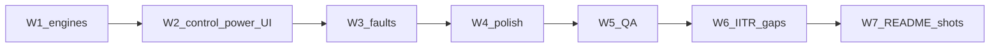

# Loop graph — ship (W1→W7)

**Scope plan:** [`IMPLEMENTATION_PLAN_SHIP.md`](IMPLEMENTATION_PLAN_SHIP.md)  
**Objective:** Ship real EE engines, control/power UI, fault gold, QA, IITR gap fixes, README screenshots.  
**Graph-of-loops:** named — executing on branch `cursor/graph-ship-waves-79c5`.

## Mermaid

## Waves (stop commands)

| Wave | Name | Stop command | Status |
|------|------|--------------|--------|
| **W1** | Real engines | `uv run python -c "from electrical_engineer.nodes.registry import get; s={'run_dir':'/tmp/arc-w1','id':'t'}; import tempfile,os; os.makedirs('/tmp/arc-w1',exist_ok=True); r=get('run-spice')(s,{}); assert r.get('ok') is False or r.get('value') is not None"` AND with extras: `uv sync --extra engines && uv run electrical-engineer run simulate-circuit` writes checked or honest unchecked | pending |
| **W2** | Control + power UI | `test -f ui/src/slots/control/ControlPanel.jsx && npm --prefix ui run build` exits 0 | pending |
| **W3** | Fault coverage | `uv run pytest eval/gold/power -q` OR `uv run pytest tests/integration/test_power_faults.py -q` ≥2 pass | pending |
| **W4** | UI polish | Manual checklist in `docs/planning/QA_VISUAL_SHIP.md` all pass on control/power views | pending |
| **W5** | QA | `docs/planning/QA_CHECKLIST_SHIP.md` all P0 rows pass; `./scripts/validate.sh` green | pending |
| **W6** | IITR gaps | `test -f docs/planning/IITR_GAP_MATRIX.md` and every row shipped or `blocker` | pending |
| **W7** | README shots | `ls docs/media/*.{png,svg} 2>/dev/null | wc -l` ≥ 4 and README links | pending |

## Lifecycle (software)

| Stage | Node | N/A |
|-------|------|-----|
| R0 Gate 0 | `GATE_0.md` | done |
| P0 Product lock | waves table above | — |
| D0 Docs-in | planning artifacts | — |
| A1 Architecture | reuse ARCHITECTURE.md providers | — |
| U1 Design | W2/W4 UI tokens | — |
| B* Build | W1–W6 | — |
| E1 Evaluate | W3 gold + W5 pytest | — |
| R1 Boot | `docs/planning/R1_BOOT_SHIP.md` | created in W5 |
| T1 Trials | CLI demos RLC, control, fault | W5 |
| D1 Docs-out | W7 README + media | after W6 |
| H1 Harden | validate.sh | W5 |

## Approval

Owner approved revised wave order 2026-09-21. Execute without re-asking Gate 0.
