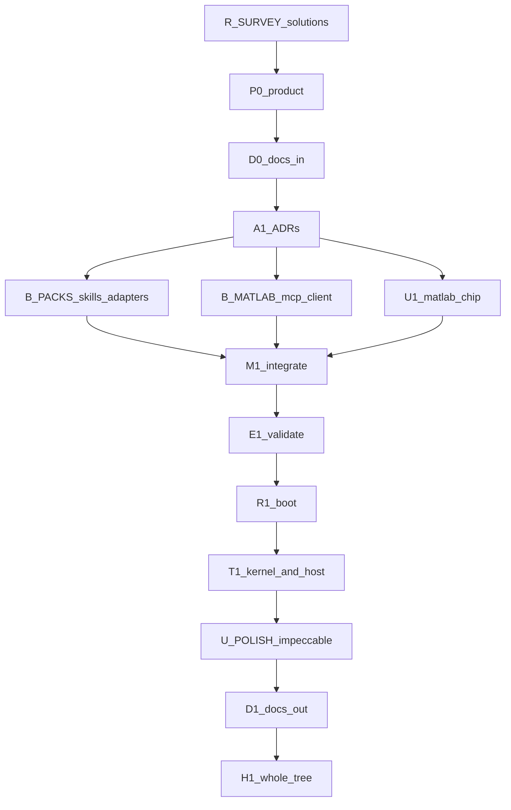

# Loop graph (archived — skills + MATLAB MCP)

> **Archived 2026-09-14.** Live graph: [`../../LOOP_GRAPH.md`](../../LOOP_GRAPH.md).
> This graph is complete (waves 0–8). Do not treat it as live.

> XOR: do not treat [`../../EXECUTION_GRAPH.md`](../../EXECUTION_GRAPH.md),
> [`LOOP_GRAPH_D19.md`](LOOP_GRAPH_D19.md), or
> [`LOOP_GRAPH_KNOWLEDGE.md`](LOOP_GRAPH_KNOWLEDGE.md) as live.
> Scope: [`IMPLEMENTATION_PLAN_SKILLS_MATLAB.md`](IMPLEMENTATION_PLAN_SKILLS_MATLAB.md).
> Gate 0: [`GATE_0_SKILLS_MATLAB.md`](GATE_0_SKILLS_MATLAB.md).

---

## Metadata

| Field | Value |
|-------|-------|
| **Scope plan** | [IMPLEMENTATION_PLAN.md](IMPLEMENTATION_PLAN.md) |
| **Objective** | Knowledge-linked pack skills + host-native specialists; Arc-mediated MATLAB MCP; proven by research, boot, host-harness trials, UI critique, harden |
| **Topology mix** | chain (R_SURVEY→A1) + fan-out (B_PACKS ∥ B_MATLAB ∥ U1) + diamond (M1) + tail (E1–H1) |
| **Depth** | 2 |
| **Graph-of-loops** | named — this graph is live |
| **Graph-engineering** | not loaded (XOR) |
| **Branch** | `cursor/ee-skills-matlab-mcp-37b3` |
| **Cheap checker** | `composer-2.5-fast` else `inherit` |
| **Wave status** | 8 done |

---

## Loop plans

| ID | Name | Plan | Stop | Max rounds | Status |
|----|------|------|------|------------|--------|
| R_SURVEY | solution landscape | [plans/skills-matlab-loops/R_SURVEY.md](plans/skills-matlab-loops/R_SURVEY.md) | landscape files + R0_SOLUTIONS headings | 3 | passed |
| P0 | product lock | [plans/skills-matlab-loops/P0.md](plans/skills-matlab-loops/P0.md) | grep PRODUCT headings + mediat | 3 | passed |
| D0 | docs-in | [plans/skills-matlab-loops/D0.md](plans/skills-matlab-loops/D0.md) | D0_GAPS_SKILLS_MATLAB.md | 3 | passed |
| A1 | ADRs | [plans/skills-matlab-loops/A1.md](plans/skills-matlab-loops/A1.md) | ADR-0015 + ADR-0016 + R0_SOLUTIONS | 3 | passed |
| U1 | MATLAB chip | [plans/skills-matlab-loops/U1.md](plans/skills-matlab-loops/U1.md) | pytest test_ui_a11y | 3 | passed |
| B_PACKS | skills and adapters | [plans/skills-matlab-loops/B_PACKS.md](plans/skills-matlab-loops/B_PACKS.md) | pytest host_adapters + pack_skills | 3 | passed |
| B_MATLAB | MATLAB MCP client | [plans/skills-matlab-loops/B_MATLAB.md](plans/skills-matlab-loops/B_MATLAB.md) | pytest matlab_mcp + sim_seams | 3 | passed |
| M1 | integrate | [plans/skills-matlab-loops/M1.md](plans/skills-matlab-loops/M1.md) | pytest test_host_docs | 3 | passed |
| E1 | evaluate | [plans/skills-matlab-loops/E1.md](plans/skills-matlab-loops/E1.md) | ./scripts/validate.sh | 3 | passed |
| R1 | boot | [plans/skills-matlab-loops/R1.md](plans/skills-matlab-loops/R1.md) | R1_BOOT.md names commands | 3 | passed |
| T1 | kernel and host trials | [plans/skills-matlab-loops/T1.md](plans/skills-matlab-loops/T1.md) | T1_HOST ≥10 pack rows | 3 | passed |
| U_POLISH | impeccable UI | [plans/skills-matlab-loops/U_POLISH.md](plans/skills-matlab-loops/U_POLISH.md) | a11y + U_CRITIQUE changelog | 3 | passed |
| D1 | docs-out | [plans/skills-matlab-loops/D1.md](plans/skills-matlab-loops/D1.md) | README hosts install + MATLAB | 3 | passed |
| H1 | whole-tree harden | [plans/skills-matlab-loops/H1.md](plans/skills-matlab-loops/H1.md) | validate.sh + ponytail Findings | 3 | passed |

State: `plans/skills-matlab-loops/<id>.state.json`.

---

## Lifecycle

| Stage | Node id(s) | Plan |
|-------|------------|------|
| Research + questions | R0 | [GATE_0_SKILLS_MATLAB.md](docs/planning/GATE_0_SKILLS_MATLAB.md) — done |
| Solution landscape | R_SURVEY | [R_SURVEY](plans/skills-matlab-loops/R_SURVEY.md) |
| Product lock | P0 | [P0](plans/skills-matlab-loops/P0.md) |
| Docs-in | D0 | [D0](plans/skills-matlab-loops/D0.md) |
| Architecture | A1 | [A1](plans/skills-matlab-loops/A1.md) |
| Design / UI UX | U1 + U_POLISH | chip then post-boot critique |
| Build | B_PACKS, B_MATLAB | links above |
| Integrate | M1 | [M1](plans/skills-matlab-loops/M1.md) |
| Evaluate | E1 | [E1](plans/skills-matlab-loops/E1.md) |
| Run | R1 | [R1](plans/skills-matlab-loops/R1.md) |
| Trials | T1 | [T1](plans/skills-matlab-loops/T1.md) |
| Docs-out | D1 | [D1](plans/skills-matlab-loops/D1.md) |
| Harden | H1 | [H1](plans/skills-matlab-loops/H1.md) |

---

## Mermaid

---

## Waves

| Wave | Nodes | Barrier |
|------|-------|---------|
| 0 | R_SURVEY | yes — P0/A1 need synthesis |
| 1 | P0, D0, A1 | yes — B* need ADRs |
| 2 | B_PACKS, B_MATLAB, U1 | yes — M1 needs the set |
| 3 | M1 | yes |
| 4 | E1, R1 | yes |
| 5 | T1 | yes |
| 6 | U_POLISH | yes |
| 7 | D1 | yes |
| 8 | H1 | done |

---

## Escalate

Max rounds 3. Escalated node waits for the human. Do not start dependents.
