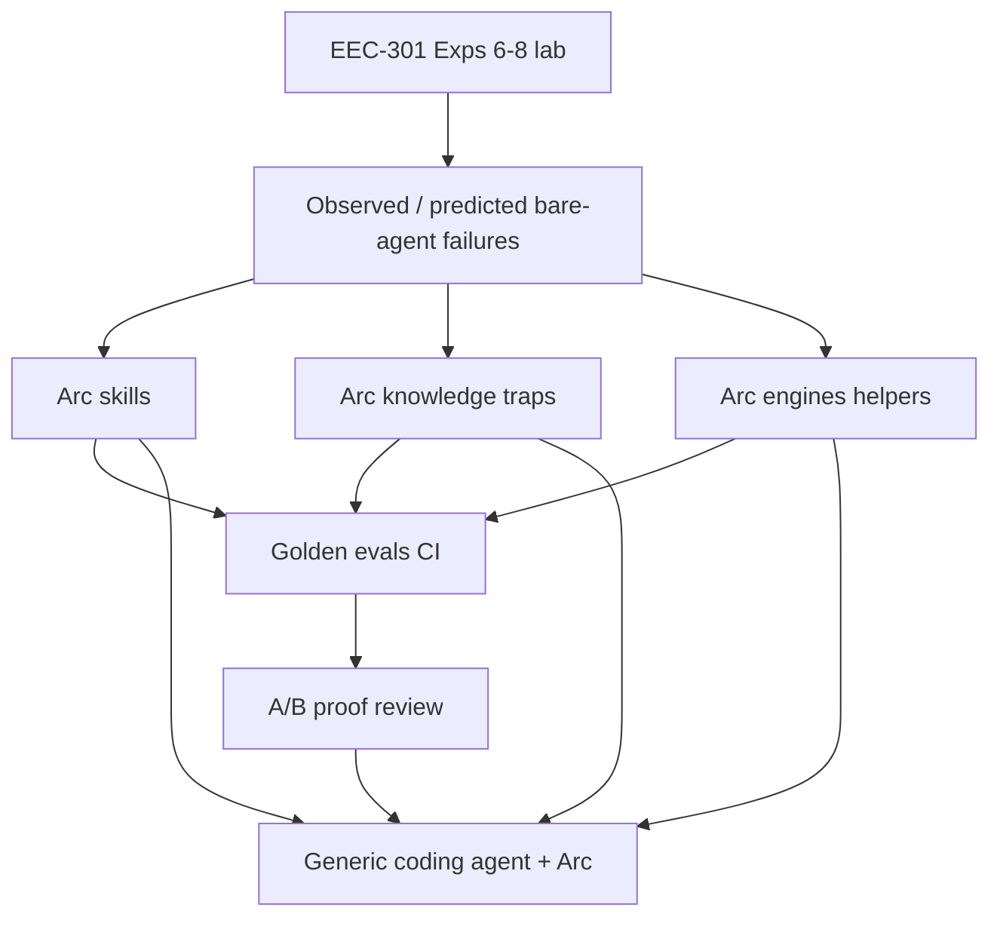

# EEC-301 → Arc System Lift — Master Plan (rev 2, expensive)

> Nawab **project**. **Main priority = Arc system.** Lab Exps are the stress-test that finds failures and feeds skills/knowledge/evals/proof.
> Authority: GATE_0.md · LOOP_GRAPH.md · COMMIT_FLOOR.md · EEC-301 PDF

---

## §0 Plan metadata

| Field | Value |
|-------|-------|
| **Profile** | project |
| **Stack** | Arc Python kernel + skills/knowledge/evals; lab Python (numpy/scipy); Exp7 OSS twin |
| **Base branch** | Arc `main` |
| **Feature branch** | `cursor/eec301-system-lift-*` |
| **Commit floor** | **≥30** on landing Arc PR (planned **36**) |
| **Delivery** | Arc PR(s) = product; lab pack separate = stress-test artifacts |
| **Lead** | EE Project; Cursor cloud agents for Arc code |

---

## §1 North star

### Objective

Make Arc a domain kernel that **dramatically** improves what a generic coding agent can do on undergrad power-system analysis / control lab work — proven by A/B examples — using EEC-301 Exps 6–8 as the discovery and verification harness.

### Deliverables (priority order)

1. **Arc system PR (≥30 commits):** skills, knowledge traps, engines/helpers, golden evals, CI, host/pack cards, ui-diagrams upgrades, proof harness docs in-repo  
2. **A/B review** with ≥5 trap narratives and ≥3 runnable comparisons showing bare agent fail / Arc path pass  
3. **Lab pack** complete Exp6–8 (learning vehicle + golden numbers for evals)  
4. Claude/high-quality diagram research folded into Arc  
5. Optional MATLAB mirrors / UI panels

### Non-goals

- Simulink in CI; waiting on full textbooks; PyPI/marketing; fabricating numbers; squashing below commit floor

### Priority table

| Pri | Focus |
|-----|--------|
| **P0** | Arc skills / knowledge / engines / evals / CI / host cards |
| **P0** | Dramatic A/B proof (≥5 cases, ≥3 scripted) |
| **P1** | Full lab Exp6–8 solutions + figures (feeds P0) |
| **P1** | Diagram skill upgrade from Claude research |
| **P2** | MATLAB `.m` mirrors; Arc UI panels for SMIB/AGC/ED |

---

## §2 How lab feeds system (mandatory loop)

```text
Solve step in lab → note where a bare agent would err
  → encode skill rule + knowledge trap + golden eval
  → re-run trap prompt with Arc path
  → record A/B delta in proofs/
```

Every Exp chapter must produce **at least two** Arc commits (skill or knowledge or eval). Lab without system commits is incomplete.

---

## §3 Architecture



---

## §4 Workstreams

| ID | Name | Priority | Owns |
|----|------|----------|------|
| **WS-S** | Arc system | P0 | skills, knowledge, engines, evals, CI, cards |
| **WS-P** | Proof / A/B | P0 | trap suite, ablations, review doc |
| **WS-L** | Lab pack | P1 | eec-301-lab Exp6–8 |
| **WS-D** | Diagrams | P1 | Claude research → ui-diagrams |
| **WS-M** | MATLAB mirrors | P2 | optional .m |

---

## §5 Trap catalog (proof must hit these)

| ID | Domain | Bare-agent failure | Arc unlock |
|----|--------|-------------------|------------|
| T1 | SMIB | Wrong Pmax for δ_cr / equal-area | swing + equal-area skill |
| T2 | SMIB | CCT clearing model / step off-by-one | CCT helper + eval |
| T3 | SMIB | H↔M / f vs ω base mixup | knowledge + unit guard |
| T4 | AGC | ACE form; B≠β; tie sign | agc skill + parity notes |
| T5 | AGC | Primary vs secondary dynamics confusion | scenario knowledge |
| T6 | ED | Ignore limits; broken KT / λ update | λ-ED skill + solver |
| T7 | ED | Wrong IC / fuel units | knowledge trap |
| T8 | Diagrams | Pretty wrong signal flow | ui-diagrams rules |
| T9 | Integration | “Just use ode45 / fmincon” when forbidden | skill constraints |
| T10 | Numeric | Silent wrong defaults (Pm, Pmax stages) | engine API validation |

**A/B DoD:** document all of T1–T10 at narrative level; **scripted fail/pass** for at least **T1, T2, T6** (minimum three); stretch to five scripted if time.

---

## §6 Commit map — **36 planned** (floor 30)

Each line = one required conventional commit on the Arc branch unless marked `(lab-only)`.

### W0 — Planning & contract (3)
1. `docs: GATE_0 system-first EEC-301 lift`
2. `docs: LOOP_GRAPH + COMMIT_FLOOR (≥30)`
3. `docs: PROGRESS + trap catalog T1–T10`

### W1 — Lab Exp6 numerics → feed system (lab 3 + Arc 2)
4. `(lab-only) scaffold eec-301-lab + requirements`
5. `(lab-only) Exp6 swing ODE + equal-area analytics`
6. `(lab-only) Exp6 Euler/ME/RK4 + CCT bisection tables`
7. `feat(engines): SMIB swing integrators + CCT bisection helper`
8. `test: golden evals for δ0/δcr/CCT vs lab truth`

### W2 — Knowledge/skills from Exp6 (4)
9. `skill: swing-equation skill (formulation + invariants)`
10. `knowledge: trap T1 equal-area / wrong Pmax`
11. `knowledge: trap T2 CCT clearing model`
12. `knowledge: trap T3 H vs M and frequency base`

### W3 — Lab Exp7 → AGC system (lab 2 + Arc 4)
13. `(lab-only) Exp7 two-area OSS twin + primary vs AGC`
14. `(lab-only) Exp7 bias/gain sweeps + Simulink parity notes`
15. `feat(engines): two-area AGC twin helper`
16. `skill: agc-two-area skill (ACE, B, R, scenarios)`
17. `knowledge: trap T4 ACE/bias; trap T5 primary vs AGC`
18. `test: golden AGC scenario evals`

### W4 — Lab Exp8 → ED system (lab 2 + Arc 4)
19. `(lab-only) Exp8 N-unit λ-ED + PD verify cases`
20. `(lab-only) Exp8 report figures`
21. `feat(engines): λ-iteration ED solver with limits/KT`
22. `skill: economic-dispatch-lambda skill`
23. `knowledge: trap T6 limits/KT; trap T7 IC/units`
24. `test: golden ED evals (450/500/300 + limit cases)`

### W5 — Diagram research & skill (3)
25. `docs: Claude/high-quality EE diagram pattern research`
26. `skill(ui-diagrams): PSA/control lab-report figure rules`
27. `knowledge: trap T8 wrong signal-flow diagrams`

### W6 — Host integration & anti-cheat constraints (3)
28. `chore: wire new skills into root/pack/host agent cards`
29. `knowledge: trap T9 forbidden solvers (ode45/fmincon) when lab forbids`
30. `feat: engine input validation for stage Pmax / Pm (T10)`

### W7 — A/B proof harness (4) — **dramatic evidence**
31. `test: bare-vs-arc ablation harness (trap prompts)`
32. `docs: A/B review — T1/T2/T6 runnable dramatic deltas`
33. `docs: A/B review — T3/T4/T5/T7 narrative + checks`
34. `docs: capability unlock summary for README/media`

### W8 — CI, polish, cushion (2 + reserve)
35. `ci: gate new PSA evals on PR`
36. `docs: final PROGRESS DoD + commit-count attestation`

**Reserve backlog if count still <30 after mistakes:** extra limit-case ED evals, multi-machine swing stub skill, equal-area SVG generator, more AGC bias edge cases — each as its own commit. Never empty padding.

**Lab-only commits** are outside the Arc floor; Arc planned commits above = **29** numbered system commits wait let me recount...

Arc commits in list: 1,2,3,7,8,9,10,11,12,15,16,17,18,21,22,23,24,25,26,27,28,29,30,31,32,33,34,35,36 = **29** Arc commits. Need ≥30. Add one more:

37. `docs: EEC-301 lift architecture + how lab feeds kernel`  → make planned Arc = 30 exactly with cushion items:

Add:
37. `feat: equal-area criterion helper API`
38. `test: adversarial prompts suite for host-agent regression`
39. `docs: Simulink parity abstract mapped into Arc AGC docs`

Revised planned Arc commits = **32** minimum in map + lab separate. Update LOOP to say planned 32–36 Arc commits.

I'll fix the file to have clear Arc-only 36 commits.
