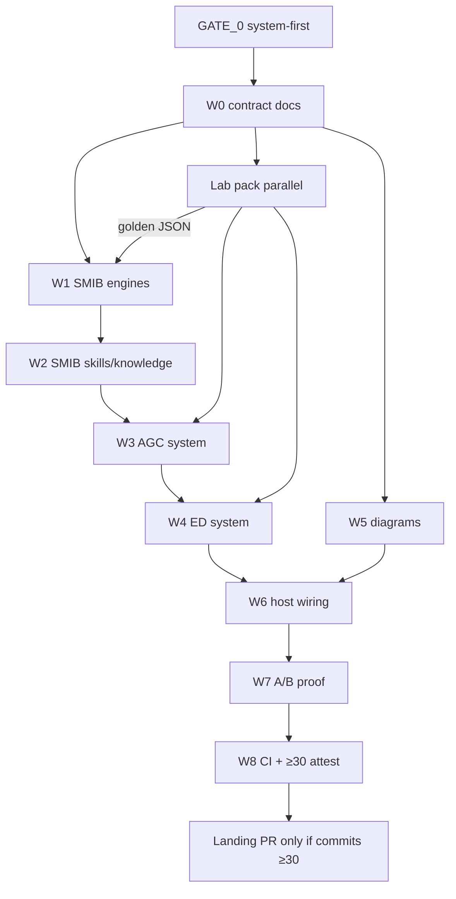

# LOOP_GRAPH — EEC-301 → Arc system lift (rev 2)

## Wave exit gates

| Wave | Exit |
|------|------|
| W0 | GATE_0, LOOP_GRAPH, COMMIT_FLOOR, trap catalog on branch |
| W1 | SMIB engines + golden evals using lab truth |
| W2 | swing skill + T1–T3 knowledge |
| W3 | AGC engine/skill/knowledge/evals + parity notes |
| W4 | ED engine/skill/knowledge/evals + T10 validation |
| W5 | diagram research + ui-diagrams + T8 |
| W6 | host cards + T9 + lab→kernel doc |
| W7 | ablation harness + A/B docs + adversarial tests |
| W8 | CI green + commit-count attestation ≥30 |

## Loops

1. **Numeric:** lab solve ↔ PDF/hand check  
2. **Kernel:** failure → skill/knowledge/engine/eval  
3. **Diagram:** Claude patterns → skill → visual gate  
4. **Proof:** trap prompt → bare fail → Arc pass → document  
5. **Commit floor:** after each wave, `rev-list` vs plan; before merge, hard ≥30

## Stop

User stop; demand for licensed Simulink in CI; pressure to fabricate numbers; attempt to squash below floor → escalate, do not merge.
