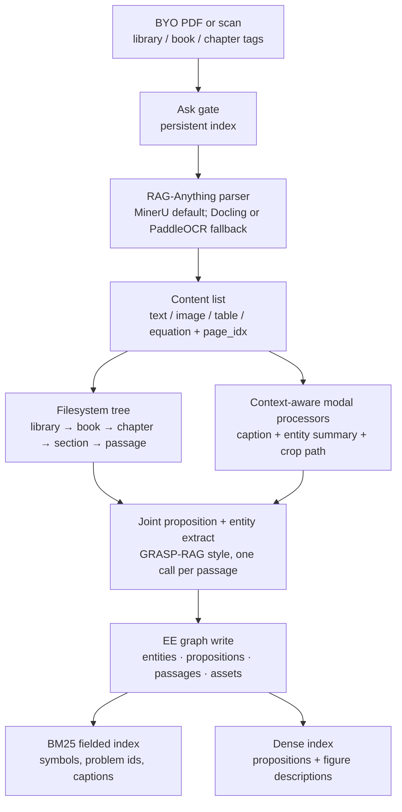
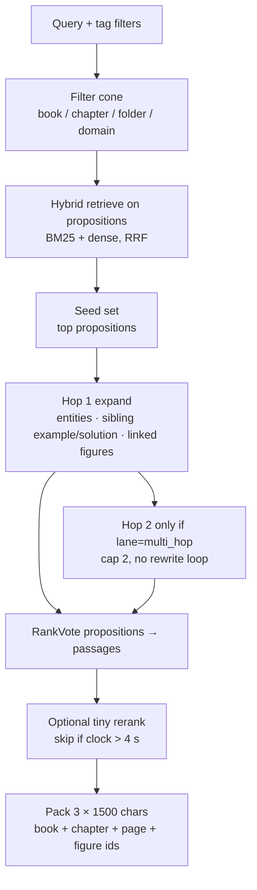

# Ingest vs query RAG architecture (GRASP graph + RAG-Anything)

Product diagrams (ingest graph, query graph, kernel vs harness) live in [`docs/architecture/rag.md`](../../docs/architecture/rag.md). This note is the research argument and spike order.

## Purpose

Separate **ingest** from **query** for Arc’s local textbook RAG. Pin a **typed graph ontology** that can hold worked examples, equations, and **figures linked to text**, using RAG-Anything-style multimodal ingest plus a GRASP-style three-layer search space (entities → propositions → passages). Query path is **hybrid BM25 + dense, then bounded graph hops**, with a **p95 retrieve budget of 7 s** (aim under 6 s).

This note does not lock a vendor library as product identity. The facade in [`docs/ARCHITECTURE.md`](../../docs/ARCHITECTURE.md) §10 stays: `retrieve-citation` / inventory, filters first, **3 × 1500 char** passages, BM25 fallback if a spike fails.

Name collision: kernel research already cites **GraSP** (S124) for pack-skill loading. This note’s **GRASP** is Jenkins et al. 2026 — Graph Agentic Search over Propositions (S128). Call the retrieval graph **GRASP-RAG** in code comments if both appear in one file.

## Findings

Claim | Evidence (URL or ledger ID) | Confidence
--- | --- | ---
Ingest and query should be separate pipelines: parse/OCR/VLM and graph build are offline; retrieve must stay a bounded local hop | Databricks two-stage hybrid then rerank (S129); Anthropic contextual retrieval is index-time (S130); Arc §10 ingest vs retrieve | high
EE PDFs need OCR plus image understanding plus **explicit image–text links**, not caption-only search | RAG-Anything dual-graph + `belongs_to` anchors (S44); MinerU formula/OCR path (S31); prior parse note | high
Propositions beat sentences/triples as the **indexed retrieval unit**; entities are traversal keys; passages are what you cite | Dense X Retrieval (S131); GRASP-RAG (S128); PropRAG (S132); ToPG (S133) | high
GRASP-RAG’s **agentic** planner (sub-agents, rewrite loops) is the wrong default for a 6–7 s local `retrieve-citation` node | GRASP-RAG inference is multi-LLM (S128 Fig. 2); Arc hop cap already lives inside `retrieve-passage` | high
Production search that must be both exact and semantic uses **filter → hybrid BM25+dense → optional rerank**, not GraphRAG global map-reduce | Databricks AI Search quality guide (S129); Red Hat enterprise RAG (S23) | high
LightRAG / RAG-Anything already extract a KG but do not ship Arc’s academic node types (problem/solution/figure/assumption) | S43, S44, `rag-anything-evaluation.md` | high

### Why two pipelines

| | Ingest (offline, `rag add`) | Query (online, `retrieve-citation`) |
|--|----------------------------|--------------------------------------|
| Latency | Minutes per chapter is acceptable | **p95 ≤ 7 s**, target ≤ 6 s on a student laptop |
| Models | MinerU/OCR, optional VLM captions, proposition extractor | Embeddings + BM25 + graph walk; **no** VLM unless the hit set contains an image the host asked about |
| Failure | Fail closed (`CD-RAG-PARSE`), keep inventory row | Empty retrieval **visible**; never silent |
| Writes | Persistent index + graph | Read-only |

Do not run GRASP-RAG’s planner/sub-agents inside the kernel retrieve verb. The **host** may still decompose a multi-hop viva using the existing `retrieve-passage` hop cap. Kernel retrieve is **one shot + 1–2 graph hops**.

---

## Ingest architecture



**Parser.** Keep **RAG-Anything** as the ingest engine (D11): MinerU for formula LaTeX, tables as HTML, multi-column OCR, parse cache. Circuit **homework photos meant for simulation** still go through `ingest-figure` / photo-to-netlist, not this path.

**Image linking (RAG-Anything + Arc).** For each figure/table/equation block:

1. Keep the **pixel crop** (or page image) and MinerU `page_idx` / bbox.
2. Build a **multimodal anchor** `v_mm` (RAG-Anything): VLM description `d_chunk` for retrieval + entity summary `e_entity` for the graph, using the **page/chunk context window** (captions, nearby “Figure n”, problem statement).
3. Extract **intra-image entities** (e.g. “magnetizing branch”, “ωL”, axis labels) with `belongs_to → v_mm`.
4. Align those names with **text-graph entities** (same canonical name + type).
5. Add Arc edges the dual-graph does not invent: `illustrates` proposition, `belongs_to` passage, `part_of` worked example.

**Proposition extract (index-time only).** Follow GRASP-RAG joint extract: one LLM (or small local model) call per passage yields atomic **self-contained** propositions (Dense X rules: one fact, coreference resolved, assumptions named) plus typed entities with index links. Do **not** compress EE into `(s,r,o)` triples as the primary unit — GRASP-RAG and later critiques show triples drop nuance.

**Filesystem tree stays authoritative.** Graph node ids always point at `book_id` / `chapter_id` / `page` / `chunk_id`. Filters (`book_id`, `chapter_id`, `folder_tag`, `domain_tag`) apply **before** hybrid search.

---

## Query architecture



**Default retrieve (fits 6–7 s):**

1. Honour filters (empty cone → empty visible result).
2. Hybrid search **propositions** (lexical for `Y_bus`, problem numbers, LaTeX tokens; dense for “explain synchronous reactance”).
3. **One hop** around seeds: entity neighbours, `part_of` worked-example bundle, `illustrated_by` figures.
4. RankVote (reciprocal rank of propositions) to **passages** — GRASP-RAG’s aggregation, without the agent loop.
5. Optional cross-encoder on ≤ 30 candidates if remaining budget allows (Databricks: rerank ~50 docs in well under 1 s on their stack; locally use a tiny MiniLM reranker or skip).
6. Emit at most three passages plus **linked figure ids** (paths, not pixels unless VLM query mode is on).

**Lanes (router, cheap heuristics, no extra LLM if possible):**

| Lane | Trigger | Extra graph work |
|------|---------|------------------|
| `exact` | Problem numbers, `Ybus`, device ids | BM25 field boost; hop 0–1 |
| `concept` | Explain / define | Hybrid + hop 1 |
| `figure` | “figure”, “phasor diagram”, “equivalent circuit drawing” | Prefer `FigureAsset` + caption BM25; optional ColPali page index later |
| `example` | “worked example”, “solution of problem” | Expand `WorkedExample` so problem and solution stay together |
| `multi_hop` | Cross-chapter or “using §2 to …” | Hop 2 only; still one kernel call |

VLM-enhanced query (RAG-Anything) is **opt-in** when a returned `FigureAsset` is in the pack and the student asked about the drawing. It is outside the 7 s budget unless a local tiny VLM is measured in.

---

## Graph ontology (academic EE)

Three GRASP-RAG layers, plus **assets** and **academic bundles**. Typed nodes beat a schemaless LightRAG dump for reasoning over problems, solutions, and figures.

### Node types

| Layer | Type | What it stores | Indexed? |
|-------|------|----------------|----------|
| Entity | `Concept` | Named idea (Thevenin, slip, pu) | name + aliases |
| Entity | `Symbol` | `Y_bus`, `s`, `ω_s` | **BM25 primary** |
| Entity | `Device` | Transformer, CT, MOSFET (as textbook objects) | name |
| Entity | `Law` | KCL, Faraday, Nyquist | name |
| Proposition | `Proposition` | One self-contained fact or step; assumptions in the sentence | **dense + BM25** |
| Passage | `Passage` | Parent section/example span for citation; page start/end | stored, cited |
| Asset | `FigureAsset` | Crop path, caption, page, bbox | caption + VLM description |
| Asset | `TableAsset` | HTML/Markdown body + caption | lexical |
| Asset | `EquationAsset` | LaTeX + nearby prose | LaTeX + BM25 |
| Bundle | `WorkedExample` | Problem passage + solution passage + optional figures | metadata (`example_id`) |

Passage `chunk_type` stays: `prose` | `equation` | `example` | `figure` | `table` (existing schema in `rag-chunking-and-retrieval.md`).

### Edge types

| Edge | From → to | Why |
|------|-----------|-----|
| `extracted_from` | Proposition → Passage | GRASP-RAG backbone |
| `mentions` | Proposition → Entity | traversal key |
| `same_as` | Entity → Entity | alias / OCR variant (`Ybus` / `Y_bus`) |
| `prerequisite` | Concept → Concept | optional P1 curriculum overlay |
| `belongs_to` | intra-image Entity → FigureAsset | RAG-Anything multimodal anchor |
| `illustrated_by` | Proposition or Passage → FigureAsset | **image–text link** |
| `depicts` | FigureAsset → Entity | diagram of a concept/device |
| `part_of` | Passage or FigureAsset → WorkedExample | keep problem + solution + figure |
| `follows` | Passage → Passage | reading order / “Solution” after problem |
| `assumes` | Proposition → Proposition | linearity, balanced three-phase, CCM |

**Worked example (required shape).** A homework-like retrieve must be able to return the **problem statement, the solution steps, and any figure the solution points at** as one bundle. That is an ontology constraint, not a prompt hint. Parent–child chunking without `WorkedExample` still splits “Solution” across a page break (known parse failure).

**Citation contract.** Every returned passage carries `book_id`, `chapter_id`, `page`, optional `figure_id`. Graph neighbourhood is **not** a citation.

### Example neighbourhood (circuits)

```text
WorkedExample:ex_thevenin_dependent
  Passage:problem   --follows--> Passage:solution
  Passage:solution --illustrated_by--> FigureAsset:fig_equiv_circuit
  FigureAsset --depicts--> Concept:thevenin_equivalent
  FigureAsset --belongs_to-- Entity:dependent_source   (intra-image)
  Proposition:"Under the passive sign convention, Vth equals open-circuit voltage at terminals a-b."
    --mentions--> Concept:thevenin_equivalent
    --extracted_from--> Passage:solution
    --assumes--> Proposition:"The network is linear."
```

---

## Production and recent RAG (what we copy vs skip)

| Pattern | What it is | Copy for Arc | Skip |
|---------|------------|--------------|------|
| **Hybrid + metadata filters + rerank** (Databricks AI Search, 2025–26) | BM25 ∪ vectors, then cross-encoder | Default query spine | Their managed service |
| **Contextual retrieval** (Anthropic, 2024) | 50–100 token situating prefix before embed/BM25 | Cheap index-time prefix: book, chapter, example id | Cloud prompt-cache pricing as a requirement |
| **Docling + hybrid OpenSearch** (IBM tutorials) | Layout JSON + BM25 + vectors | Provenance fields; Docling as parser **fallback** | Replacing MinerU as formula default |
| **RAG-Anything dual graph** | Cross-modal KG fused with text KG | Image anchors + `belongs_to` | Treating LightRAG entities as the EE ontology |
| **GRASP-RAG / ToPG / PropRAG** | Proposition graph + hops or beam paths | **Index + RankVote + 1–2 hops** | Agentic rewrite loops / many sub-agents at retrieve time |
| **HippoRAG 2** | PPR on open KG | Optional overlay if hops underperform | Replacing hybrid first stage |
| **Microsoft GraphRAG community reports** | Leiden + map-reduce summaries | Optional “whole book themes” later | Default homework retrieve (latency + non-evidentiary summaries) |
| **ColPali / ColQwen** | Page-as-image late interaction | Spike if figure Recall@k lags caption+VLM | Sole index (RAM, GPU) |
| **MiniRAG** | Heterogeneous chunk–entity graph, SLM | Emergency ultra-light profile | Academic bundle types |

Quality-first production RAG in 2025–26 is still **parse well, filter hard, hybrid retrieve, rerank a little**. Graph structure pays off for **associative** questions (figure ↔ equation ↔ example) and **multi-hop**, not for replacing BM25 on problem numbers.

---

## Latency budget (local retrieve)

Wall-clock **target ≤ 6 s, hard cap 7 s** for one `retrieve-citation` call (not including host generation).

| Stage | Budget | Notes |
|-------|--------|-------|
| Embed query | ≤ 0.4 s | small local embedder |
| BM25 + ANN over filtered propositions | ≤ 1.5 s | chapter filter cuts the corpus |
| Hop 1 neighbourhood fetch | ≤ 1.0 s | adjacency lists on disk / NetworkX / sqlite |
| Hop 2 (multi_hop lane only) | ≤ 1.0 s | skip otherwise |
| Tiny rerank | ≤ 1.5 s or skip | skip if elapsed > 4 s |
| Pack + citation attach | ≤ 0.2 s | |

If hop+rerank would exceed the cap, **return hybrid top passages only** and set a retrieve note `graph_truncated: true`. Empty is better than a 20 s GraphRAG global search.

Index-time VLM/proposition extract is **not** in this budget.

---

## Spike order (still ADR-0004)

Measure on **one owned chapter** (no commercial PDF in git), using the pack eval bank in [`rag-eval-pack-stack.md`](rag-eval-pack-stack.md):

1. RAG-Anything MinerU parse + caption-only figures (no VLM).
2. Same + VLM figure descriptions + `illustrated_by` edges.
3. Hybrid proposition retrieve, hop 0.
4. Hop 1 (example bundle + figures).
5. Optional ColPali page index if figure lane Recall@3 is weak.

Pass if citation page error is low, example bundles stay intact, figure queries retrieve the linked crop, and p95 retrieve ≤ 7 s. Fail → peel to MinerU + BM25+dense + parent–child, keep the **ontology as the schema** even if LightRAG is dropped.

## Open questions

- Local proposition extractor: small T5-style propositionizer vs one Ollama call per passage vs GRASP-RAG joint prompt.
- Whether `prerequisite` edges are curated (pack skill) or extracted (noisy).
- ColPali as a second index vs VLM captions only, given laptop RAM.
- Minimum RAM/disk for MinerU + graph store for a 400-page machines text.

## Sources

- [GRASP: Graph Agentic Search over Propositions](https://arxiv.org/abs/2605.16598) — retrieved 2026-09-15 — reliability: paper (S128)
- [Databricks AI Search retrieval quality](https://docs.databricks.com/aws/en/ai-search/retrieval-quality) — retrieved 2026-09-15 — reliability: vendor (S129)
- [Anthropic Contextual Retrieval](https://www.anthropic.com/engineering/contextual-retrieval) — retrieved 2026-09-15 — reliability: primary (S130)
- [Dense X Retrieval](https://aclanthology.org/2024.emnlp-main.845/) — retrieved 2026-09-15 — reliability: paper (S131)
- [PropRAG](https://aclanthology.org/2025.emnlp-main.317.pdf) — retrieved 2026-09-15 — reliability: paper (S132)
- [ToPG: Traversal over Proposition Graphs](https://arxiv.org/html/2601.04859v1) — retrieved 2026-09-15 — reliability: paper (S133)
- [RAG-Anything technical report](https://arxiv.org/abs/2510.12323) — retrieved 2026-09-08 — reliability: paper (S44)
- [RAG-Anything GitHub](https://github.com/HKUDS/RAG-Anything) — retrieved 2026-09-08 — reliability: primary (S43)
- [ColPali](https://arxiv.org/abs/2407.01449) — retrieved 2026-09-15 — reliability: paper (S134)
- [rag-anything-evaluation.md](rag-anything-evaluation.md) — retrieved 2026-09-15 — reliability: primary
- [rag-chunking-and-retrieval.md](rag-chunking-and-retrieval.md) — retrieved 2026-09-15 — reliability: primary
- [`docs/ARCHITECTURE.md`](../../docs/ARCHITECTURE.md) §10 — retrieved 2026-09-15 — reliability: primary

## Confidence

Overall confidence for this note: med-high

The split (RAG-Anything ingest, GRASP-RAG **index** + deterministic hops at query, hybrid first) matches both the papers and Arc’s latency/citation constraints. Ranking vs a thin MinerU+hybrid stack still needs the chapter spike.
